# RFC-004: PytStop em microsserviços com saga orquestrada

> [↑ Raiz do projeto](../../../../README.md) · [↑ Arquitetura](../../README.md)

**Data**: 2026-10-06

**Autores**: Grupo 158 (PytStop), turma 15SOAT

> **Status**: Aceita

## Conformidade com o template de RFC (Software Architecture, Aula 4)

| Seção do template | Cobertura nesta RFC |
|---|---|
| Resumo e problema | Seção 1. O monolito modular da fase 3, com banco único e transações ACID (atomicidade, consistência, isolamento e durabilidade) locais, vira três serviços com saga ([gap analysis](../../../requisitos/fase4/gap-analysis-fase-4.md)) |
| Proposta técnica | Seções 2 a 10 |
| Impacto esperado | Requisitos funcionais RF-028 a RF-038, regras de negócio RN-023 a RN-029 e requisitos não funcionais RNF-031 a RNF-056; o PDF e o vídeo reaproveitam os diagramas das seções 2 e 4 |
| Alternativas consideradas | Nos registros de decisão de arquitetura (ADR) 034 a 043, uma decisão por ADR |
| Pontos em aberto | [Seção 11.2](#112-pontos-em-aberto), itens 1 a 5 |

## Onde achar

| Procura | Onde |
|---|---|
| Diagrama geral: serviços, bancos e comunicação | [Seção 2](#2-diagrama-geral-da-arquitetura) |
| Divisão dos serviços, justificativa e mapa de contextos | [Seção 3](#3-divisão-dos-serviços) e [ADR-034](../../adr/fase4/034-decomposicao-em-microsservicos.md) |
| Tecnologias utilizadas | [Seção 1.1](#11-tecnologias) |
| Estratégia da saga e por que orquestração | [Seção 4](#4-saga-de-atendimento) e [ADR-035](../../adr/fase4/035-saga-orquestrada.md) |
| Etapas da saga, status da OS (ordem de serviço) e compensações por etapa | [Seções 4.1 a 4.4](#41-etapas-da-instância) |
| Sequências de sucesso e de compensação | [Seção 4.8](#48-sequências) |
| Mensageria: topologia, envelope e catálogo de mensagens | [Seção 5](#5-mensageria) e [ADR-036](../../adr/fase4/036-mensageria-rabbitmq.md) |
| Rotas, borda e autenticação | [Seção 6](#6-apis-e-borda), [seção 8](#8-segurança), [ADR-038](../../adr/fase4/038-borda-e-comunicacao-sincrona.md) e [ADR-039](../../adr/fase4/039-autenticacao-entre-servicos.md) |
| Estados dos agregados, modelos de dados e índices | [Seção 7](#7-dados) e [ADR-037](../../adr/fase4/037-banco-por-servico.md) |
| Observabilidade | [Seção 9](#9-observabilidade) e [ADR-043](../../adr/fase4/043-observabilidade-distribuida.md) |
| Operação da saga: saga parada, falha na compensação, retomada e redrive da DLQ | [Runbook da saga](../../../operacao/runbook-saga.md) |
| Pipeline e implantação | [Seção 10](#10-implantação), [ADR-041](../../adr/fase4/041-estrategia-de-testes-e-qualidade.md) e [ADR-042](../../adr/fase4/042-cicd-e-deploy-kubernetes.md) |
| Parâmetros e variáveis de ambiente | [Seção 10.3](#103-parâmetros-e-variáveis-de-ambiente) |
| Riscos e pontos em aberto | [Seção 11](#11-riscos-limitações-e-pontos-em-aberto) |
| Glossário e siglas | [Glossário e siglas](#glossário-e-siglas) |

## 1. Resumo e objetivos

O [enunciado](../../../requisitos/fase4/desafio-tech-fase-4.md) pede "no mínimo, 3 microsserviços independentes, cada um com seu próprio repositório, infraestrutura e banco de dados" (l. 27) e o Saga Pattern "com rollback seguro em caso de falhas" (l. 17). Esta RFC (*request for comments*) junta num desenho único as decisões dos ADR-034 a ADR-043, que seguem como fonte de verdade de cada escolha e das alternativas descartadas.

Duas convenções valem no texto. "p3" é o código da fase 3, commit `08dcffe`, de onde os três serviços partem; o OS Service inclui também a correção `fc06263` do p3, a normalização ASCII de CPF e CNPJ (pull request #32). As disciplinas aparecem pelo nome do material: SAGA Pattern, Estrutura de Microsserviços (Microsserviços I), Estrutura de Microsserviços Parte II (Microsserviços II) e Data Engineering.

| Objetivo | Requisitos | Decisão |
|---|---|---|
| Três serviços com repositório, infraestrutura e banco próprios | RNF-031, RNF-044, RNF-047 | [ADR-034](../../adr/fase4/034-decomposicao-em-microsservicos.md) |
| Dockerfile, manifestos Kubernetes e pipeline em cada repositório | RNF-048, RNF-049 | [seção 10](#10-implantação) e [ADR-042](../../adr/fase4/042-cicd-e-deploy-kubernetes.md) |
| Banco por serviço, um SQL e um NoSQL, sem acesso a banco alheio | RNF-032, RNF-033, RNF-036 | [ADR-037](../../adr/fase4/037-banco-por-servico.md) |
| Operações do enunciado (OS, orçamento e pagamento, execução) | RF-028 a RF-037 | ADR-034, [ADR-040](../../adr/fase4/040-integracao-mercado-pago.md) |
| Saga com compensação em qualquer passo, escolha justificada | RF-038, RN-023 a RN-029, RNF-037 | [ADR-035](../../adr/fase4/035-saga-orquestrada.md) |
| Mensageria, REST só quando necessário, tolerância a falhas | RNF-034, RNF-035, RNF-045, RNF-055 | [ADR-036](../../adr/fase4/036-mensageria-rabbitmq.md), [ADR-038](../../adr/fase4/038-borda-e-comunicacao-sincrona.md) |
| Borda única e autenticação entre serviços sem segredo compartilhado | RNF-034, RNF-036; do p3, RF-009 (JWT, *JSON Web Token*), RF-012 (revogação), RF-014 (papéis) e RF-026 (gateway) | ADR-038, [ADR-039](../../adr/fase4/039-autenticacao-entre-servicos.md) |
| Testes unitários, BDD (*behavior-driven development*), cobertura e SonarQube na integração contínua (CI) | RNF-038 a RNF-041, RNF-050 | [ADR-041](../../adr/fase4/041-estrategia-de-testes-e-qualidade.md) |
| Pipeline por serviço com deploy em Kubernetes, `main` protegida | RNF-042, RNF-043 | [ADR-042](../../adr/fase4/042-cicd-e-deploy-kubernetes.md) |
| Observabilidade da fase 3 com rastreamento distribuído | RNF-046, RNF-056 | [ADR-043](../../adr/fase4/043-observabilidade-distribuida.md) |
| Documentação por serviço, Swagger e Postman, vídeo e PDF | RNF-051 a RNF-054 | [gap analysis, seção 10](../../../requisitos/fase4/gap-analysis-fase-4.md#10-entregáveis) |

Fora do escopo:

- Orçamento complementar (RF-016 da fase 1) e o status `AGUARDANDO_APROVACAO_COMPLEMENTAR`: com o pagamento integral e antecipado e o pivot (ponto sem retorno, RN-029) no início da execução, um complementar seria uma segunda cobrança sobre OS já paga. Serviço extra achado na execução vira OS nova, com saga e pagamento próprios (RF-016 e RN-015 do p3; ADR-034).
- Interface NiceGUI, Lambda de CPF e rotas `/minhas-ordens`: o cliente usa o acompanhamento público e o link assinado.
- CQRS (*command query responsibility segregation*): status e histórico são leitura local do OS (Microsserviços I, Aula 05: CQRS só quando a API Composition não basta).
- Operação de produção (alta disponibilidade, backup).
- Filiais como dimensão do modelo: as "múltiplas filiais" do enunciado (l. 15) não mudam os dados nesta fase; a escala vem de réplicas e do HPA (*Horizontal Pod Autoscaler*), e o volume de cada serviço cabe num nó (ADR-037).

Continua da fase 1 o tempo médio de execução (RF-008), agora calculado por status a partir do histórico da OS ([seção 6.1](#61-rotas-por-serviço)).

### 1.1 Tecnologias

| Camada | Tecnologia | Decisão |
|---|---|---|
| Linguagem, pacotes e API | Python 3.14, uv, FastAPI, Pydantic v2 | herdados do p3 ([ADR-001](https://github.com/fiap-postech-sw-architecture/postech-sw-arch-p3/blob/main/docs/arquitetura/adr/001-framework-fastapi.md), [ADR-014](https://github.com/fiap-postech-sw-architecture/postech-sw-arch-p3/blob/main/docs/arquitetura/adr/014-gerenciador-pacotes-uv.md)) |
| Arquitetura interna | DDD (*domain-driven design*) com camadas Onion, conferidas pelo import-linter | herdado do p3 ([ADR-003](https://github.com/fiap-postech-sw-architecture/postech-sw-arch-p3/blob/main/docs/arquitetura/adr/003-arquitetura-ddd-onion.md)) |
| Banco relacional | PostgreSQL 16, SQLAlchemy 2.0 com mapeamento imperativo, Alembic | [ADR-037](../../adr/fase4/037-banco-por-servico.md); do p3, [ADR-002](https://github.com/fiap-postech-sw-architecture/postech-sw-arch-p3/blob/main/docs/arquitetura/adr/002-banco-postgresql.md) e [ADR-006](https://github.com/fiap-postech-sw-architecture/postech-sw-arch-p3/blob/main/docs/arquitetura/adr/006-mapeamento-imperativo-sqlalchemy.md) |
| Banco de documentos | MongoDB 7 em replica set de um nó, PyMongo | [ADR-037](../../adr/fase4/037-banco-por-servico.md) |
| Mensageria | RabbitMQ 4.3.6 com filas quorum, pika; contratos em AsyncAPI e JSON Schema | [ADR-036](../../adr/fase4/036-mensageria-rabbitmq.md) |
| Borda e REST entre serviços | Kong Ingress Controller em modo DB-less; httpx com timeout, retry e circuit breaker | [ADR-038](../../adr/fase4/038-borda-e-comunicacao-sincrona.md) |
| Identidade | JWT RS256 validado pelo JWKS (*JSON Web Key Set*), o conjunto de chaves públicas do OS, com PyJWT 2.15.1 ou superior; senhas com bcrypt, como no p3 | [ADR-039](../../adr/fase4/039-autenticacao-entre-servicos.md); do p3, [ADR-004](https://github.com/fiap-postech-sw-architecture/postech-sw-arch-p3/blob/main/docs/arquitetura/adr/004-autenticacao-jwt.md) |
| Pagamento | Mercado Pago Checkout Pro, com simulador para CI e demonstração | [ADR-040](../../adr/fase4/040-integracao-mercado-pago.md) |
| Validação de documentos | BrUtils para CPF e CNPJ, placa por expressão regular | herdado do p3 ([ADR-010](https://github.com/fiap-postech-sw-architecture/postech-sw-arch-p3/blob/main/docs/arquitetura/adr/010-validacao-documentos-brutils.md)) |
| Testes e qualidade | pytest, testcontainers, pytest-bdd 8.0 ou superior (Gherkin em português), SonarQube Community, ruff, mypy strict | [ADR-041](../../adr/fase4/041-estrategia-de-testes-e-qualidade.md); do p3, [ADR-005](https://github.com/fiap-postech-sw-architecture/postech-sw-arch-p3/blob/main/docs/arquitetura/adr/005-estrategia-testes.md) e [ADR-013](https://github.com/fiap-postech-sw-architecture/postech-sw-arch-p3/blob/main/docs/arquitetura/adr/013-testes-bdd-pytest-bdd.md) |
| Segurança na cadeia | bandit, pip-audit, gitleaks, trivy, SBOM (inventário de componentes) em SPDX | [ADR-042](../../adr/fase4/042-cicd-e-deploy-kubernetes.md); do p3, [ADR-011](https://github.com/fiap-postech-sw-architecture/postech-sw-arch-p3/blob/main/docs/arquitetura/adr/011-pipeline-seguranca-analise-estatica.md) e [ADR-012](https://github.com/fiap-postech-sw-architecture/postech-sw-arch-p3/blob/main/docs/arquitetura/adr/012-licenciamento-software-sbom.md) |
| CI/CD (integração e entrega contínuas) e implantação | GitHub Actions, GHCR (GitHub Container Registry), Docker multi-stage, kind, k3s numa máquina virtual (VM) da Azure, OIDC (OpenID Connect), Terraform, metrics-server, cert-manager | [ADR-042](../../adr/fase4/042-cicd-e-deploy-kubernetes.md) |
| Observabilidade | OpenTelemetry, Jaeger, Prometheus, Grafana, Loki com Promtail, exportadores de PostgreSQL e MongoDB | [ADR-043](../../adr/fase4/043-observabilidade-distribuida.md); do p3, [ADR-020](https://github.com/fiap-postech-sw-architecture/postech-sw-arch-p3/blob/main/docs/arquitetura/adr/fase2/020-observabilidade-opentelemetry.md) e [ADR-032](https://github.com/fiap-postech-sw-architecture/postech-sw-arch-p3/blob/main/docs/arquitetura/adr/fase3/032-monitoramento-grafana-loki.md) |
| E-mail ao cliente | SMTP, o protocolo de envio de e-mail, com Mailpit na demonstração | herdado do p3 ([ADR-018](https://github.com/fiap-postech-sw-architecture/postech-sw-arch-p3/blob/main/docs/arquitetura/adr/fase2/018-notificacao-email.md)) |

As versões fixadas dos componentes ficam numa tabela do README do [`platform`](https://github.com/fiap-postech-sw-architecture/postech-sw-arch-p4-platform).

## 2. Diagrama geral da arquitetura

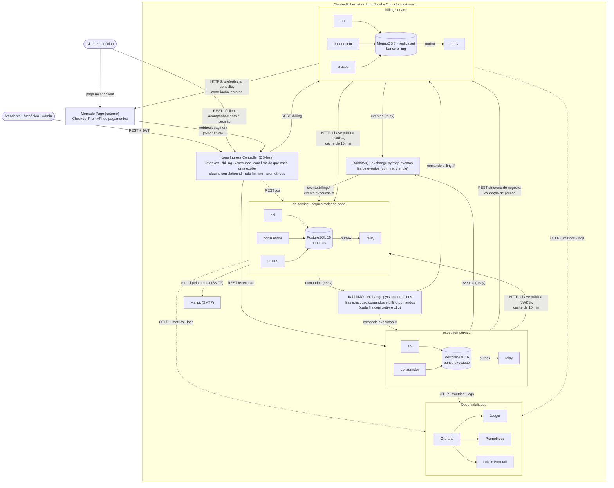

- Linhas cheias são REST, HTTP e mensagens; pontilhadas, telemetria. Comandos saem do relay do OS para o consumidor do participante, e eventos fazem o caminho inverso. Os processos api, consumidor e `prazos` gravam estado e mensagem de saída na mesma transação (outbox), e o relay publica depois.
- A única chamada síncrona de negócio entre serviços é a validação de preços da Execução no Billing. A outra dependência HTTP é a chave pública do JWT: Billing e Execução leem o JWKS do OS, com cache de 10 minutos ([ADR-038](../../adr/fase4/038-borda-e-comunicacao-sincrona.md), [ADR-039](../../adr/fase4/039-autenticacao-entre-servicos.md)).
- O cliente não tem login: usa o acompanhamento público e o link assinado e paga no checkout do Mercado Pago, cujo webhook entra pelo Kong.
- O `platform` traz RabbitMQ, Kong, observabilidade, Mailpit e metrics-server. A definição do RabbitMQ que ele carrega declara exchanges, filas e bindings, e os serviços só conferem a topologia ([seção 5.1](#51-topologia)). Banco, manifestos, Ingress e pipeline ficam no repositório de cada serviço.

## 3. Divisão dos serviços

No formato da Aula 01 de Microsserviços I (serviço, operações, integrações), com o banco. "Execution Service" é o nome do serviço; "Execução", o contexto que ele hospeda.

| Serviço | Operações | Integrações | Banco |
|---|---|---|---|
| [OS Service](https://github.com/fiap-postech-sw-architecture/postech-sw-arch-p4-os-service) | Abrir a OS; atualizar o status pelas respostas da saga; consultar status, histórico, etapa e tempo médio por status; cancelar antes do pivot; registrar a entrega; clientes, veículos e consentimentos da LGPD (Lei Geral de Proteção de Dados); login interno e emissão de JWT; orquestrar a saga; notificar o cliente por e-mail, inclusive com o orçamento | Envia comandos à Execução e ao Billing e consome os eventos dos dois; publica o JWKS; e-mail pelo relay (SMTP) | PostgreSQL 16 |
| [Billing Service](https://github.com/fiap-postech-sw-architecture/postech-sw-arch-p4-billing-service) | Preços de serviços e peças; validação de códigos; orçamento com preços congelados, link de decisão e validade; decisão do cliente (link ou atendente); solicitação, confirmação, recusa, expiração, cancelamento e estorno de pagamento; conciliação com o Mercado Pago | Mercado Pago (Checkout Pro, consulta, estorno, webhook); atende a Execução por REST; lê o JWKS do OS; comandos e eventos | MongoDB 7 |
| [Execution Service](https://github.com/fiap-postech-sw-architecture/postech-sw-arch-p4-execution-service) | Fila de diagnóstico, com o retrato do veículo; reserva, liberação e baixa de peças; fila de execução (agendamento, início, finalização); estoque físico | Valida preços no Billing por REST; lê o JWKS do OS; comandos e eventos | PostgreSQL 16 |

Justificativa resumida (detalhe no [ADR-034](../../adr/fase4/034-decomposicao-em-microsservicos.md)):

- Os contextos do p3 ([ADR-007](https://github.com/fiap-postech-sw-architecture/postech-sw-arch-p3/blob/main/docs/arquitetura/adr/007-organizacao-contextos-delimitados.md)) vão inteiros para o serviço cuja capacidade sustentam, com duas exceções. O contexto Ordem de Serviço misturava atendimento, orçamento e diagnóstico com execução e se reparte entre os três serviços; a peça vira dois modelos ligados pelo `sku`, o código de estoque, com preço no Billing e quantidade na Execução.
- Clientes, veículos e usuários ficam no OS, o único a falar com o cliente: o Billing gera o orçamento e o link de decisão, e o e-mail sai do OS quando chega `OrcamentoGerado`. Um serviço próprio de clientes e identidade poria uma chamada síncrona em toda abertura de OS, o "monolito distribuído" da Aula 01 de Microsserviços I; o ADR-034 discute essa alternativa e o custo de concentrar tanto no OS.
- A base técnica do p3 (entidades, `Dinheiro`, unit of work, outbox, logging, métricas) é copiada em cada serviço, sem pacote compartilhado, para manter deploy e versão independentes.
- Banco compartilhado "trata-se de um anti-pattern" (Microsserviços I, Aula 05), e cada serviço pode usar o tipo de banco de que precisa (Data Engineering, Aula 07). O Billing usa documentos porque orçamento e pagamento já eram JSONB no p3 e o exemplo de documento da disciplina é uma fatura com itens (Data Engineering, Aula 02); OS e Execução precisam de integridade relacional e lock pessimista ([ADR-037](../../adr/fase4/037-banco-por-servico.md)).

### 3.1 Mapa de contextos

As setas vão do fornecedor para o cliente (*upstream* → *downstream*), como no mapa de contextos do p3, e a classificação dos subdomínios segue a dele (Principal, Suporte, Genérico). Os participantes fornecem capacidades ao orquestrador, que é o cliente na relação *Customer-Supplier*. Os contratos de mensagem são a linguagem publicada (*Published Language*) entre os três serviços, e a validação de preços é um *Open Host Service* do Billing. Cada consumidor traduz o contrato alheio para o próprio modelo na infraestrutura, a camada anticorrupção (ACL, *anticorruption layer*), sem importar código de outro serviço.

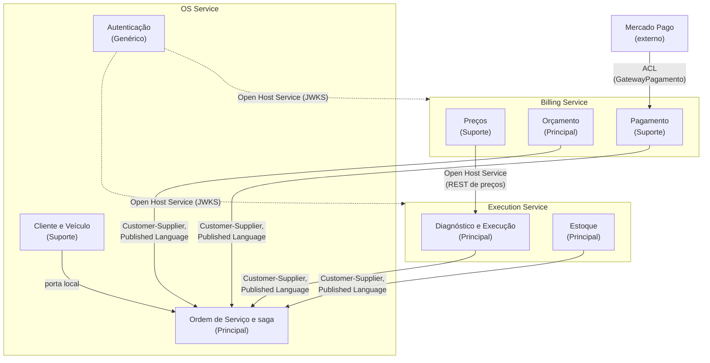

A ACL fica nos consumidores de mensagens dos três serviços, no cliente HTTP da validação de preços na Execução e no port `GatewayPagamento` do Billing; Cliente e Veículo segue ligado à Ordem de Serviço pela porta local do p3. A saga não é um contexto à parte: é um *process manager* da camada de aplicação do OS ([seção 4](#4-saga-de-atendimento)). Orçamento e decisão eram parte do contexto Principal do p3 e continuam no núcleo do negócio; preço e pagamento sustentam a cobrança.

## 4. Saga de atendimento

Uma instância por OS, com `saga_id = ordem_id`, que também é o `correlation_id` das mensagens. A saga é um *process manager* da camada de aplicação do OS Service, persistido como agregado próprio na tabela `sagas`, no mesmo PostgreSQL da outbox. OS e saga mudam na mesma transação: etapa e status não podem divergir, e a mudança de etapa e o comando seguinte entram no mesmo commit.

Por que orquestração: a saga tem nove passos (T1 a T9) em três serviços, mais a entrega local (T10), com esperas humanas, um provedor externo e seis compensações, e a Aula 02 de SAGA Pattern cita Richardson: "a estratégia de coreografia é mais recomendada para SAGAS simples" (p. 12). Em coreografia, os passos ficariam espalhados nos três serviços, sem um lugar que diga em que etapa a OS está, e prazos, ordem das compensações e pivot exigiriam que cada serviço assinasse eventos dos outros dois, com risco de ciclo (Aula 02, p. 7-8). As alternativas e o lugar do orquestrador estão no [ADR-035](../../adr/fase4/035-saga-orquestrada.md).

### 4.1 Etapas da instância

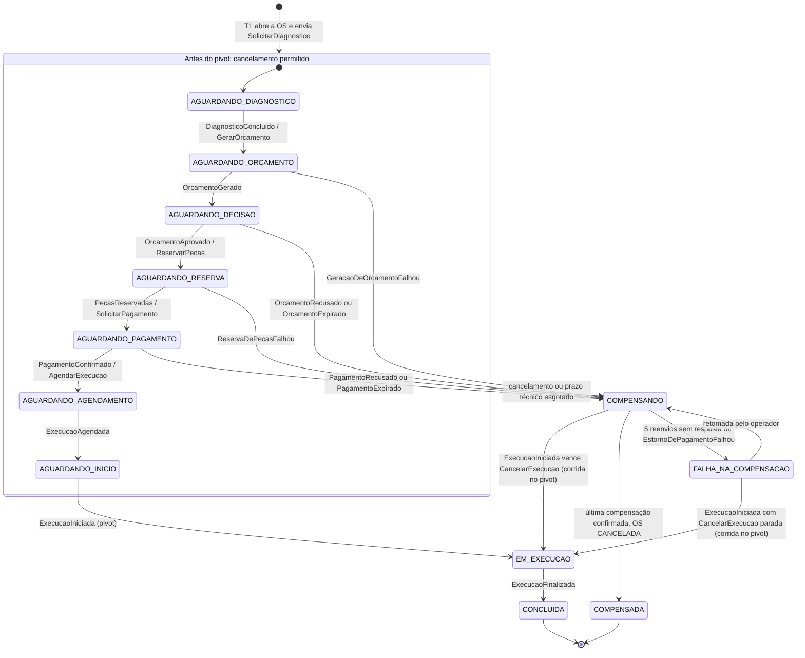

Etapa e status são campos diferentes: a etapa é o estado interno do orquestrador, e o status é o que cliente e atendente veem na OS. Dois nomes coincidem (`AGUARDANDO_PAGAMENTO` e `EM_EXECUCAO`); nesta RFC, nos logs e nas métricas (label `etapa`), "etapa" é sempre a da saga. "Técnico" é a espera por resposta automática, com prazo no orquestrador ([seção 4.6](#46-prazos)).

| Etapa | Status da OS | A saga espera |
|---|---|---|
| `AGUARDANDO_DIAGNOSTICO` | `RECEBIDA`; `EM_DIAGNOSTICO` com `DiagnosticoIniciado` | mecânico |
| `AGUARDANDO_ORCAMENTO` | `EM_DIAGNOSTICO` | Billing (técnico) |
| `AGUARDANDO_DECISAO` | `AGUARDANDO_APROVACAO` | cliente, com validade no Billing |
| `AGUARDANDO_RESERVA` | `AGUARDANDO_APROVACAO` | Execução (técnico) |
| `AGUARDANDO_PAGAMENTO` | `AGUARDANDO_PAGAMENTO` | Billing até `PagamentoSolicitado` (técnico); depois o cliente, com validade no Billing |
| `AGUARDANDO_AGENDAMENTO` | `AGUARDANDO_EXECUCAO` | Execução (técnico) |
| `AGUARDANDO_INICIO` | `AGUARDANDO_EXECUCAO` | mecânico |
| `EM_EXECUCAO` | `EM_EXECUCAO` | mecânico |
| `CONCLUIDA` | `FINALIZADA`; `ENTREGUE` no T10, fora da saga | ninguém |
| `COMPENSANDO`, `FALHA_NA_COMPENSACAO` | mantém o anterior; o histórico mostra a compensação | participantes; operador, por alerta |
| `COMPENSADA` | `CANCELADA`, com motivo | ninguém |

A OS vai a `AGUARDANDO_EXECUCAO` já no `PagamentoConfirmado`: o agendamento é técnico e não falha por regra de negócio, e quem acabou de pagar não vê "aguardando pagamento".

### 4.2 Status da OS

A `MaquinaDeStatus` do p3 continua como guarda, com lista de transições permitidas, dois status novos e um a menos:

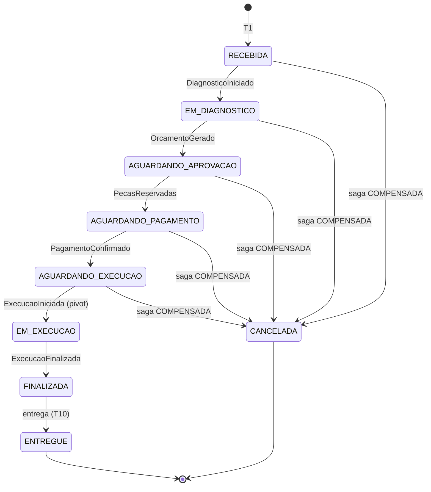

A OS só chega a `CANCELADA` a partir de status anteriores a `EM_EXECUCAO`, quando a compensação termina (RN-029). `AGUARDANDO_PAGAMENTO` e `AGUARDANDO_EXECUCAO` são novos; `AGUARDANDO_APROVACAO_COMPLEMENTAR` sai com o orçamento complementar.

### 4.3 Passos, compensações e tipos

| Passo | Dono | Comando | Sucesso | Falha | Compensação | Tipo |
|---|---|---|---|---|---|---|
| T1 abrir OS | OS (local) | nenhum | OS `RECEBIDA` | nenhuma | OS `CANCELADA` | compensável |
| T2 diagnóstico | Execução | `SolicitarDiagnostico` | `DiagnosticoIniciado`, `DiagnosticoConcluido` | nenhuma | `DescartarDiagnostico` | compensável |
| T3 orçamento | Billing | `GerarOrcamento` | `OrcamentoGerado` | `GeracaoDeOrcamentoFalhou` | `CancelarOrcamento` | compensável |
| T4 decisão do cliente | Billing | nenhum (espera humana) | `OrcamentoAprovado` | `OrcamentoRecusado`, `OrcamentoExpirado` | nenhuma | desfecho de negócio |
| T5 reserva de peças | Execução | `ReservarPecas` | `PecasReservadas` | `ReservaDePecasFalhou` | `LiberarReserva` | compensável |
| T6 pagamento | Billing e Mercado Pago | `SolicitarPagamento` | `PagamentoSolicitado`, `PagamentoConfirmado` | `PagamentoRecusado`, `PagamentoExpirado` | `EstornarPagamento` (cancela a cobrança em aberto ou estorna a confirmada) | compensável |
| T7 agendamento | Execução | `AgendarExecucao` | `ExecucaoAgendada` | nenhuma | `CancelarExecucao` | compensável |
| T8 início da execução | Execução (mecânico) | nenhum | `ExecucaoIniciada` | nenhuma | nenhuma | pivot |
| T9 finalização | Execução | nenhum | `ExecucaoFinalizada` (baixa do estoque) | nenhuma | nenhuma | reprocessável |
| T10 entrega | OS (local, fora da saga) | nenhum | OS `ENTREGUE` | nenhuma | nenhuma | reprocessável |

"Nenhuma" na coluna Falha quer dizer sem evento de falha de negócio. Falha técnica é coberta pelo prazo técnico, quando o passo tem resposta automática, ou pela DLQ (fila de mensagens mortas) com alerta. T2 não tem resposta automática: `SolicitarDiagnostico` só põe a OS na fila do mecânico. Se esse comando não for processado, cai na DLQ e dispara o alerta, e por isso `DescartarDiagnostico` entra em toda compensação.

Compensável, pivot e reprocessável (*retriable*) são termos de Richardson, referência da disciplina; as aulas falam em transação local e operação compensatória.

### 4.4 Pivot e plano de compensação

O pivot é o início da execução física (T8). Antes dele, `POST /api/v1/ordens-de-servico/{id}/cancelamento` responde 202 com a etapa da saga e dispara a compensação; depois, responde 409. O pagamento segue compensável por estorno, o "registro reverso" da Aula 01 de SAGA Pattern. A reserva vem antes do pagamento, como no exemplo da mesma aula (reservar antes de cobrar), e a falta de peça aparece antes da cobrança, sem estorno (RN-026).

As compensações rodam em sequência, cada uma esperando a resposta, nesta ordem: `CancelarExecucao` → `EstornarPagamento` → `LiberarReserva` → `CancelarOrcamento` → `DescartarDiagnostico` → OS `CANCELADA` → saga `COMPENSADA`. O plano leva os passos concluídos (`passos_concluidos`) e o passo em voo, cujo comando saiu sem resposta e pode ainda estar na fila ou em retry; o efeito dele também precisa ser desfeito. Orçamento recusado ou expirado não recebe `CancelarOrcamento`, e pagamento recusado ou expirado não recebe `EstornarPagamento`.

| Etapa | Gatilho | Compensações, em ordem |
|---|---|---|
| `AGUARDANDO_DIAGNOSTICO` | cancelamento | `DescartarDiagnostico` |
| `AGUARDANDO_ORCAMENTO` | `GeracaoDeOrcamentoFalhou` | `DescartarDiagnostico` |
| `AGUARDANDO_ORCAMENTO` | cancelamento ou prazo técnico esgotado, com `GerarOrcamento` em voo | `CancelarOrcamento`, `DescartarDiagnostico` |
| `AGUARDANDO_DECISAO` | `OrcamentoRecusado` ou `OrcamentoExpirado` | `DescartarDiagnostico` |
| `AGUARDANDO_DECISAO` | cancelamento | `CancelarOrcamento`, `DescartarDiagnostico` |
| `AGUARDANDO_RESERVA` | `ReservaDePecasFalhou` | `CancelarOrcamento`, `DescartarDiagnostico` |
| `AGUARDANDO_RESERVA` | cancelamento ou prazo técnico esgotado, com `ReservarPecas` em voo | `LiberarReserva`, `CancelarOrcamento`, `DescartarDiagnostico` |
| `AGUARDANDO_PAGAMENTO` | `PagamentoRecusado` ou `PagamentoExpirado` | `LiberarReserva`, `CancelarOrcamento`, `DescartarDiagnostico` |
| `AGUARDANDO_PAGAMENTO` | cancelamento (antes de `PagamentoSolicitado` ou com o checkout aberto) ou prazo técnico esgotado | `EstornarPagamento`, `LiberarReserva`, `CancelarOrcamento`, `DescartarDiagnostico` |
| `AGUARDANDO_AGENDAMENTO` | cancelamento ou prazo técnico esgotado, com `AgendarExecucao` em voo | `CancelarExecucao`, `EstornarPagamento`, `LiberarReserva`, `CancelarOrcamento`, `DescartarDiagnostico` |
| `AGUARDANDO_INICIO` | cancelamento | `CancelarExecucao`, `EstornarPagamento`, `LiberarReserva`, `CancelarOrcamento`, `DescartarDiagnostico` |
| `EM_EXECUCAO` e depois | cancelamento | nenhuma: 409 `TRANSICAO_STATUS_INVALIDA` (RN-029; [seção 6.1](#61-rotas-por-serviço)) |

As esperas humanas (`AGUARDANDO_DIAGNOSTICO`, `AGUARDANDO_DECISAO`, `AGUARDANDO_INICIO` e o checkout aberto em `AGUARDANDO_PAGAMENTO`) não têm prazo técnico; a validade das esperas do cliente é do Billing (seção 4.6).

`EstornarPagamento` compensa o T6 em qualquer estado do pagamento: em `SOLICITADO`, o Billing cancela a cobrança, o checkout deixa de valer, e a resposta é `PagamentoCancelado`; em `CONFIRMADO`, estorna no Mercado Pago e responde `PagamentoEstornado`; já cancelado ou estornado, republica o desfecho. Aprovação que chega depois do cancelamento, da expiração ou da recusa é estornada pelo próprio Billing, com motivo `pagamento_apos_encerramento`, e o orquestrador ignora `PagamentoConfirmado` em `COMPENSANDO` e `COMPENSADA` ([ADR-040](../../adr/fase4/040-integracao-mercado-pago.md)).

A resposta ao `EstornarPagamento` se reconhece pelo `causation_id` ([seção 5.2](#52-envelope)). A instância guarda o `id` de cada envio do comando em voo, o original e os reenvios. Em `COMPENSANDO`, com o `EstornarPagamento` em voo, a resposta a ele é o `PagamentoCancelado`, o `PagamentoEstornado` (com qualquer `motivo`) ou o `EstornoDePagamentoFalhou` cujo `causation_id` é um desses ids: os dois primeiros concluem a compensação, e o terceiro leva a saga a `FALHA_NA_COMPENSACAO` ([seção 4.7](#47-falha-na-compensação-e-retomada)). O `PagamentoEstornado` do estorno automático leva o `id` do `SolicitarPagamento` e, em qualquer etapa, só atualiza o resumo do pagamento na OS, se houver. Nem o tipo nem o `motivo` bastariam: o estorno automático também chega como `PagamentoEstornado`, inclusive com a compensação pendente, e o Billing responde ao comando com `pagamento_apos_encerramento` quando a aprovação tardia já tinha sido estornada.

### 4.5 Contramedidas de isolamento

A saga não tem o "I" do ACID (SAGA Pattern, Aula 03). Contramedidas, detalhadas no ADR-035:

- Reler o valor (*reread value*): toda transição da OS e da instância é condicionada à versão lida (bloqueio otimista), e o perdedor de uma corrida, como aprovação contra cancelamento, relê e é reavaliado.
- Visão pessimista (*pessimistic view*): a ordem das compensações tira a OS da fila antes de estornar.
- Etapas explícitas: as etapas `AGUARDANDO_*` e a `MaquinaDeStatus` do p3 recusam comandos incompatíveis (o *semantic lock* de Richardson, fora das aulas).
- Evento fora de ordem: o de etapa já passada, ou de saga encerrada, é ignorado com log; o de etapa à frente, como `ExecucaoIniciada` antes de `ExecucaoAgendada`, volta pela `.retry` até a saga alcançá-lo e, esgotadas as tentativas, vai para a DLQ com alerta. Dentro da mesma etapa vale o mesmo critério: `DiagnosticoConcluido` com a OS ainda `RECEBIDA` (antes do `DiagnosticoIniciado`) e `PagamentoConfirmado`, `PagamentoRecusado` ou `PagamentoExpirado` antes do `PagamentoSolicitado` também são adiantados e voltam pelo retry do consumidor; `DiagnosticoIniciado` com a OS já `EM_DIAGNOSTICO` e `PagamentoSolicitado` repetido são ignorados.
- Comando repetido, pelo mesmo `id` ou pela mesma chave de negócio (o reenvio do orquestrador leva `id` novo), não repete o efeito e publica de novo a resposta registrada.
- Lápide: a compensação que chega antes do comando original cria o registro já no estado final (seção 7.1); o comando atrasado, ao chegar, encontra esse registro pelo índice único por OS e é descartado.
- Corrida no pivot: decide a transação da Execução. Se o início vencer, o `ExecucaoIniciada` que chega com só `CancelarExecucao` pendente devolve a saga a `EM_EXECUCAO`, o pedido de cancelamento guardado na OS é descartado, e o histórico registra "cancelamento recusado: execução já iniciada". Vale também em `FALHA_NA_COMPENSACAO` quando a compensação parada é o `CancelarExecucao`: nada foi desfeito, e a Execução não cancela execução iniciada, então ignorar o evento deixaria a OS parada, com uma retomada que nunca concluiria.
- Reserva tudo ou nada, com o lock pessimista do p3 (RN-012, [ADR-008](https://github.com/fiap-postech-sw-architecture/postech-sw-arch-p3/blob/main/docs/arquitetura/adr/008-bloqueio-pessimista-estoque.md)) sem o `NOWAIT`: `SELECT ... FOR UPDATE` bloqueante, limitado por `lock_timeout`, com os itens travados em ordem de `sku`, para que duas reservas nunca travem em ordem oposta. Quem perde a disputa pela última unidade recebe `ReservaDePecasFalhou`, e não um erro de lock.

### 4.6 Prazos

- Espera humana com validade: quem expira é o dono do dado. O processo `prazos` do Billing expira o orçamento (`ORCAMENTO_VALIDADE_HORAS`, padrão 72) e o pagamento (`PAGAMENTO_VALIDADE_MINUTOS`, padrão 60) com atualização condicional por status: só vence o orçamento ainda `PENDENTE` e o pagamento ainda `SOLICITADO`, e assim não disputa com a decisão do cliente nem com o webhook.
- Conciliação: a cada 30 segundos, o mesmo processo consulta no Mercado Pago os pagamentos em `SOLICITADO`, o que cobre webhook perdido e prova a integração real sem URL pública, no kind local com `MP_MODE=mercadopago` (ADR-040).
- Diagnóstico e execução dependem do mecânico, sem prazo automático: a OS fica visível nas filas e pode ser cancelada antes do pivot.
- Espera técnica: sem resposta em `SAGA_PRAZO_RESPOSTA_SEGUNDOS` (padrão 120), o processo `prazos` do OS reenvia o comando, com `id` novo e a mesma chave de negócio, uma vez a cada prazo vencido, até `SAGA_MAX_REENVIOS` reenvios (padrão 5); depois inicia a compensação, com o passo em voo no plano. Com os padrões, o comando original e os cinco reenvios cobrem 12 minutos.
- O prazo só corre depois que o comando sai da outbox: vence `SAGA_PRAZO_RESPOSTA_SEGUNDOS` depois do `entregue_em` da linha, e o comando que ainda está pendente, com o relay ou o broker fora, não gasta reenvio.
- Pausa: a cada ciclo, o `prazos` confere a fila `os.eventos` por declaração passiva. Sem consumidor nela (o consumidor do OS fora) ou com o broker fora do ar, o ciclo não reenvia nem esgota prazo, só registra em log, porque a resposta pode estar esperando na fila; quando a fila volta a ter consumidor, a saga segue de onde estava.
- A janela de reenvio (12 minutos com os padrões) fica maior que a soma dos atrasos de retry do consumidor (1 + 5 + 15 + 60 + 300 = 381 s, [seção 10.3](#103-parâmetros-e-variáveis-de-ambiente)), e um teste da configuração do OS Service confere essa relação: com os atrasos nominais, a saga não desiste de um passo cujo comando o participante ainda está tentando processar.
- Na compensação vale a mesma regra para cada comando, e, esgotados os reenvios, a saga vai a `FALHA_NA_COMPENSACAO`. O contador `reenvios` da instância recomeça a cada comando novo, inclusive ao entrar em `COMPENSANDO`.
- Saga parada: o alerta da [seção 9](#9-observabilidade) acusa instância com prazo técnico vencido e não tratado, inclusive durante a pausa (gauge `pytstop_saga_prazo_vencido_segundos`), ou em `FALHA_NA_COMPENSACAO`; o gauge `pytstop_saga_etapa_mais_antiga_segundos{etapa}` dá a idade da instância mais antiga em cada etapa.

### 4.7 Falha na compensação e retomada

Uma compensação que esgota os reenvios, ou um `EstornoDePagamentoFalhou`, leva a saga a `FALHA_NA_COMPENSACAO`, e a instância registra a falha: `reenvios_esgotados` ou `estorno_recusado`. A sequência para nesse ponto: as compensações seguintes não são enviadas, e o operador encontra cada recurso como a compensação o deixou. Depois de um `EstornoDePagamentoFalhou` num cancelamento pós-pagamento, por exemplo:

| Recurso | Estado |
|---|---|
| Execução | `CANCELADA`, fora da fila (`CancelarExecucao` concluída) |
| Pagamento | `CONFIRMADO`, sem estorno |
| Reserva | `ATIVA`, com as peças separadas |
| Orçamento | `APROVADO` |
| Diagnóstico | `CONCLUIDO` |
| OS | status anterior (`AGUARDANDO_EXECUCAO`); etapa `FALHA_NA_COMPENSACAO` no `GET /api/v1/ordens-de-servico/{id}`, e o histórico registra o estorno recusado |

O alerta "Saga parada" dispara, e o operador segue o [runbook da saga](../../../operacao/runbook-saga.md), em `docs/operacao/` do `platform`:

1. consulta `GET /api/v1/sagas/{ordem_id}`, que mostra a compensação pendente, o motivo e a falha;
2. resolve a causa: no exemplo, faz o estorno pelo painel do Mercado Pago; se uma mensagem estiver numa `.dlq`, devolve-a à fila com `make -C platform redrive FILA=<fila>`;
3. retoma com `POST /api/v1/sagas/{ordem_id}/compensacao` (admin), que reenvia a compensação pendente e segue o plano até `COMPENSADA`. Como o Billing consulta o pagamento antes de estornar, o estorno feito no painel é reconhecido e respondido com `PagamentoEstornado`, sem nova chamada ao provedor.

Resposta que chega atrasada em `FALHA_NA_COMPENSACAO` é ignorada, como todo evento fora da etapa: quem retoma é o operador, e o participante responde ao reenvio com o desfecho registrado. A exceção é o `ExecucaoIniciada` com o `CancelarExecucao` parado, que devolve a saga a `EM_EXECUCAO` ([seção 4.5](#45-contramedidas-de-isolamento)).

### 4.8 Sequências

Setas de ponta aberta são mensagens assíncronas (outbox, relay, exchange, fila, consumidor); chamadas REST de fora do cluster passam pelo Kong, omitido.

#### (a) Caminho feliz até a entrega

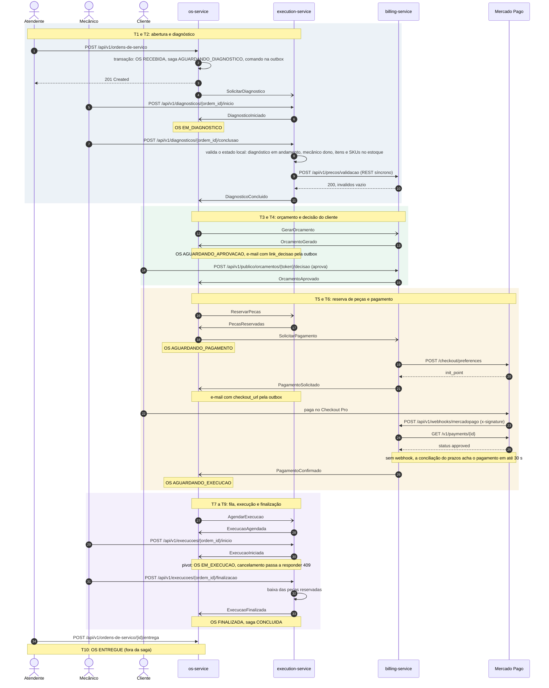

#### (b) Orçamento recusado ou expirado

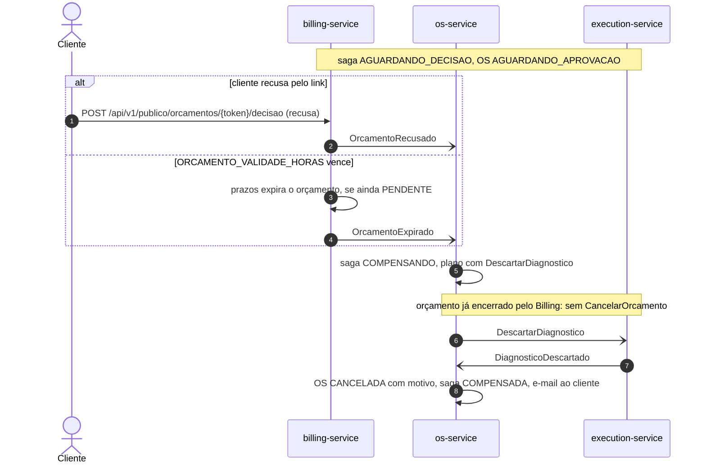

#### (c) Falta de peça na reserva

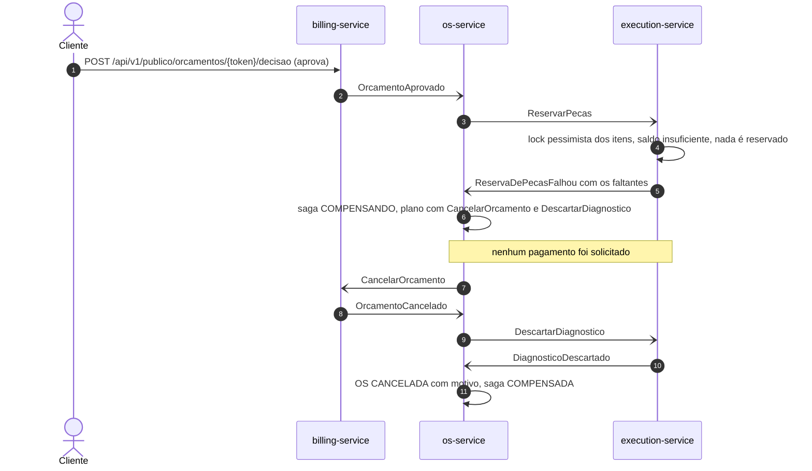

#### (d) Cancelamento depois do pagamento, com estorno

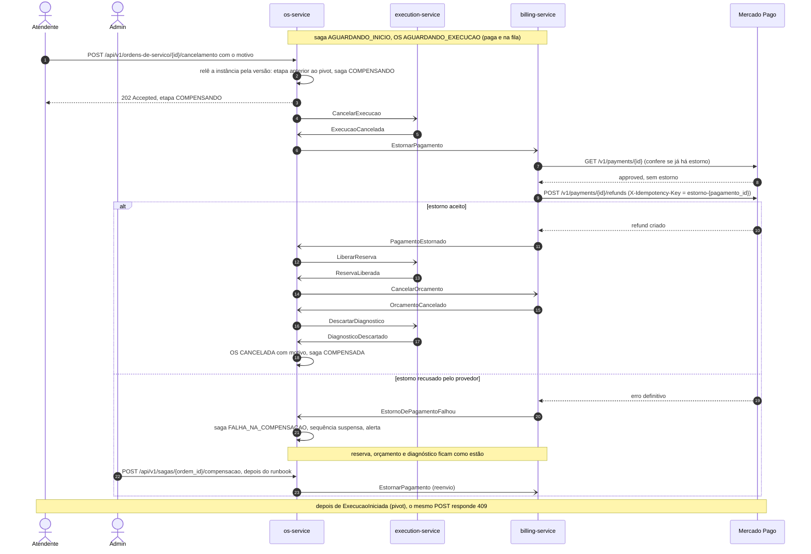

Pagamento recusado ou expirado segue o trecho a partir de `LiberarReserva`, sem estorno.

## 5. Mensageria

RabbitMQ ([ADR-036](../../adr/fase4/036-mensageria-rabbitmq.md)), citado no enunciado e usado no projeto prático de SAGA Pattern (Aulas 04 e 05).

### 5.1 Topologia

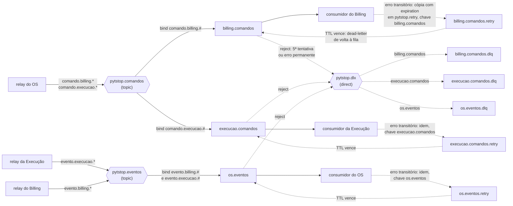

- Routing keys `comando.<servico>.<acao>` e `evento.<servico>.<fato>`. Participantes só consomem comandos e só o orquestrador consome eventos, sem os ciclos que a Aula 02 de SAGA aponta na coreografia.
- Fonte única: o `definitions.json` que o `platform` carrega no RabbitMQ declara os exchanges, as nove filas (`X`, `X.retry` e `X.dlq` para cada uma das três), os bindings e as `policies` de TTL (*time to live*), dead-letter e overflow. A policy vale também para fila que já existe, e por isso a topologia converge quando o broker reinicia. Os serviços só fazem declaração passiva, que no RabbitMQ 4.3.6 também exige permissão sobre o recurso: cada serviço confere só as filas e os exchanges em que lê ou escreve e, se a fila ainda não existir, espera com backoff, sem redeclarar argumentos. Assim, nenhuma mensagem publicada com `mandatory` volta por falta de fila na primeira subida.
- Filas duráveis do tipo quorum, com dead-lettering *at-least-once*. A `X.retry` não tem consumidor: o consumidor publica a cópia no exchange de tópico `pytstop.retry`, com a routing key `X`, e o dead-letter da `X.retry` a devolve a `X` quando o TTL vence. A `X.dlq` guarda a mensagem por 7 dias.
- Permissões: um usuário do RabbitMQ por serviço (`os`, `billing`, `execucao`), mais um `admin` para a operação, nenhum com permissão de configure. A permissão de tópico limita as routing keys: o `os` só publica `comando.*`, o `billing` só `evento.billing.*` e a `execucao` só `evento.execucao.*`; cada um lê só a própria fila e, no `pytstop.retry`, só usa a chave dela. Os usuários nascem de um script de inicialização a partir de Secret, fora do `definitions.json`.
- Origem conferida: o publicador preenche a propriedade AMQP (*Advanced Message Queuing Protocol*) `user_id`, que o broker confere contra o usuário da conexão. O consumidor confere o `user_id` contra o produtor que o catálogo da [seção 5.3](#53-catálogo-de-comandos-e-eventos) associa ao `tipo` da mensagem, e divergência é erro permanente (DLQ). A cópia de retry leva o `user_id` do próprio consumidor, que a republicou, e só passa com esse usuário quando `x-tentativa` é maior que zero.

### 5.2 Envelope

O comando que abre o T3, publicado em `pytstop.comandos` com a routing key `comando.billing.gerar_orcamento`:

```json
{
  "id": "8f6b1c2e-4d3a-4e8b-9f1a-2b7c5d9e0a13",
  "tipo": "GerarOrcamento",
  "versao": 1,
  "origem": "os-service",
  "correlation_id": "3c9a7e10-5b2f-4f6d-8a41-0e2d9b7c6f55",
  "causation_id": "a1d4e7b2-9c3f-4b8a-b6e5-7f0c2d1e9a84",
  "ocorrido_em": "2026-10-06T14:32:05Z",
  "dados": {
    "ordem_id": "3c9a7e10-5b2f-4f6d-8a41-0e2d9b7c6f55",
    "itens": [
      {"tipo": "servico", "codigo": "SRV-TROCA-OLEO", "quantidade": 1},
      {"tipo": "peca", "codigo": "PEC-OLEO-5W30", "quantidade": 4}
    ]
  }
}
```

`causation_id` é o `id` do `DiagnosticoConcluido` que gerou o comando. A regra vale para todas as mensagens:

- a resposta a um comando, inclusive o desfecho republicado para comando repetido, leva o `id` do comando que ela responde;
- o evento espontâneo (decisão do cliente, webhook ou conciliação, prazo do Billing, ação do mecânico) leva o `id` do comando que abriu o fluxo, que o participante guarda com o registro: `SolicitarDiagnostico` no início e na conclusão do diagnóstico, `GerarOrcamento` na decisão e na expiração do orçamento, `SolicitarPagamento` na confirmação, recusa, expiração e no estorno automático do pagamento, `AgendarExecucao` no início e no fim da execução;
- o comando do orquestrador leva o `id` do evento que o disparou, ou `null` quando a causa é uma requisição HTTP (abertura, cancelamento, retomada, eliminação de dados) ou o prazo técnico (reenvio ou esgotamento).

Evento nunca leva `null`: é pelo `causation_id` que o orquestrador reconhece a resposta ao comando em voo ([seção 4.4](#44-pivot-e-plano-de-compensação)). Propriedades AMQP: `message_id` (o `id`), `correlation_id`, `type` (o `tipo`), `user_id` (o usuário do serviço), `content_type=application/json`, `delivery_mode=2` e headers `traceparent`/`tracestate` (W3C Trace Context, como `00-4bf92f3577b34da6a3ce929d0e0e4736-00f067aa0ba902b7-01`) e `x-tentativa`; metadados no cabeçalho e comando no corpo, como na Aula 02 de Microsserviços I.

### 5.3 Catálogo de comandos e eventos

A routing key deriva do nome, em snake_case: `GerarOrcamento` → `comando.billing.gerar_orcamento`; `GeracaoDeOrcamentoFalhou` → `evento.billing.geracao_de_orcamento_falhou`.

| Mensagem | Emissor → consumidor | Campos de `dados` |
|---|---|---|
| `SolicitarDiagnostico` | OS → Execução | `ordem_id`, `veiculo_id`, `veiculo{placa, marca, modelo, ano}`, `descricao_problema` |
| `DiagnosticoIniciado` | Execução → OS | `ordem_id`, `mecanico_id`, `iniciado_em` |
| `DiagnosticoConcluido` | Execução → OS | `ordem_id`, `itens[{tipo: servico ou peca, codigo, quantidade}]`, `observacoes`, `concluido_em` |
| `DescartarDiagnostico` | OS → Execução | `ordem_id`, `motivo` |
| `DiagnosticoDescartado` | Execução → OS | `ordem_id` |
| `GerarOrcamento` | OS → Billing | `ordem_id`, `itens[]` |
| `OrcamentoGerado` | Billing → OS | `ordem_id`, `orcamento_id`, `linhas[{codigo, descricao, quantidade, preco_unitario, subtotal}]`, `total`, `moeda`, `valido_ate`, `link_decisao` |
| `GeracaoDeOrcamentoFalhou` | Billing → OS | `ordem_id`, `motivo`, `codigos_invalidos[]` |
| `OrcamentoAprovado`, `OrcamentoRecusado` | Billing → OS | `ordem_id`, `orcamento_id`, `decidido_em`, `canal: link ou atendente`, `decidido_por` (`sub` do atendente, só com `canal=atendente`) |
| `OrcamentoExpirado` | Billing → OS | `ordem_id`, `orcamento_id` |
| `CancelarOrcamento` | OS → Billing | `ordem_id`, `orcamento_id` (quando já conhecido), `motivo` |
| `OrcamentoCancelado` | Billing → OS | `ordem_id`, `orcamento_id` |
| `ReservarPecas` | OS → Execução | `ordem_id`, `pecas[{sku, quantidade}]` (lista vazia vale) |
| `PecasReservadas` | Execução → OS | `ordem_id`, `reserva_id` |
| `ReservaDePecasFalhou` | Execução → OS | `ordem_id`, `faltantes[{sku, solicitado, disponivel}]` |
| `LiberarReserva` | OS → Execução | `ordem_id`, `motivo` |
| `ReservaLiberada` | Execução → OS | `ordem_id` |
| `SolicitarPagamento` | OS → Billing | `ordem_id`, `orcamento_id` |
| `PagamentoSolicitado` | Billing → OS | `ordem_id`, `pagamento_id`, `valor`, `moeda`, `checkout_url`, `expira_em` |
| `PagamentoConfirmado` | Billing → OS | `ordem_id`, `pagamento_id`, `valor`, `moeda`, `confirmado_em`, `referencia_provedor` |
| `PagamentoRecusado`, `PagamentoExpirado` | Billing → OS | `ordem_id`, `pagamento_id`, `motivo` |
| `EstornarPagamento` | OS → Billing | `ordem_id`, `pagamento_id` (quando já conhecido), `motivo` |
| `PagamentoCancelado` | Billing → OS | `ordem_id`, `pagamento_id`, `cancelado_em` |
| `PagamentoEstornado` | Billing → OS | `ordem_id`, `pagamento_id`, `estornado_em`, `motivo: compensacao ou pagamento_apos_encerramento` |
| `EstornoDePagamentoFalhou` | Billing → OS | `ordem_id`, `pagamento_id`, `motivo` |
| `AgendarExecucao` | OS → Execução | `ordem_id`, `prioridade` (`normal` ou `alta`) |
| `ExecucaoAgendada` | Execução → OS | `ordem_id`, `posicao_na_fila` |
| `CancelarExecucao` | OS → Execução | `ordem_id`, `motivo` |
| `ExecucaoCancelada` | Execução → OS | `ordem_id` |
| `ExecucaoIniciada` | Execução → OS | `ordem_id`, `mecanico_id`, `iniciada_em` |
| `ExecucaoFinalizada` | Execução → OS | `ordem_id`, `finalizada_em`, `pecas_consumidas[{sku, quantidade}]` |
| `AnonimizarVeiculo` | OS → Execução, fora da saga e sem resposta | `veiculo_id` |

- Dinheiro trafega como string decimal (`"350.00"`), com até 10 dígitos inteiros e `moeda: "BRL"`, nunca em ponto flutuante. Quantidades vão de 1 a 1000 e as listas têm no máximo 50 itens.
- O `correlation_id` é o `ordem_id`, exceto em `AnonimizarVeiculo`, que não pertence a uma saga e leva o `veiculo_id`.
- `link_decisao` e `checkout_url` são URLs `http` ou `https` sem usuário embutido e carregam token: nunca vão para log nem para atributo de span.
- Para peça, o `codigo` de `itens[]` e de `linhas[]` é o `sku`; serviço usa o código da tabela de preços. Código de serviço e `sku` têm no máximo 50 caracteres nos três serviços e nos schemas de `contratos/`. O OS guarda os itens do `DiagnosticoConcluido` na instância da saga e monta `ReservarPecas` com os de tipo `peca`.
- O participante localiza o recurso a compensar pelo `ordem_id` quando o comando chega sem `orcamento_id` ou `pagamento_id`, o caso do passo em voo.
- Nos comandos de compensação, `motivo` é um código da enumeração de `pytstop_saga_compensacoes_total` ([seção 9](#9-observabilidade)); o texto que o atendente escreve no cancelamento fica só na OS ([seção 7.2](#72-os-service-postgresql-16)).
- `AgendarExecucao` sai sempre com `prioridade: normal` nesta fase: a OS não tem dado que justifique `alta`, e nenhuma rota escolhe a prioridade. O schema mantém `alta`, que a fila da Execução já atende antes de `normal` ([seção 7.3](#73-execution-service-postgresql-16)), para quando houver regra.
- Dados pessoais: as mensagens não levam nome, documento nem contato do cliente, e o OS, dono desses dados, envia as notificações. A exceção é a placa, no retrato do veículo que a Execução guarda para o mecânico achar o carro no pátio; na eliminação de dados da LGPD, o OS envia `AnonimizarVeiculo`, e a Execução troca a placa por `ANONIMIZADO:{veiculo_id}`, o marcador do p3 (`src/cliente_veiculo/dominio/placa_anonimizada.py`). Texto livre (`descricao_problema`, `observacoes`, `motivo`) nunca vai para log.

### 5.4 Garantias de entrega

Em todos os serviços, a outbox entra na transação do efeito: no PostgreSQL, o relay evolui o do p3 ([ADR-022](https://github.com/fiap-postech-sw-architecture/postech-sw-arch-p3/blob/main/docs/arquitetura/adr/fase2/022-transactional-outbox-relay.md)), com *publisher confirms*; no MongoDB, faz *polling* com *claim* atômico, e a transação multidocumento exige o replica set. O consumidor grava o `id` da mensagem em `mensagens_processadas` na transação do efeito (o "Idempotent Event Handler" da Aula 05 de Microsserviços I), e o retry segue a [seção 5.1](#51-topologia). A entrega é pelo menos uma vez, e o consumidor idempotente faz cada efeito acontecer uma vez (RN-028). O detalhe está no ADR-036; três regras completam o desenho:

- Comando repetido, pelo mesmo `id` ou pela mesma chave de negócio, republica a resposta registrada ([seção 4.5](#45-contramedidas-de-isolamento)).
- Mensagem esgotada vai para a `.dlq` e dispara alerta; corrigida a causa, volta à fila com `make -C platform redrive FILA=<fila>`, conforme o [runbook da saga](../../../operacao/runbook-saga.md) do `platform`.
- Retenção: as linhas entregues da outbox são apagadas depois de 7 dias e as de `mensagens_processadas` depois de 30, mais que os 7 dias em que uma mensagem pode esperar o redrive na `.dlq`.

### 5.5 Contratos

Em `contratos/` no `platform` ficam um documento AsyncAPI (citado na Aula 04 de Microsserviços I) e um JSON Schema por mensagem. Cada serviço copia os schemas que produz e consome, valida-os em teste de contrato no CI (Microsserviços II, Aula 04) e guarda em `contratos/ORIGEM` o SHA do `platform` de onde copiou; um teste compara o checksum da cópia com o `contratos/` do `platform` nesse SHA. Os fakes do BDD de componente montam mensagens validadas pelos mesmos schemas.

Versionamento: mudança aditiva (campo opcional novo) mantém a `versao`, porque o consumidor lê com tolerância (`additionalProperties` permitido). Mudança que quebra exige `versao` nova, com o consumidor implantado antes do produtor. `versao` desconhecida é erro permanente e vai para a DLQ.

## 6. APIs e borda

Cada serviço expõe REST sob `/api/v1`, valida o JWT localmente ([seção 8](#8-segurança)) e responde erros no envelope do p3, `{"erro": {"codigo", "mensagem", "id_requisicao"}}`, com mensagens em português. Toda falha de credencial responde 401 com a mesma mensagem, inclusive token sem `papel`, com `papel` desconhecido ou com `type` diferente de `access`; papel válido e insuficiente responde 403 ([ADR-039](../../adr/fase4/039-autenticacao-entre-servicos.md)). `GET /metrics` serve o Prometheus e fica fora da borda.

Sondas: a liveness é `GET /api/v1/saude`, sem dependências, como no p3; a readiness é `GET /api/v1/saude/pronto`, só com o banco, porque o broker fora do ar não deve tirar a API do Service: a outbox segura as mensagens. Relay, consumidor e `prazos` não têm HTTP de negócio: usam heartbeat em arquivo, como o relay do p3, e readiness pela conexão estabelecida.

### 6.1 Rotas por serviço

Papel exigido em cada rota: matriz única do [ADR-039](../../adr/fase4/039-autenticacao-entre-servicos.md).

| OS Service (`/os` no Kong) | Acesso |
|---|---|
| `POST /api/v1/autenticacao/login`, `/refresh`, `/logout` | público (login); JWT (refresh, logout) |
| `POST /api/v1/autenticacao/registrar` (cadastro de usuário interno) | JWT (admin) |
| `GET /.well-known/jwks.json`, lido por Billing e Execução | público |
| `/api/v1/clientes` (clientes, veículos e rotas da LGPD do p3; CPF ou CNPJ validado pelo dígito verificador, módulo 11, e placa validada antes de consultar; a eliminação de dados envia `AnonimizarVeiculo`) | JWT |
| `POST /api/v1/ordens-de-servico` (abre a OS e inicia a saga); `GET /api/v1/ordens-de-servico` (fila por prioridade de status) | JWT |
| `GET /api/v1/ordens-de-servico/{id}` (com resumo de orçamento, pagamento e etapa); `GET .../{id}/historico` (status, passos da saga, ator e motivo) | JWT |
| `GET /api/v1/ordens-de-servico/metricas` (tempo médio por status, calculado do histórico; RF-008 da fase 1) | JWT (admin) |
| `POST /api/v1/ordens-de-servico/{id}/cancelamento` (202 com a etapa; 409 depois do pivot; respostas abaixo); `POST .../{id}/entrega` (T10) | JWT |
| `GET /api/v1/sagas/{ordem_id}`; `POST /api/v1/sagas/{ordem_id}/compensacao` (retoma a compensação suspensa; respostas abaixo) | JWT (admin) |
| `POST /api/v1/publico/acompanhamento` (placa e documento no corpo, nunca na URL; documento validado pelo módulo 11 e placa pelo formato antes da consulta, com o mesmo 404 para dado inválido e para OS não encontrada) | sem JWT |

Respostas do cancelamento e da retomada, conforme a etapa da saga. O 409 usa o código `TRANSICAO_STATUS_INVALIDA`, o mesmo que o OS já devolve às transições de status recusadas, com mensagem própria:

| Pedido | Etapa | Resposta |
|---|---|---|
| cancelamento | `AGUARDANDO_*` (antes do pivot) | 202 com a OS e a etapa `COMPENSANDO`; a compensação começa ([seção 4.4](#44-pivot-e-plano-de-compensação)) |
| cancelamento, inclusive repetido | `COMPENSANDO` ou `FALHA_NA_COMPENSACAO` | 202 com a etapa atual, sem novo efeito: a compensação já começou |
| cancelamento | `EM_EXECUCAO` ou `CONCLUIDA` | 409, "Cancelamento recusado: execução já iniciada" (RN-029) |
| cancelamento | `COMPENSADA` | 409, "Ordem já cancelada" |
| retomada | `FALHA_NA_COMPENSACAO` | 202 com a etapa `COMPENSANDO`; a compensação pendente sai de novo, com `id` novo, prazo novo e contador de reenvios zerado ([seção 4.7](#47-falha-na-compensação-e-retomada)) |
| retomada | qualquer outra | 409 |

| Billing Service (`/billing`) | Acesso |
|---|---|
| CRUD de `/api/v1/precos/servicos` e `/api/v1/precos/pecas` | JWT |
| `POST /api/v1/precos/validacao` (devolve `invalidos[]`; a Execução repassa o token do mecânico) | JWT |
| `GET /api/v1/orcamentos/{id}`, `GET /api/v1/orcamentos?ordem_id=`, `POST /api/v1/orcamentos/{id}/decisao` (em nome do cliente, com `decidido_por`) | JWT |
| `GET /api/v1/publico/orcamentos/{token}`, `POST /api/v1/publico/orcamentos/{token}/decisao` | token do link de decisão |
| `GET /api/v1/pagamentos/{id}` | JWT |
| `POST /api/v1/webhooks/mercadopago` | `x-signature` |
| `GET /simulador/checkout/{pagamento_id}`, `POST /api/v1/simulador/pagamentos/{id}/aprovar` e `/recusar` (só com `MP_MODE=simulado`) | token HMAC (código de autenticação de mensagem com hash) do `checkout_url` |

| Execution Service (`/execucao`) | Acesso |
|---|---|
| `GET /api/v1/diagnosticos?status=`; `GET /api/v1/fila` (fila de execução com posição e o retrato do veículo) | JWT |
| `POST /api/v1/diagnosticos/{ordem_id}/inicio` e `/conclusao` (com os itens; valida o estado local e depois os preços no Billing) | JWT |
| `POST /api/v1/execucoes/{ordem_id}/inicio` (pivot) e `/finalizacao` (baixa das peças) | JWT |
| CRUD de `/api/v1/estoque` e ajuste de quantidade | JWT |

Na conclusão do diagnóstico, a Execução valida antes o estado local (diagnóstico em andamento, mecânico dono, itens e quantidades, peças com `sku` cadastrado no estoque) e só então chama o Billing, com timeout de 2 s, 2 retries com jitter e circuit breaker que abre com 5 falhas e fica aberto por 30 s (Microsserviços I, Aula 02). Com o circuito aberto, ou com 5xx e timeout depois dos retries, a conclusão responde 503 com mensagem acionável; um 4xx do Billing vira 502, sem retry. O detalhe está no ADR-038, e o cliente do Mercado Pago segue o mesmo envelope, com retry só em operação idempotente (ADR-040).

### 6.2 Borda Kong

Kong Ingress Controller em modo DB-less, o gateway das Aulas 03 e 04 de Microsserviços I; detalhe e tabela de limites no [ADR-038](../../adr/fase4/038-borda-e-comunicacao-sincrona.md). Cada serviço declara o próprio Ingress, que expõe só `/api/v1/*`, `/docs` e `/openapi.json`, mais dois caminhos públicos fora de `/api/v1`: o JWKS do OS e a página de checkout do simulador do Billing, que só existe com `MP_MODE=simulado`. `/metrics` e `/api/v1/admin/*` ficam fora da borda. Plugins:

- `correlation-id` com `generator: uuid`, porque o middleware do p3 só aceita `[A-Za-z0-9._=-]{1,128}` e descartaria o `uuid#counter` padrão;
- `rate-limiting` por IP do cliente, com política `local` e limites por rota, no lugar do slowapi com Redis do p3 ([ADR-023](https://github.com/fiap-postech-sw-architecture/postech-sw-arch-p3/blob/main/docs/arquitetura/adr/fase2/023-rate-limiter-storage-compartilhado.md));
- `prometheus` na borda.

### 6.3 Swagger e Postman

Cada serviço publica o Swagger UI em `/docs` e versiona em `docs/api/` o OpenAPI exportado e a collection Postman com exemplos; o README aponta os arquivos e traz um `curl` por endpoint. A collection do fluxo completo fica no `platform` e roda com newman (RNF-052).

## 7. Dados

O modelo completo de cada serviço, com todas as colunas, fica no `docs/arquitetura.md` do repositório dele, junto do código; esta seção fixa os estados e os campos de que a saga e os contratos dependem. Cada banco tem credencial própria, montada só nos pods do dono ([ADR-037](../../adr/fase4/037-banco-por-servico.md)).

### 7.1 Estados dos agregados

| Agregado (serviço) | Estados | Transições |
|---|---|---|
| Saga (OS) | etapas da [seção 4.1](#41-etapas-da-instância) | seção 4.1 |
| Ordem de serviço (OS) | status da [seção 4.2](#42-status-da-os) | seção 4.2 |
| Diagnóstico (Execução) | `AGUARDANDO`, `EM_ANDAMENTO`, `CONCLUIDO`, `DESCARTADO` | `SolicitarDiagnostico` cria em `AGUARDANDO`; o mecânico inicia e conclui; `DescartarDiagnostico` leva qualquer estado a `DESCARTADO` |
| Reserva (Execução) | `ATIVA`, `LIBERADA`, `CONSUMIDA`, `RECUSADA` | `ReservarPecas` cria `ATIVA`, tudo ou nada, ou `RECUSADA`, com os faltantes; `LiberarReserva` leva a `LIBERADA`; a finalização, a `CONSUMIDA` |
| Execução (Execução) | `AGUARDANDO`, `EM_EXECUCAO`, `FINALIZADA`, `CANCELADA` | `AgendarExecucao` cria em `AGUARDANDO`; o mecânico inicia (pivot) e finaliza; `CancelarExecucao` só sai de `AGUARDANDO` |
| Orçamento (Billing) | `PENDENTE`, `APROVADO`, `RECUSADO`, `EXPIRADO`, `CANCELADO` | `GerarOrcamento` cria em `PENDENTE`; a decisão leva a `APROVADO` ou `RECUSADO`; o `prazos` leva o pendente vencido a `EXPIRADO`; `CancelarOrcamento` cancela o pendente ou o aprovado |
| Pagamento (Billing) | `SOLICITADO`, `CONFIRMADO`, `RECUSADO`, `EXPIRADO`, `CANCELADO`, `ESTORNADO` | `SolicitarPagamento` cria em `SOLICITADO`, com o checkout aberto; `approved` do provedor leva a `CONFIRMADO`; cada `rejected` soma uma recusa no campo `recusas`, e a recusa de número `PAGAMENTO_MAX_RECUSAS` leva a `RECUSADO`; o `prazos` leva o solicitado vencido a `EXPIRADO`; `EstornarPagamento` leva o solicitado a `CANCELADO` e o confirmado a `ESTORNADO`; aprovação que chega para pagamento `CANCELADO`, `EXPIRADO` ou `RECUSADO` termina em `ESTORNADO` |

Os estados finais aceitam a compensação repetida sem efeito e republicam a resposta. Diagnóstico `DESCARTADO`, reserva `LIBERADA`, execução `CANCELADA` e orçamento ou pagamento `CANCELADO` também nascem como lápide, quando a compensação chega antes do comando original.

### 7.2 OS Service (PostgreSQL 16)

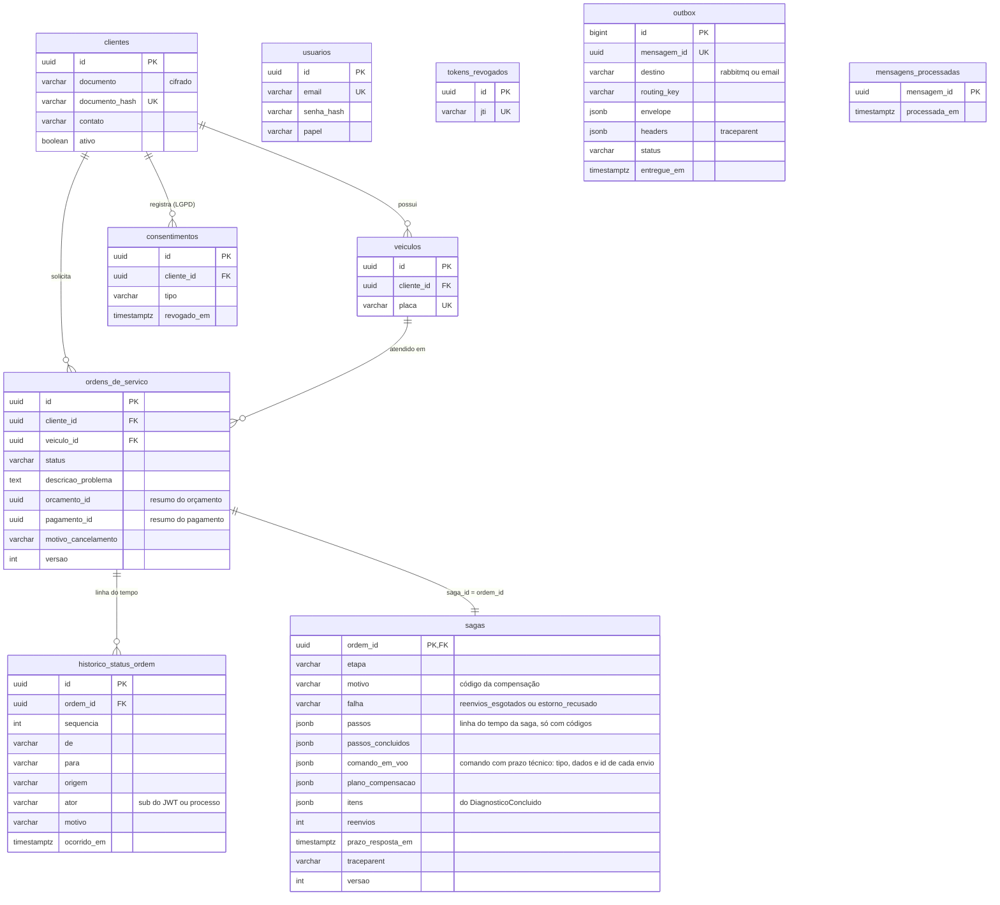

- As tabelas de cliente, veículo, consentimento, usuário e token vêm do p3 sem mudança.
- A OS perde o orçamento em JSONB e ganha versão otimista e o resumo de orçamento e pagamento copiado dos eventos, para responder sem chamar o Billing.
- `historico_status_ordem` só recebe inserções, na transação de cada transição (RF-030), com o ator: o `sub` do JWT ou o processo. A única exceção é da LGPD: a eliminação de dados do cliente reescreve o `motivo`, texto livre, com o marcador de anonimização, como faz com a descrição do problema e o motivo de cancelamento da OS.
- A instância da saga guarda a linha do tempo dos passos, que o `GET .../historico` junta às transições de status, o plano de compensação, o comando em voo, que só existe para comando com prazo técnico e não tem texto livre, com o `id` de cada envio (o original e os reenvios, com os quais a resposta casa pelo `causation_id`), os itens do diagnóstico e o `traceparent` da mensagem que a pôs em espera. A posição na fila que chega no `ExecucaoAgendada` fica só no passo desse evento; a fila atual é a do `GET /api/v1/fila` da Execução.
- A saga guarda só códigos (etapa, motivo da compensação, falha), nunca texto livre. O texto que o atendente escreve no cancelamento vai para `ordens_de_servico.motivo_cancelamento` já no pedido, antes de a compensação terminar, e passa ao histórico quando a OS chega a `CANCELADA` (na corrida do pivot, o pedido é descartado); assim a eliminação de dados da LGPD o alcança sem tocar `sagas`.
- A outbox tem dois destinos: `rabbitmq`, para os comandos, e `email`, para as notificações ao cliente, que o relay entrega por SMTP como no p3, separadas da mensageria. Falha de SMTP não trava a saga, porque a ordem do relay vale por destino: um e-mail em backoff segura só os e-mails seguintes da mesma OS, nunca os comandos dela.

### 7.3 Execution Service (PostgreSQL 16)

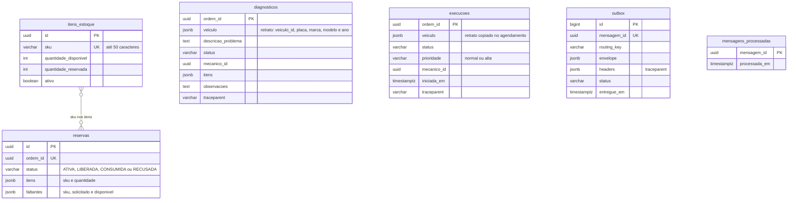

Ao contrário do p3, reservar não consome o saldo: a reserva move quantidade de disponível para reservada, a liberação devolve e a finalização dá baixa. A reserva guarda os itens em JSONB e, quando recusada, os faltantes que seguem em `ReservaDePecasFalhou`. `ordem_id` é referência lógica, sem chave estrangeira, e único por tabela (a chave primária de diagnóstico e execução), o que torna reserva, diagnóstico e execução idempotentes por OS e sustenta a lápide.

Diagnóstico e execução são os registros que esperam o mecânico, por isso guardam o `traceparent`. O diagnóstico guarda o retrato do veículo, e a execução recebe uma cópia dele no agendamento, para que a fila mostre placa, marca, modelo e ano; `AnonimizarVeiculo` troca a placa nos dois. Na fila, `alta` passa à frente de `normal`, e dentro da mesma prioridade vale a ordem de agendamento.

### 7.4 Billing Service (MongoDB 7)

Dinheiro em `Decimal128`, datas em UTC; exemplos em Extended JSON. As coleções de preço (`precos_servicos` e `precos_pecas`) guardam código ou `sku`, descrição, preço, moeda e `ativo`.

```json
{
  "_id": "6d2a9b14-8c3e-4f5a-a7b6-1c9d0e2f3a45",
  "ordem_id": "3c9a7e10-5b2f-4f6d-8a41-0e2d9b7c6f55",
  "status": "APROVADO",
  "linhas": [
    {"codigo": "SRV-TROCA-OLEO", "descricao": "Troca de óleo", "quantidade": 1,
     "preco_unitario": {"$numberDecimal": "120.00"}, "subtotal": {"$numberDecimal": "120.00"}},
    {"codigo": "PEC-OLEO-5W30", "descricao": "Óleo 5W30, 1 litro", "quantidade": 4,
     "preco_unitario": {"$numberDecimal": "45.00"}, "subtotal": {"$numberDecimal": "180.00"}}
  ],
  "total": {"$numberDecimal": "300.00"},
  "moeda": "BRL",
  "valido_ate": {"$date": "2026-10-09T14:32:06Z"},
  "decisao": {"resultado": "APROVADO", "canal": "link", "decidido_em": {"$date": "2026-10-06T15:02:11Z"}},
  "traceparent": "00-4bf92f3577b34da6a3ce929d0e0e4736-00f067aa0ba902b7-01"
}
```

```json
{
  "_id": "b7e2c4d1-0a9f-4e3b-8c6d-5f1a2b3c4d5e",
  "ordem_id": "3c9a7e10-5b2f-4f6d-8a41-0e2d9b7c6f55",
  "orcamento_id": "6d2a9b14-8c3e-4f5a-a7b6-1c9d0e2f3a45",
  "status": "CONFIRMADO",
  "valor": {"$numberDecimal": "300.00"},
  "moeda": "BRL",
  "checkout_url": "http://localhost/billing/simulador/checkout/b7e2c4d1-0a9f-4e3b-8c6d-5f1a2b3c4d5e?token=...",
  "referencia_provedor": "sim-000173",
  "recusas": 0,
  "expira_em": {"$date": "2026-10-06T16:02:12Z"},
  "traceparent": "00-4bf92f3577b34da6a3ce929d0e0e4736-5c3d1e8a2b7f9046-01",
  "historico": [{"status": "SOLICITADO", "em": {"$date": "2026-10-06T15:02:12Z"}},
                {"status": "CONFIRMADO", "em": {"$date": "2026-10-06T15:05:40Z"}}]
}
```

| Coleção | Índices |
|---|---|
| `precos_servicos`, `precos_pecas` | únicos `{codigo: 1}` e `{sku: 1}`; o `sku` liga a peça ao estoque da Execução |
| `orcamentos` | único `{ordem_id: 1}`: um orçamento por OS, imutável depois de gerado, com os preços congelados nas linhas (RN-013 e RN-016 do p3); `{status: 1, valido_ate: 1}` para a expiração |
| `pagamentos` | único `{orcamento_id: 1}` (uma cobrança por orçamento, RF-032); único `{ordem_id: 1}`, pelo qual a compensação acha a cobrança; único e esparso `{referencia_provedor: 1}` para o webhook; `{status: 1, expira_em: 1}` para a expiração e a conciliação |
| `outbox`, `mensagens_processadas` | `{status: 1, proxima_tentativa_em: 1}` para o *claim*; `_id` igual ao `id` da mensagem |

- Orçamento e pagamento são os registros que esperam o cliente e guardam o `traceparent`.
- Do provedor, o pagamento guarda só id, status e seu detalhe, valor, moeda e datas; dados do pagador e do cartão são descartados antes de persistir e de logar.
- O Job de inicialização do Billing cria o replica set (`rs.initiate`), os índices e a validação `$jsonSchema` (nível `moderate`, só mudanças aditivas) antes do rollout ([seção 10.2](#102-pipeline-e-deploy)).

## 8. Segurança

Resumo; o detalhe está no [ADR-039](../../adr/fase4/039-autenticacao-entre-servicos.md) (identidade e papéis), no [ADR-040](../../adr/fase4/040-integracao-mercado-pago.md) (Mercado Pago), no [ADR-038](../../adr/fase4/038-borda-e-comunicacao-sincrona.md) (borda) e no [ADR-042](../../adr/fase4/042-cicd-e-deploy-kubernetes.md) (segredos, rede e exposição do k3s).

- JWT RS256, com chave RSA de 2048 bits e `exp` de 15 minutos, emitido só pelo OS e validado por Billing e Execução pelo JWKS. Falha de credencial responde 401 uniforme; papel insuficiente, 403; JWKS indisponível sem chave em cache, 503 com `Retry-After`. O logout revoga só no OS; nos outros vale a expiração curta, na faixa de "5 a 15 minutos" da Aula 04 de Microsserviços I.
- Link de decisão assinado com HMAC-SHA256, de uso único, com o mesmo 404 para token inválido, expirado ou já usado e o `{token}` mascarado em logs e spans (evolução do canal assinado do p3, [ADR-021](https://github.com/fiap-postech-sw-architecture/postech-sw-arch-p3/blob/main/docs/arquitetura/adr/fase2/021-aprovacao-externa-orcamento.md)). Webhook: `x-signature` conferido e estado sempre lido em `GET /v1/payments/{id}`; estorno com `X-Idempotency-Key = estorno-{pagamento_id}`.
- Simulador só com `MP_MODE=simulado`, que o boot recusa com `ENVIRONMENT=production` sem `SIMULADOR_PERMITIDO=true`; as rotas dele exigem o token HMAC do `checkout_url` e têm rate limit.
- Broker com usuário por serviço, permissão só nas próprias routing keys e `user_id` conferido ([seção 5.1](#51-topologia)). NetworkPolicy de entrada por namespace, que libera só o tráfego previsto; o tráfego interno sem TLS (criptografia da conexão) é risco aceito do ambiente de demonstração.
- LGPD e auditoria: placa na Execução com anonimização por comando ([seção 5.3](#53-catálogo-de-comandos-e-eventos)), retenção limitada ([seção 5.4](#54-garantias-de-entrega)) e texto livre fora dos logs; `decidido_por` na decisão em nome do cliente, `ator` no histórico e log de auditoria nas ações privilegiadas.
- Segredos: nenhum segredo de aplicação fica no GitHub; os de runtime nascem no cluster, só se ausentes, e a tabela, com a regra de rotação, está no ADR-042.

## 9. Observabilidade

A stack da fase 3 continua ([ADR-032](https://github.com/fiap-postech-sw-architecture/postech-sw-arch-p3/blob/main/docs/arquitetura/adr/fase3/032-monitoramento-grafana-loki.md)), agora no `platform`, com um `service.name` por serviço. O OpenTelemetry exporta OTLP (OpenTelemetry Protocol) para o Jaeger (Microsserviços II, Aula 06), e a propagação por mensagem é código próprio ([ADR-043](../../adr/fase4/043-observabilidade-distribuida.md)). Cada saga é um trace no Jaeger, com raiz na abertura da OS. O trecho abaixo começa quando o mecânico conclui o diagnóstico: a requisição dele chega com trace próprio, e o caso de uso roda no contexto da saga guardado com o diagnóstico, com span link para essa requisição:

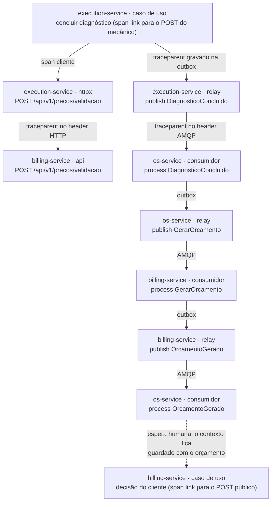

A outbox de todos os serviços guarda o `traceparent` de quem a gravou; o relay publica como filho desse contexto, e o consumidor processa como filho da publicação. Ação externa (mecânico, cliente, atendente, webhook do provedor, processo `prazos`) chega com trace próprio; o registro que esperava por ela guarda o `traceparent` da mensagem que o pôs em espera, e o caso de uso roda como filho desse contexto, com span link para a requisição.

O `correlation_id` vai como atributo dos spans de mensagem e em todo log JSON, com `trace_id`, `span_id` e `request_id` e sem PII (dado pessoal identificável); uma busca por ele no Loki traz a OS nos três serviços. Os laços ociosos (poll do relay, relay do MongoDB, `prazos`) só abrem span quando há trabalho.

Métricas novas levam o prefixo `pytstop_`; as herdadas do p3 mantêm o nome (`outbox_pendentes`, `outbox_dead`, `http_request_duration_seconds`), para reaproveitar regras e painéis. As da saga:

| Métrica | Tipo e labels | Quem calcula |
|---|---|---|
| `pytstop_saga_iniciadas_total` | contador | api, na abertura da OS |
| `pytstop_saga_finalizadas_total{resultado}` | contador; `resultado` em `concluida` ou `compensada` | consumidor |
| `pytstop_saga_compensacoes_total{motivo}` | contador | quem inicia a compensação (consumidor, api ou `prazos`) |
| `pytstop_saga_etapa_duracao_segundos{etapa}` | histograma | quem tira a saga da etapa |
| `pytstop_saga_reenvios_total{comando}` | contador; `comando` é o tipo do comando reenviado | `prazos` |
| `pytstop_saga_prazos_esgotados_total{comando}` | contador | `prazos` |
| `pytstop_saga_ativas{etapa}` | gauge: instâncias em cada etapa não final | coletor da API |
| `pytstop_saga_etapa_mais_antiga_segundos{etapa}` | gauge: idade da instância mais antiga em cada etapa | coletor da API |
| `pytstop_saga_prazo_vencido_segundos` | gauge: maior atraso entre as instâncias com prazo técnico vencido, zero sem atraso | coletor da API |

Os três gauges saem de uma consulta à tabela `sagas` que o coletor da API faz na hora da raspagem, e por isso continuam certos com o `prazos` fora do ar. O label `etapa` leva o nome da etapa em minúsculas (`falha_na_compensacao`), e o `motivo` é enumeração fechada: `orcamento_recusado`, `orcamento_expirado`, `geracao_falhou`, `reserva_falhou`, `pagamento_recusado`, `pagamento_expirado`, `cancelamento` e `prazo_tecnico`. Mensageria, Mercado Pago, circuit breaker, webhook, JWKS, Kong e bancos têm métricas próprias, com os nomes no ADR-043.

Coleta: o Prometheus raspa por pod, com `kubernetes_sd`, a porta `metrics` de todo Deployment nos namespaces `pytstop-*` e no da plataforma, com o label `processo` (api, relay, consumidor, `prazos`).

Dashboards em JSON, um arquivo por dashboard em `observabilidade/dashboards/` do `platform`, documentados painel a painel: Saga, Mensageria, Serviços (taxa, erros e duração, o RED, mais recursos e respostas 401, 403 e 429 do Kong) e Negócio (inclusive o tempo médio por status do RF-008). Alertas, com níveis de aviso e de alerta (Microsserviços II, Aula 06): mensagem em DLQ, compensações acima do normal, saga parada, 5xx acima de 1%, circuit breaker aberto, outbox parada (`outbox_pendentes` acima de zero por 5 minutos), assinatura inválida no webhook e falha na busca do JWKS. Saga parada é `pytstop_saga_prazo_vencido_segundos` acima de 60 s, dois ciclos do `prazos` (instância com prazo técnico vencido e não tratado, em qualquer etapa), ou alguma instância em `FALHA_NA_COMPENSACAO`; o procedimento está no [runbook da saga](../../../operacao/runbook-saga.md). Expressões e janelas ficam no ADR-043.

## 10. Implantação

### 10.1 Ambientes

| Ambiente | Para quê | Como sobe | Credencial externa |
|---|---|---|---|
| compose do serviço | desenvolver um serviço (com banco e RabbitMQ) | `make compose-up` | nenhuma |
| compose da plataforma | stack completa local, demonstração rápida | `make -C platform up` | nenhuma |
| kind | Kubernetes local e no CI (deploy obrigatório) | `make -C platform kind-up deploy`; no CI, com o overlay `kind-ci` | nenhuma no CI; credenciais de teste do Mercado Pago para a evidência da integração real no kind local |
| k3s na Azure | ambiente persistente para evidências e vídeo | Terraform da VM e das credenciais federadas, aplicado uma vez no passo humano; depois, CD por OIDC | OIDC com o environment `producao`, restrito à `main`; crédito da Azure a aprovar |

### 10.2 Pipeline e deploy

A lista canônica de workflows e jobs está no [ADR-042](../../adr/fase4/042-cicd-e-deploy-kubernetes.md), e a de testes e qualidade, no [ADR-041](../../adr/fase4/041-estrategia-de-testes-e-qualidade.md). Cada serviço tem três workflows, e os nomes dos jobs são os checks obrigatórios da proteção e do ruleset da `main`:

- `ci.yml`, em todo pull request (PR): `lint`, `type-check`, `security`, `test` (gate de 90% e `diff-cover` de 90% no código novo), `sonarqube` e `build`;
- `security.yml`, em todo PR e semanal: `pip-audit`, `gitleaks` e `trivy`;
- `cd.yml`, a cada push na `main`: `ci` e `security-scan`, que chamam os dois anteriores, `image`, `deploy-kind`, `deploy-k3s` e `k3s-skipped`.

Build único: o `image` constrói a imagem uma vez, publica no GHCR com a tag do SHA e gera o SBOM em SPDX; o `deploy-kind` carrega o tar dessa imagem, e o `deploy-k3s` implanta o mesmo digest. No kind, os dois vizinhos e o `platform` entram no SHA da última execução verde do CD de cada um, com o overlay enxuto `kind-ci` (sem Loki, Promtail e Grafana, uma réplica), um smoke por namespace e o E2E (teste de ponta a ponta) BDD; o summary nomeia o serviço que falhou.

A independência que o enunciado pede (l. 90) está no que é de cada serviço: build, testes, imagem e deploy saem do pipeline dele, disparados pelo commit dele, e o kind é o ambiente de integração.

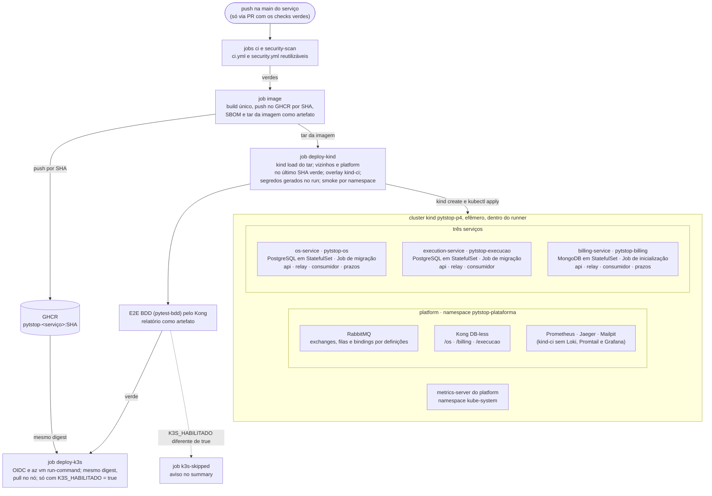

- Rollback: migrações só expand/contract, compatíveis com a versão anterior, e `kubectl rollout undo`, sem rebaixar o schema; E2E vermelho depois do `image` não chega ao k3s, e `main` vermelha se corrige com PR de revert.
- k3s: o `deploy-k3s` aplica por `az vm run-command`, autenticado por OIDC, sem expor a API do Kubernetes, e faz o pull da imagem no nó; com a VM desligada ou o login recusado, termina verde com aviso. Só 80 e 443 ficam públicas, com hostname da Azure e certificado Let's Encrypt; painéis e consoles, só por túnel SSH. Tamanho da VM, desligamento diário e Terraform estão no ADR-042.
- Manifestos: cada serviço tem `k8s/` com base e overlays `kind`, `kind-ci` e `k3s`, no próprio namespace. São um Deployment por processo (api, relay, consumidor e, no OS e no Billing, `prazos`), todos com a porta `metrics`; Service, HPA, ConfigMap, NetworkPolicy e Ingress; banco em StatefulSet com PVC (*persistent volume claim*); Job de migração nos serviços SQL e Job de inicialização no Billing, antes do rollout. Os Secrets não são versionados: o deploy os gera no cluster.
- Encerramento gracioso: o processo para de consumir, conclui a mensagem em curso e fecha as conexões dentro do `terminationGracePeriodSeconds`.

### 10.3 Parâmetros e variáveis de ambiente

Nomes em maiúsculas são variáveis de ambiente, definidas no ConfigMap ou no Secret de cada overlay; os demais são constantes do código, revistas quando sair a disciplina Resiliência em Microsserviços.

| Parâmetro | Padrão | Unidade | Serviço | Efeito |
|---|---|---|---|---|
| `SAGA_PRAZO_RESPOSTA_SEGUNDOS` | 120 | s | OS (`prazos`) | espera por resposta a comando, contada da saída da outbox, antes de cada reenvio |
| `SAGA_MAX_REENVIOS` | 5 | reenvios | OS (`prazos`) | esgotados, compensa; numa compensação, vai a `FALHA_NA_COMPENSACAO` |
| `ORCAMENTO_VALIDADE_HORAS` | 72 | h | Billing | validade do orçamento e do link de decisão |
| `PAGAMENTO_VALIDADE_MINUTOS` | 60 | min | Billing | validade da cobrança e da preferência no Mercado Pago |
| `PAGAMENTO_MAX_RECUSAS` | 3 | recusas | Billing | recusas do provedor, contadas em `recusas`, até o pagamento virar `RECUSADO` (o E2E usa 1) |
| `PRAZOS_INTERVALO_SEGUNDOS` | 30 | s | OS e Billing (`prazos`) | intervalo entre varreduras de prazo; no Billing, também entre conciliações |
| `MP_MODE` | sem padrão | | Billing | `simulado` ou `mercadopago`, obrigatório |
| `SIMULADOR_PERMITIDO` | `false` | | Billing | aceita `MP_MODE=simulado` com `ENVIRONMENT=production` |
| `MP_ACCESS_TOKEN`, `MP_WEBHOOK_SECRET` | sem padrão | | Billing | credenciais do Mercado Pago, exigidas com `MP_MODE=mercadopago` |
| `ENVIRONMENT` | definido por overlay | | todos | com `production`, o boot recusa valores de demonstração |
| `JWT_PRIVATE_KEY` | sem padrão (Secret) | | OS | chave RSA de 2048 bits ou mais que assina os tokens |
| `JWT_PREVIOUS_PUBLIC_KEY` | vazio (Secret) | | OS | chave pública extra no JWKS durante a rotação em duas etapas |
| `JWKS_URL` | URL interna do OS | | Billing e Execução | endereço do `/.well-known/jwks.json` do OS |
| `JWT_EXPIRATION_MINUTES` | 15 | min | OS | validade do access token |
| `JWT_REFRESH_EXPIRATION_MINUTES` | 10080 | min | OS | validade do refresh, como no p3 |
| atrasos da fila de retry | 1, 5, 15, 60 e 300 | s | todos (consumidor) | espera de cada tentativa na `.retry`; depois da quinta, DLQ |
| reconexão do relay ao broker | até 30 | s | todos (relay) | backoff de reconexão; sem conexão, o relay não reivindica linhas |
| retenção da outbox entregue | 7 | dias | todos | linhas entregues apagadas depois disso |
| retenção de `mensagens_processadas` | 30 | dias | todos | janela de idempotência |
| TTL das `.dlq` | 7 | dias | `platform` (definições do RabbitMQ) | mensagem não reprocessada expira |
| timeout da validação de preços | 2 | s | Execução | por chamada ao Billing, com 2 retries com jitter |
| circuit breaker da validação de preços | 5 falhas, 30 s aberto | | Execução | aberto, a conclusão do diagnóstico responde 503 |
| cache e timeout do JWKS | 600 e 2 | s | Billing e Execução | renovação da chave pública do OS |
| tolerância de relógio do JWT (`leeway`) | 10 | s | todos | folga aceita em `exp` e `iat` |
| janela dos alertas de 5xx e de outbox parada | 5 | min | `platform` (regras do Grafana) | tempo acima do limite antes de disparar |
| `K3S_HABILITADO` | sem padrão | | CD (variável da organização) | `true` liga o `deploy-k3s`; outro valor roda o `k3s-skipped` |

Os limites de rate limit por rota estão no ADR-038, e os requests e limits por componente, no ADR-042.

## 11. Riscos, limitações e pontos em aberto

### 11.1 Riscos e limitações

| # | Risco ou limitação | Tratamento |
|---|---|---|
| 1 | Sem as credenciais de teste do Mercado Pago, o pagamento real não é exercitado | simulador (`MP_MODE=simulado`) em CI, kind de CI, E2E e compose, pelo mesmo caso de uso do webhook; adapter real com teste de contrato; com as credenciais, a conciliação ativa prova a integração no kind local, e preferência, pagamento aprovado e estorno ficam como evidência em `docs/entrega/fase4/evidencias/`; README e vídeo dizem o que é simulado |
| 2 | Webhook exige URL pública com HTTPS, que o kind não tem | no k3s, hostname e certificado ([seção 10.2](#102-pipeline-e-deploy)); no kind, a conciliação a cada 30 s cobre a confirmação |
| 3 | Bancos em StatefulSet: sem backup automatizado nem alta disponibilidade; replica set de um nó só para transações | custo zero e paridade kind/k3s; evoluir para banco gerenciado (DBaaS, banco de dados como serviço, Aula 06 de Data Engineering) troca connection string e manifestos, não código |
| 4 | Consistência eventual: logo após a decisão no Billing, a OS ainda mostra o status anterior, e os resumos no OS são cópias | a consulta mostra a etapa da saga; E2E e collection esperam o evento antes de afirmar o status |
| 5 | Orquestrador como ponto único de falha (SAGA Pattern, Aulas 02 e 05) | estado persistido, réplicas e filas duráveis: com o OS fora, as mensagens esperam e a saga segue na volta, porque o `prazos` não reenvia nem esgota prazo com `os.eventos` sem consumidor ([seção 4.6](#46-prazos)) |
| 6 | Pagamento aprovado no provedor depois do cancelamento, da expiração ou da recusa | o Billing estorna sozinho e publica `PagamentoEstornado` com motivo `pagamento_apos_encerramento`; a saga não muda de etapa por ele, só atualiza o resumo do pagamento na OS ([seção 4.4](#44-pivot-e-plano-de-compensação)), e o caso aparece em `pytstop_pagamentos_estornados_total{motivo}` |
| 7 | TTL por mensagem numa `.retry` única só expira na cabeça da fila: uma espera de 300 s atrasa as de 1 s atrás dela | aceito no volume de uma oficina; evolução: uma fila de retry por nível de atraso |
| 8 | Um serviço com acesso ao broker poderia forjar mensagem de outro | usuário por serviço, permissão só nas próprias routing keys e `user_id` conferido pelo consumidor ([seção 5.1](#51-topologia)) |
| 9 | Billing e Execução dependem do JWKS do OS | cache de 10 minutos; acabado o cache com o OS fora, respondem 503 com `Retry-After`, não 401, e `pytstop_jwks_falhas_total` acusa |
| 10 | O token do link de decisão viaja no caminho da URL | `{token}` mascarado em access log, spans e logs; uso único e validade igual à do orçamento |
| 11 | Simulador ligado num ambiente com URL pública | boot recusa `simulado` com `ENVIRONMENT=production` sem `SIMULADOR_PERMITIDO=true`; rotas com token HMAC e rate limit |
| 12 | k3s exposto à internet | só 80 e 443 públicas, TLS, painéis por túnel SSH, API do Kubernetes fechada e dados fictícios |
| 13 | Tráfego interno sem TLS | NetworkPolicy por namespace; risco aceito do ambiente de demonstração |
| 14 | Placa fora do OS, na Execução | necessária ao mecânico; `AnonimizarVeiculo` na eliminação LGPD e retenção limitada de mensagens |
| 15 | Promtail em fim de vida desde 02/03/2026 | mantido porque o enunciado exige as ferramentas da fase 3 (l. 102); a saída é o Grafana Alloy (ADR-043) |

Também aceitos:

- revogação de JWT só no OS: um token roubado vale até 15 minutos nos outros serviços, e o evento de revogação fica como evolução;
- cluster, broker e gateway compartilhados no `platform`, enquanto banco, manifestos e pipeline ficam em cada repositório;
- o peso do kind: o CI usa o `kind-ci`, e a máquina local precisa de pelo menos 10 GB no colima;
- a base técnica copiada, em que uma correção comum vira três PRs.

### 11.2 Pontos em aberto

1. A disciplina Resiliência em Microsserviços não tinha sido liberada até 06/10/2026. Timeout, retry, circuit breaker e DLQ vêm da Aula 02 de Microsserviços I e da política do relay do p3; a tabela da [seção 10.3](#103-parâmetros-e-variáveis-de-ambiente) e os ADR-036 e ADR-038 são revistos quando o material sair.
2. Credenciais de teste do Mercado Pago, passo humano: criar as contas de teste e gravar `MP_ACCESS_TOKEN` e `MP_WEBHOOK_SECRET` como segredos da organização, visíveis só ao Billing. São necessárias para a evidência da integração real (risco 1).
3. `x-signature` na notificação enviada à `notification_url` da preferência: a documentação não diz se ela vem assinada. A primeira execução na sandbox decide; se faltar assinatura, a URL passa a ser cadastrada no painel de Webhooks (ADR-040).
4. Crédito da Azure para o k3s, passo humano: sem ele, o deploy obrigatório continua no kind do CI, e o vídeo usa o kind local.
5. Minutos e pico de memória do `kind-ci` no runner, medidos no primeiro `deploy-kind` e registrados no summary.

## Glossário e siglas

| Termo | Significado nesta fase |
|---|---|
| Saga | sequência de transações locais nos três serviços que leva uma OS da abertura à finalização, ou desfaz o que foi feito; uma instância por OS |
| Passo | cada transação local da saga, de T1 a T9; T10, a entrega, fica fora |
| Etapa | estado da instância da saga no orquestrador ([seção 4.1](#41-etapas-da-instância)); não é o status da OS |
| Compensação | comando que desfaz o efeito de um passo concluído ou em voo ([seção 4.4](#44-pivot-e-plano-de-compensação)) |
| Pivot | o ponto sem retorno (RN-029): o início da execução física, T8; depois dele não há compensação, e o cancelamento responde 409 |
| Reserva | separação de peças para uma OS: move quantidade de disponível para reservada, sem consumir o saldo; a liberação devolve, e a finalização dá baixa. No p3, reservar decrementava o saldo |
| Lápide | registro criado já no estado final quando a compensação chega antes do comando original, que é descartado ao chegar |
| Outbox | tabela ou coleção gravada na mesma transação do efeito, de onde o relay publica as mensagens e envia os e-mails |
| DLQ | fila de mensagens mortas (*dead letter queue*): destino da mensagem com erro permanente ou com as tentativas esgotadas |
| Reenvio | nova emissão de um comando pelo orquestrador quando o prazo técnico vence |
| Tentativa | nova entrega de uma mensagem pelo retry do consumidor (header `x-tentativa`) |
| Recusa | `rejected` do Mercado Pago para um pagamento em `SOLICITADO`, contada no campo `recusas` até `PAGAMENTO_MAX_RECUSAS`; não é tentativa |
| Prazo técnico | espera máxima por resposta automática a um comando (`SAGA_PRAZO_RESPOSTA_SEGUNDOS`), contada da saída do comando da outbox |
| Conciliação | consulta periódica do Billing ao Mercado Pago pelos pagamentos em `SOLICITADO` |
| Fila de diagnóstico, fila de execução | listas de trabalho da oficina na Execução; as filas do RabbitMQ aparecem sempre pelo nome (`os.eventos`, `billing.comandos`, `execucao.comandos`) |

| Sigla | Significado |
|---|---|
| ACID | atomicidade, consistência, isolamento e durabilidade |
| ACL | camada anticorrupção (*anticorruption layer*) |
| ADR | registro de decisão de arquitetura (*architecture decision record*) |
| AMQP | protocolo de mensageria usado pelo RabbitMQ (*Advanced Message Queuing Protocol*) |
| BDD | desenvolvimento guiado por comportamento (*behavior-driven development*) |
| CI, CD | integração contínua, entrega contínua |
| CQRS | separação entre comandos e consultas (*command query responsibility segregation*) |
| DBaaS | banco de dados como serviço |
| DDD | projeto orientado a domínio (*domain-driven design*) |
| DLQ | fila de mensagens mortas (*dead letter queue*) |
| E2E | teste de ponta a ponta (*end to end*) |
| GHCR | registro de imagens do GitHub (*GitHub Container Registry*) |
| HMAC | código de autenticação de mensagem baseado em hash |
| HPA | escalonamento horizontal de pods do Kubernetes (*Horizontal Pod Autoscaler*) |
| JWKS | conjunto de chaves públicas em JSON (*JSON Web Key Set*) |
| JWT | token assinado em JSON (*JSON Web Token*) |
| LGPD | Lei Geral de Proteção de Dados |
| OIDC | OpenID Connect, usado na federação entre GitHub Actions e Azure |
| OS | ordem de serviço |
| OTLP | protocolo de exportação do OpenTelemetry |
| PII | dado pessoal identificável |
| PVC | volume persistente do Kubernetes (*persistent volume claim*) |
| RED | taxa, erros e duração (*rate, errors, duration*) |
| RF, RN, RNF | requisito funcional, regra de negócio, requisito não funcional |
| RFC | documento de proposta técnica (*request for comments*) |
| RS256 | assinatura RSA com SHA-256 |
| SBOM, SPDX | inventário dos componentes do software (*software bill of materials*) e o formato desse inventário |
| SKU | código de estoque da peça (*stock keeping unit*) |
| SMTP | protocolo de envio de e-mail |
| TLS | criptografia da conexão (*transport layer security*) |
| TTL | tempo de vida (*time to live*) |
| VM | máquina virtual |

## Referências

- [Enunciado da fase 4](../../../requisitos/fase4/desafio-tech-fase-4.md), [gap analysis da fase 4](../../../requisitos/fase4/gap-analysis-fase-4.md) e ADR-034 a ADR-043 (linkados nas seções).
- [RFC-003](https://github.com/fiap-postech-sw-architecture/postech-sw-arch-p3/blob/main/docs/arquitetura/rfc/fase3/rfc-003-gateway-serverless-observabilidade.md), desenho integrado da fase 3.
- Disciplinas da fase 4: SAGA Pattern (Aulas 01 a 05), Estrutura de Microsserviços (Aulas 01 a 05), Estrutura de Microsserviços Parte II (Aulas 04 e 06), Data Engineering (Aulas 02, 06 e 07).
- Mercado Pago para desenvolvedores (Checkout Pro, webhooks, reembolsos): <https://www.mercadopago.com.br/developers/pt/docs>

---

> [↑ Raiz do projeto](../../../../README.md) · [↑ Arquitetura](../../README.md)
