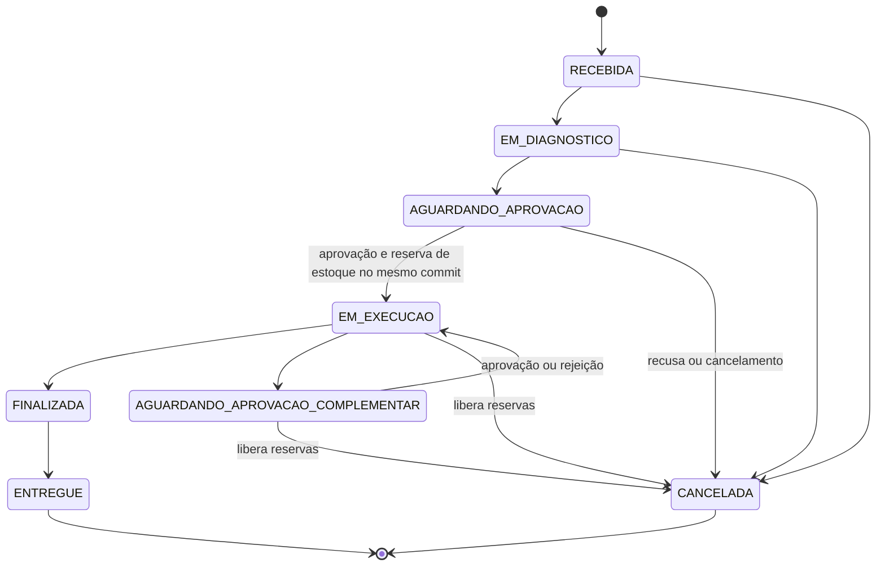

# Gap analysis da fase 4: enunciado × PytStop da fase 3

> [↑ Raiz do projeto](../../../README.md) · [↑ Requisitos](../README.md)

> **Versão**: 1.1, de 06/10/2026. As ações e os pontos abertos seguem a [RFC-004](../../arquitetura/rfc/fase4/rfc-004-microsservicos-saga.md), o desenho integrado da fase (*request for comments*), e os registros de decisão de arquitetura (ADR) 034 a 043.
>
> **Enunciado**: Tech Challenge da fase 4, cópia fiel em [desafio-tech-fase-4.md](desafio-tech-fase-4.md). As referências "l. N" indicam a linha nessa cópia.
>
> **Código analisado**: branch `main` do repositório [postech-sw-arch-p3](https://github.com/fiap-postech-sw-architecture/postech-sw-arch-p3), commit `08dcffe` (o estado da fase 3 que serviu de base ao recorte; correções posteriores do p3 usadas na fase 4, como a `fc06263`, são citadas onde entram), chamado de p3 neste documento. Toda evidência no formato `caminho:linha` é relativa à raiz desse repositório.
>
> **Numeração**: continua a das fases anteriores, com RF para requisito funcional, RNF para requisito não funcional e RN para regra de negócio. Os últimos IDs em uso eram RF-027, RNF-030 e RN-022 (`docs/requisitos/fase3/gap-analysis-fase-3.md:13-21`). Este documento cria RF-028 a RF-038, RNF-031 a RNF-056 e RN-023 a RN-029.

## Como ler

- A seção 2 tem uma linha por exigência do enunciado, na ordem do texto. A seção 2.1 reúne requisitos derivados: não aparecem como obrigação explícita, mas decorrem do enunciado e da arquitetura-alvo; cada um indica a linha de onde deriva. A seção 2.2 liga cada requisito à decisão e à evidência que a banca pode conferir.
- Gap **Total**: nada do p3 atende. **Parcial**: há base reaproveitável e falta adequar. **Processual**: muda a forma de trabalhar, não o código.
- "Inexistente no p3" vem sempre com a busca feita. Salvo indicação, as buscas cobrem `src/`, `relay/`, `tests/`, `ui/`, `migrations/`, `k8s/`, `infra/`, `.github/`, `full-test/`, `pyproject.toml`, `Makefile` e `docker-compose.yml`.
- Na coluna de repositório, `os-service`, `billing-service`, `execution-service` e `platform` abreviam `postech-sw-arch-p4-<nome>`, na organização `fiap-postech-sw-architecture`. "Os três serviços" não inclui o `platform`.
- OS é a ordem de serviço, e OS Service, o serviço que cuida dela. Execution Service é o nome do serviço de execução; Execução, o contexto que ele hospeda.
- Decisões da [RFC-004](../../arquitetura/rfc/fase4/rfc-004-microsservicos-saga.md) e dos ADR-034 a ADR-043 que orientam as ações: saga orquestrada pelo OS Service, com o pivot (ponto sem retorno, RN-029) no início da execução física; RabbitMQ; PostgreSQL 16 no OS Service e no Execution Service; MongoDB 7 no Billing; Kong como API Gateway, pelo Kong Ingress Controller em modo DB-less; JWT (JSON Web Token) assinado em RS256 (RSA com SHA-256) pelo OS Service e validado pela chave pública nos demais; deploy em kind no runner da integração contínua (CI) a cada push na `main`; nenhum segredo de aplicação guardado no GitHub.
- Os nomes de comandos e eventos são os do catálogo da RFC-004 (seção 5.3).

## 1. Resumo

O p3 é um monolito modular: cinco contextos delimitados numa aplicação FastAPI, um banco PostgreSQL compartilhado, outbox transacional que entrega e-mail e uma stack de observabilidade completa para um único serviço. A fase 4 pede o contrário em quase todos os eixos estruturais: três serviços com dados isolados, mensageria entre eles, saga com compensação, Billing com Mercado Pago e banco NoSQL, BDD (*behavior-driven development*), SonarQube no CI e pipeline por serviço.

Das 36 exigências do enunciado, 19 têm gap total, 16 têm gap parcial e 1 é processual. A seção 2.1 acrescenta 8 requisitos derivados.

Gaps de maior peso:

- Isolamento de dados (RNF-031, RNF-036, RNF-044): os adapters do p3 leem tabelas de outros contextos pela mesma sessão SQLAlchemy, e o agregado `ItemEstoque` guarda na mesma linha o preço (que vai para o Billing) e o saldo (que vai para o Execution Service).
- Saga com compensação (RF-038, RN-023 a RN-029): toda transação crítica do p3 é ACID local. Não há estado de saga, prazo, estorno nem idempotência por mensagem.
- Mensageria (RNF-035, RNF-045): não há broker. A outbox só entrega e-mail e a idempotência é chaveada pelo id local da outbox.
- Billing do zero (RF-032 a RF-034, RNF-033): pagamento é não-objetivo do produto desde a fase 1; não há Mercado Pago nem banco NoSQL.
- Qualidade e entrega por serviço (RNF-039, RNF-041, RNF-042): o BDD nunca passou de proposta (ADR-013), o SonarQube está fora do CI por decisão (ADR-011) e o deploy do p3 não depende do resultado dos testes.

## 2. Tabela de rastreabilidade

| ID | Exigência (enunciado) | Estado no p3 (evidência) | Gap | Ação na fase 4 | Repositório |
|---|---|---|---|---|---|
| RNF-031 | "no mínimo, 3 microsserviços independentes, cada um com seu próprio repositório, infraestrutura e banco de dados" (l. 27; banco próprio reforçado em l. 57) | Monolito modular: uma aplicação FastAPI inclui os routers dos cinco contextos (`src/main.py:150-162`); um único metadata recebe os mapeamentos de todos (`src/compartilhado/infraestrutura/bootstrap.py:21-57`), com uma cadeia Alembic única (`migrations/versions/001_initial_schema.py` a `migrations/versions/008_indice_ordem_id_pk_processed_events.py`); API e relay rodam na mesma imagem (`relay/__main__.py:3-5`) | Total | Três repositórios de serviço com código, manifestos, banco e pipeline próprios, cada um nascido de um recorte da `main` do p3 (`git archive`, proveniência registrada no pull request (PR) e no README); `platform` com cluster, gateway Kong, broker e observabilidade compartilhados | os três serviços, platform |
| RF-028 | "Abertura da OS" (l. 35) | `CriarOrdem` valida cliente e veículo pela `ClientePort`, monta os itens com preços lidos das tabelas de catálogo e estoque e persiste tudo num único commit (`src/ordem_servico/aplicacao/use_cases.py:234-309`); `OrdemCriadaEvent` é evento de domínio puro, sem consumidor (`src/ordem_servico/dominio/events.py:22-35`) | Parcial: a abertura existe, mas não dispara fluxo algum e depende de tabelas de outros contextos | OS Service grava a OS e a instância da saga na mesma transação e publica o comando de diagnóstico pela outbox; a descrição do problema segue nesse comando, e serviços e peças passam a nascer no diagnóstico (muda o RF-020, seção 6.5); CPF ou CNPJ validado pelo dígito verificador (módulo 11) e placa validada antes de qualquer consulta | os-service |
| RF-029 | "Atualização de status" (l. 36) | Transições só por endpoints HTTP: os internos (`src/ordem_servico/interfaces/router.py:249-382`) e o canal externo de decisão (`src/compartilhado/interfaces/router_publico.py:221-269`), guardadas pela `MaquinaDeStatus` (`src/ordem_servico/dominio/maquina_de_status.py:20-59`); a máquina vai de `AGUARDANDO_APROVACAO` direto para `EM_EXECUCAO`, sem estado de pagamento (`src/ordem_servico/dominio/maquina_de_status.py:33-38`) | Parcial: faltam transições disparadas por resposta de outro serviço e os estados de espera de pagamento e de execução | O orquestrador aplica as transições a partir das respostas da saga; a máquina de status continua como guarda, ganha `AGUARDANDO_PAGAMENTO` e `AGUARDANDO_EXECUCAO` e perde `AGUARDANDO_APROVACAO_COMPLEMENTAR` (seção 6.2); endpoints manuais ficam só para entrega e cancelamento; este vale só antes do início da execução (RN-029), responde 202 e corre pela compensação | os-service |
| RF-030 | "Consulta de status e histórico" (l. 37) | Status consultável por id (`src/ordem_servico/interfaces/router.py:189`), pelo acompanhamento público (`src/compartilhado/interfaces/router_publico.py:91-132`) e por `/minhas-ordens` (`src/ordem_servico/interfaces/router_cliente.py:29-63`). Histórico inexistente: `ordens_de_servico` guarda só `status`, `criado_em` e `atualizado_em` (`migrations/versions/001_initial_schema.py:100-118`); grep por `historico` em `src/` só encontra comentários | Parcial: há consulta de status, não há histórico | Tabela de histórico de status, só de inserção, gravada na mesma transação de cada transição, com origem, ator e motivo (a eliminação de dados da LGPD, a Lei Geral de Proteção de Dados, é a única que reescreve o `motivo`); endpoint de histórico por OS, que junta os passos da saga; o acompanhamento público continua `POST /api/v1/publico/acompanhamento`, com placa e documento no corpo, valida o CPF ou CNPJ pelo dígito verificador (módulo 11) e a placa antes do repositório e responde o mesmo 404 para dado inválido e para OS não encontrada; o tempo médio por status (RF-008) sai do histórico | os-service |
| RF-031 | "Geração e envio de orçamentos para aprovação" (l. 43) | O orçamento é objeto de valor dentro do agregado da OS (`src/ordem_servico/dominio/orcamento.py:76-151`, `src/ordem_servico/dominio/ordem_de_servico.py:234-267`), gravado como JSONB na tabela da OS (`migrations/versions/004_orcamento_jsonb.py:42-49`, `migrations/versions/007_escopo_aprovado_os.py:29-32`); o envio é disponibilização via API (RN-014, `docs/requisitos/requisitos.md:78`) mais o e-mail de mudança de status (`relay/handlers.py:112-149`); a decisão externa usa assinatura HMAC, código de autenticação de mensagem com hash (`src/compartilhado/interfaces/router_publico.py:135-269`) | Parcial: cálculo e canal de decisão são reaproveitáveis; o orçamento não tem serviço nem banco próprios | Billing gera o orçamento ao receber o comando da saga, com preços congelados da sua tabela, guarda em MongoDB (um por OS, com estado) e publica o orçamento gerado com validade e link de decisão. O envio da l. 43 fica com o OS Service, dono do contato: ao receber `OrcamentoGerado`, grava o e-mail na outbox, e o relay o entrega por SMTP. O cliente decide pelo link assinado com expiração (reuso de `src/compartilhado/infraestrutura/webhook_signature.py:21-32`) ou pelo atendente em seu nome, registrado em `decidido_por` | billing-service, os-service |
| RF-032 | "Registro e verificação de pagamentos" (l. 44) | Inexistente: grep por `pagamento` e `payment` sem resultado. Pagamento é não-objetivo do produto (`docs/requisitos/prd.md:30`, `docs/requisitos/prd.md:159`) e `PagamentoRecebido` ficou fora do produto mínimo viável (MVP) no event storming (`docs/arquitetura/event-storming/workshop-event-storming.md:778`) | Total | Agregado Pagamento no Billing (estado, recusas, id externo, valor). Cada `rejected` do provedor soma uma recusa no campo `recusas`, e o pagamento só vira `RECUSADO` na recusa de número `PAGAMENTO_MAX_RECUSAS` (padrão 3). O estado só muda depois de confirmar o pagamento na API do provedor, nunca pelo corpo do webhook, e o processo `prazos` do Billing concilia os pagamentos em `SOLICITADO` a cada 30 s. Do provedor, o Billing guarda só id, status e seu detalhe, valor, moeda e datas. Uma cobrança por orçamento, com chave de idempotência | billing-service |
| RF-033 | "Atualização do status da OS após pagamento" (l. 45) | Inexistente: a aprovação leva a OS direto para `EM_EXECUCAO` e reserva estoque (`src/ordem_servico/dominio/ordem_de_servico.py:287-295`, `src/ordem_servico/aplicacao/use_cases.py:447-494`); não há estado nem evento de pagamento | Total | Billing publica `PagamentoConfirmado`, `PagamentoRecusado` ou `PagamentoExpirado`; o orquestrador no OS Service leva a OS a `AGUARDANDO_EXECUCAO` já na confirmação e avança a saga para o agendamento no Execution Service. O Billing não escreve no banco do OS (RNF-036) | billing-service, os-service |
| RF-034 | "para a parte de pagamentos devemos nos integrar com o Mercado Pago" (l. 47) | Inexistente: grep por `mercado` e `mercadopago` sem resultado | Total | Adapter do Mercado Pago (criar cobrança, consultar, estornar) com chave de idempotência; webhook com validação de `x-signature` e conciliação ativa por consulta, que dispensa URL pública; simulador fiel ao contrato para CI, E2E (teste de ponta a ponta) e demonstração; teste de contrato do adapter; as credenciais de teste são necessárias para a evidência da integração real (seção 12) | billing-service |
| RF-035 | "Gerenciar a fila de execução da OS" (l. 53) | Não há fila: a listagem administrativa ordena por prioridade de status e antiguidade (`src/ordem_servico/infraestrutura/repository.py:48-54`, `src/ordem_servico/infraestrutura/repository.py:162-189`); não há atribuição a mecânico nem apontamento de início e fim, embora o papel exista (`src/autenticacao/dominio/papel.py:8`) | Total | O Execution Service mantém filas de diagnóstico e de execução (entrada por OS, prioridade, mecânico, início e fim) em PostgreSQL próprio; a OS só entra na fila de execução, pelo comando de agendamento, com orçamento aprovado, peças reservadas e pagamento confirmado (RN-027) | execution-service |
| RF-036 | "Atualizar status durante diagnóstico e reparos" (l. 54) | `iniciar_diagnostico` e `finalizar_servico` são transições do agregado da OS (`src/ordem_servico/dominio/ordem_de_servico.py:225-232`, `src/ordem_servico/dominio/ordem_de_servico.py:297-325`), expostas no router da OS (`src/ordem_servico/interfaces/router.py:249`, `src/ordem_servico/interfaces/router.py:294`); os itens do diagnóstico entram por `AdicionarItem` (`src/ordem_servico/aplicacao/use_cases.py:312-362`) | Parcial: os status existem, mas no serviço errado e por chamada local | O Execution Service expõe as ações do mecânico (iniciar e concluir diagnóstico, iniciar e concluir reparo). Ao concluir o diagnóstico, valida primeiro o estado local (diagnóstico em andamento, mecânico dono, itens e códigos de peça, os SKUs, no estoque) e depois, por REST no Billing, os códigos de serviço e peça; publica eventos de progresso que o OS aplica | execution-service |
| RF-037 | "Comunicar finalização ao OS Service" (l. 55) | Chamada local: `FinalizarServico` transita o agregado dentro da mesma aplicação (`src/ordem_servico/aplicacao/use_cases.py:497-505`) | Total: não há comunicação entre serviços | O Execution Service publica a finalização pela outbox e dá baixa nas peças reservadas; o OS transita para `FINALIZADA` e notifica o cliente | execution-service, os-service |
| RNF-032 | "Uso de pelo menos um banco relacional (SQL)" (l. 59) | PostgreSQL 16 (`docker-compose.yml:73-74`, `infra/postgres.tf:33`, `infra/postgres.tf:63`), porém uma única base para todos os contextos | Parcial | PostgreSQL 16 próprio no OS Service e no Execution Service, com instância, credencial e migrações Alembic separadas | os-service, execution-service |
| RNF-033 | "Uso de pelo menos um banco não relacional (NoSQL)" (l. 60) | Inexistente: grep por `mongo`, `nosql` e `dynamo` sem resultado. O Redis do p3 só guarda contadores do rate limiter (`pyproject.toml:21`, `k8s/configmap.yaml:79`) | Total | MongoDB 7 no Billing: tabela de preços, orçamentos e pagamentos como documentos; replica set de um nó, para a outbox entrar na mesma transação | billing-service |
| RNF-034 | "APIs RESTful síncronas (quando necessário)" (l. 65) | REST só na borda; entre contextos a chamada é em processo, por portas Python (`src/ordem_servico/aplicacao/ports.py:88-196`); grep por `httpx`, `requests.`, `urllib.request` e `aiohttp` em `src/` e `relay/` sem resultado | Total entre serviços | REST só quando a resposta é necessária na hora; a única chamada síncrona de negócio entre serviços é a validação de códigos do Execution Service no Billing ao concluir o diagnóstico, com timeout, retry e circuit breaker (RNF-055) e OpenAPI versionado; a outra dependência HTTP é a leitura da chave pública do JWT no OS, com cache ([ADR-038](../../arquitetura/adr/fase4/038-borda-e-comunicacao-sincrona.md), [ADR-039](../../arquitetura/adr/fase4/039-autenticacao-entre-servicos.md)); o tráfego externo entra pelo Kong | execution-service, billing-service, platform |
| RNF-035 | "Mensageria assíncrona (RabbitMQ, Kafka, SQS, etc.) para eventos e integração desacoplada" (l. 66) | Outbox transacional com relay sobre PostgreSQL (`src/compartilhado/infraestrutura/unit_of_work.py:46-73`, `src/compartilhado/infraestrutura/outbox_mapping.py:133-142`) entregando só e-mail (`relay/handlers.py:112-149`); broker adiado por decisão (`docs/arquitetura/adr/fase2/022-transactional-outbox-relay.md:61`), com o gatilho de revisão já previsto (`docs/arquitetura/adr/fase2/022-transactional-outbox-relay.md:106`); grep por `rabbit`, `kafka`, `pika` e `sqs` sem resultado | Parcial: outbox pronta, broker inexistente | RabbitMQ no `platform`, com exchanges, filas, filas de retry, DLQ (fila de mensagens mortas) e bindings numa definição única que os serviços só conferem ([ADR-036](../../arquitetura/adr/fase4/036-mensageria-rabbitmq.md)); o relay de cada serviço publica no broker, e o e-mail ao cliente segue pela outbox do OS, separado da mensageria; consumidores em processo separado da API, idempotentes por `message_id` (RN-028), com um usuário do RabbitMQ por serviço | os três serviços, platform |
| RNF-036 | "Nenhum serviço pode acessar diretamente o banco de outro serviço" (l. 67) | Adapters leem tabelas de outros contextos pela sessão compartilhada: a OS lê `itens_estoque`, `servicos_oferecidos`, `clientes` e `veiculos` (`src/ordem_servico/infraestrutura/adapters.py:35-321`); o Estoque lê `ordens_de_servico` e `itens_da_ordem` (`src/estoque/infraestrutura/adapters.py:23-37`); a Lambda da fase 3 lê `clientes` direto (`docs/arquitetura/mapa-contextos.md:113`). O import-linter só proíbe acoplamento de núcleo; adapters e composition roots ficam fora dos contratos e cruzam contextos (`pyproject.toml:256-266`) | Total | Banco e credencial exclusivos por serviço; dado de outro serviço só por REST ou evento; Secret do banco montado apenas nos pods do próprio serviço; contrato do import-linter em cada repositório | os três serviços |
| RF-038 | "Implementar o Saga Pattern para coordenar o fluxo transacional das ordens de serviço" (l. 71-72) | Inexistente: grep por `saga` e `compensa` sem resultado. A transação crítica é ACID local; por exemplo, aprovação e reserva de estoque no mesmo commit (`src/ordem_servico/aplicacao/use_cases.py:482-493`) | Total | Saga orquestrada pelo OS Service ([ADR-035](../../arquitetura/adr/fase4/035-saga-orquestrada.md)): uma instância por OS, com estado na tabela de sagas do mesmo banco da outbox; comandos e respostas pelo RabbitMQ; prazo técnico de resposta a comando no orquestrador, com reenvio idempotente; pivot no início da execução (seção 6) | os-service (orquestrador), billing-service, execution-service |
| RN-023 | "Deve haver rollback e compensação no caso de falha em qualquer etapa" (l. 73) | Só existe rollback da transação local (`src/compartilhado/infraestrutura/unit_of_work.py:36-44`, `src/compartilhado/infraestrutura/unit_of_work.py:75-76`); a liberação de reservas no cancelamento e na rejeição do complementar acontece no mesmo commit (`src/ordem_servico/aplicacao/use_cases.py:561-570`, `src/ordem_servico/aplicacao/use_cases.py:631-635`), não como compensação; não há estorno nem prazo | Total | Compensação definida e testada para cada passo compensável (RN-024 a RN-026), executada em sequência para os passos concluídos e para o passo em voo, cujo comando saiu sem resposta (seção 6.3); comando de compensação sem resposta é reenviado e, esgotados os reenvios, a saga vai para falha na compensação, com alerta, runbook e retomada pelo operador; teste no orquestrador, BDD de componente e cenário no E2E | os três serviços |
| RNF-037 | "Orquestrado (com um orquestrador central). Coreografado (via eventos entre serviços). Documentar a escolha e justificar no README" (l. 74-77) | Inexistente (não há saga) | Total | ADR com as alternativas e a escolha; seção no README do OS Service com justificativa e diagrama de sequência; os READMEs do Billing Service e do Execution Service descrevem o papel de participante e apontam para essa seção | os-service, platform |
| RNF-038 | "Testes unitários em todos os microsserviços" (l. 81) | 1.554 funções `test_*` em 123 arquivos de `tests/unitarios/` (contagem estática, sem expandir `parametrize`), organizadas por contexto (seção 7) | Parcial: existem, mas para um único deploy | Os testes migram com o código de cada contexto; o código novo (saga, mensageria, MongoDB, Mercado Pago) nasce com teste | os três serviços |
| RNF-039 | "Pelo menos um fluxo completo testado com BDD" (l. 82) | Inexistente: nenhum arquivo `.feature` (find sem resultado), `pytest-bdd` fora das dependências (`pyproject.toml:26-46`), `tests/e2e/` não existe; o ADR-013 está como "Proposta" (`docs/arquitetura/adr/013-testes-bdd-pytest-bdd.md:5`) e o TD-013 segue aberto (`docs/tech-debt/README.md:74`). O E2E de `full-test/` é Python sem Gherkin | Total | pytest-bdd 8.0 ou superior com Gherkin em português (a decisão do ADR-013 sai do papel): fluxo completo da OS pelos três serviços, caminho feliz e cada compensação, no E2E do `platform` contra o kind; BDD de componente no CI de cada serviço: no OS, a saga com barramento em memória; no Billing, orçamento expirado e pagamento recusado pelo limite de recusas; na Execução, reserva tudo ou nada ([ADR-041](../../arquitetura/adr/fase4/041-estrategia-de-testes-e-qualidade.md)) | platform, os três serviços |
| RNF-040 | "Cobertura mínima de 80% por serviço" (l. 83) | Gate de 95% sobre o total de `src` e `relay` (`.github/workflows/ci.yml:119-129`, `.coveragerc:50`) e gate separado da UI (`.github/workflows/ci.yml:130-138`); 96,4% no gate e 94,6% no SonarQube no fechamento da fase 3 (`sonar-project.properties:18-22`) | Parcial: cobertura alta, mas medida no monolito | Gate por repositório com meta de 90%, acima dos 80% exigidos, e `diff-cover` de 90% sobre o código novo; `coverage.xml` publicado como artefato do CI e enviado ao SonarQube | os três serviços |
| RNF-041 | "Validação de qualidade do código via SonarQube ou similar no CI" (l. 84) | SonarQube só como scan manual de fechamento, fora do CI por decisão (`docs/arquitetura/adr/011-pipeline-seguranca-analise-estatica.md:32`, TD-010 em `docs/tech-debt/README.md:44`, `docs/seguranca/scan-fase-3.md:15`); no CI rodam ruff, import-linter, mypy e bandit (`.github/workflows/ci.yml:33-86`) e CodeQL em default setup (`README.md:218`) | Parcial: há análise estática no CI, mas não o SonarQube | SonarQube efêmero no job, com quality gate bloqueante. O motivo do ADR-011 (repositório privado) deixa de valer: os repositórios de serviço são públicos | os três serviços |
| RNF-042 | "pipeline independente de CI/CD com: Build. Testes automatizados. Verificação de qualidade. Deploy automatizado em ambiente Kubernetes" (l. 88-94; o deploy em Kubernetes aparece de novo em l. 100) | Workflows do monolito: `.github/workflows/ci.yml` (qualidade e testes), `.github/workflows/security.yml` e `.github/workflows/cd.yml` (imagem no GHCR, o registro de imagens do GitHub, kind no runner, EKS). O CD (entrega contínua) dispara no push e não depende dos testes (`.github/workflows/cd.yml:27-30`; o job `image`, em `.github/workflows/cd.yml:47-81`, não tem `needs`) | Parcial: os estágios existem, mas não por serviço, e o deploy não espera os testes | Três workflows por repositório, com a lista canônica de jobs no [ADR-042](../../arquitetura/adr/fase4/042-cicd-e-deploy-kubernetes.md): `ci.yml` (lint, type-check, security, test, sonarqube, build), `security.yml` (pip-audit, gitleaks, trivy, também semanal) e `cd.yml` (ci, security-scan, image, deploy-kind, deploy-k3s, k3s-skipped), que chama os dois primeiros antes de construir a imagem. O `image` constrói uma vez, e o mesmo artefato vai ao kind do runner, a cada push na `main`, e ao k3s; reuso dos passos de `.github/workflows/cd.yml:83-201` | os três serviços |
| RNF-043 | "Repositórios protegidos (branch main com PR obrigatório e checagens automáticas)" (l. 95) | Na fase 3 a proteção só foi ativada em 03/09/2026 (`docs/arquitetura/adr/fase3/033-cicd-multi-repo.md:160`), depois de um bootstrap com push direto autorizado (`docs/arquitetura/adr/fase3/033-cicd-multi-repo.md:31`); a avaliação contou commits diretos na `main` (29 na aplicação, 11 na Lambda) | Processual | Proteção ligada logo após a criação de cada repositório (o único commit fora de PR é o `auto_init` do GitHub): PR obrigatório com administradores incluídos, sem force push; checks obrigatórios assim que existir o primeiro workflow; ruleset de repositório na `main`, visível a quem tem leitura, com os nomes exatos dos jobs; verificação final de que todo commit first-parent da `main` referencia um PR; evidência versionada (seção 10.4) | os três serviços, platform |
| RNF-044 | "Cada microsserviço deve estar em seu próprio repositório" (l. 99) | Um repositório de aplicação com todos os contextos (`README.md:19-29`) | Total | Um repositório por serviço; o `platform` complementa e não substitui nada que o enunciado pede de cada serviço (seção 10.1) | os três serviços |
| RNF-045 | "Mensageria para orquestração ou coreografia" (l. 101) | Inexistente: a única mensageria do p3 é a outbox de notificação por e-mail (`relay/handlers.py:112-149`) | Total | Comandos e respostas da saga só pelo RabbitMQ: exchange de comandos e de eventos, fila de comandos por serviço, fila de respostas do orquestrador; envelope com `message_id`, `correlation_id`, `causation_id` e `traceparent` | os três serviços, platform |
| RNF-046 | "Uso de ferramentas de monitoramento e observabilidade já implementadas na Fase 3" (l. 102) | Stack completa para um serviço: Prometheus (`k8s/prometheus.yaml:24-71`), Grafana com dois dashboards JSON documentados painel a painel (`k8s/grafana/dashboards/pytstop-negocio.json`, `k8s/grafana/dashboards/pytstop-plataforma.json`, `docs/observabilidade/dashboards-grafana.md:31-67`) e cinco alertas (`k8s/grafana.yaml:584-722`), Loki com Promtail, Jaeger via OpenTelemetry (`src/compartilhado/infraestrutura/observability.py:76-158`) | Parcial: ferramentas prontas, instrumentação de um só serviço | Stack no `platform`; cada serviço com `service.name`, métricas e traces próprios; trace propagado por HTTP e por mensagem (RNF-056); dashboards e alertas de saga, filas e DLQ (seção 9) | platform, os três serviços |
| RNF-047 | Entregável por repositório: "Código-fonte" (l. 108) | Todo o código num repositório | Parcial: o código existe, a repartição não | Recorte por serviço da `main` do p3, sem histórico e com proveniência registrada; base técnica de `src/compartilhado/` copiada em cada serviço, sem pacote compartilhado | os três serviços |
| RNF-048 | Entregável por repositório: "Dockerfile e manifestos Kubernetes" (l. 109) | Um `Dockerfile` multi-stage para API e relay (`Dockerfile:10`, `Dockerfile:37`) e `ui/Dockerfile`; manifestos da aplicação, do apoio e da observabilidade juntos em `k8s/` | Parcial | Em cada serviço: Dockerfile e `k8s/` com um Deployment por processo (API, relay, consumidor e, no OS e no Billing, `prazos`), Service, ConfigMap, Secret com valores gerados no cluster pelo deploy (seção 8.2), HPA (escalonamento horizontal de pods), NetworkPolicy, Job de migração (serviços SQL) ou de inicialização (Billing), o banco e o Ingress do serviço; no `platform`: Kong (Kong Ingress Controller, modo DB-less), RabbitMQ, metrics-server e observabilidade | os três serviços, platform |
| RNF-049 | Entregável por repositório: "Pipelines de CI/CD" (l. 110) | `.github/workflows/ci.yml`, `.github/workflows/cd.yml`, `.github/workflows/security.yml` e `.github/workflows/full-test-ci.yml`, todos do monolito | Parcial | Workflows em cada repositório (RNF-042) e pipeline do `platform` para a infraestrutura compartilhada e o E2E BDD | os três serviços, platform |
| RNF-050 | Entregável por repositório: "Evidências de cobertura de testes (prints ou links no README)" (l. 111) | O README traz o badge "coverage ≥95%" (`README.md:10`) e os comandos de teste (`README.md:324-335`); não há tabela por camada, print nem link para relatório | Total na forma pedida | Seção de testes em cada README: tabela de cobertura por camada, print do relatório e do quality gate do SonarQube, link para a execução do CI e para o artefato `reports/sonarqube.json` | os três serviços |
| RNF-051 | Entregável por repositório: "Documentação da arquitetura do serviço" (l. 112) | Documentação do monolito: diagrama da fase 3 no README (`README.md:42-103`), RFC-003 e ADRs 026 a 033 em `docs/arquitetura/` | Total por serviço | `docs/arquitetura.md` em cada serviço (componentes, modelo de dados, comandos e eventos consumidos e publicados, fluxos passo a passo); arquitetura global (RFC-004, ADRs 034 em diante) no `platform` | os três serviços, platform |
| RNF-052 | Entregável por repositório: "Swagger ou collection Postman atualizada" (l. 113) | Swagger em `/docs` fora de produção (`src/main.py:130-138`); `docs/entrega/fase3/openapi-fase3.json` e `docs/entrega/fase3/postman-collection-fase3.json` versionados (`README.md:230`) | Parcial: existe para o monolito | OpenAPI exportado e collection com exemplos em cada serviço; exemplo `curl` por endpoint no README; collection do fluxo completo no `platform`, executada com newman | os três serviços, platform |
| RNF-053 | Vídeo de até 15 minutos, no YouTube ou Vimeo, com quatro demonstrações (l. 115-122) | O roteiro da fase 3 (`docs/entrega/fase3/roteiro-video.md`) serve de modelo; o `Makefile` não tem alvo de demonstração | Total | Roteiro novo com os quatro pontos (seção 10.2) e `make demo` automatizando o fluxo completo e as falhas do roteiro | platform |
| RNF-054 | PDF no portal com seis itens (l. 124-133) | Documento e PDF da fase 3 (`docs/entrega/fase3/entrega-fase-3.md`, `scripts/build-entrega-pdf.sh`); o índice de artefatos fica dentro do documento (`docs/entrega/fase3/entrega-fase-3.md:81`), sem arquivo próprio | Total | `INDICE-DA-ENTREGA.md` único, com link direto para cada artefato, replicado no PDF; documento com os seis itens (seção 10.3) | platform |

### 2.1 Requisitos derivados

| ID | Requisito | Origem | Estado no p3 (evidência) | Ação na fase 4 | Repositório |
|---|---|---|---|---|---|
| RN-024 | Orçamento recusado ou expirado: diagnóstico descartado e OS cancelada; o orçamento já encerrado não recebe cancelamento | l. 73 | A recusa externa cancela a OS (`src/ordem_servico/aplicacao/use_cases.py:705-718`); não há prazo de validade do orçamento (grep por `expir`, `prazo` e `validade` em `src/ordem_servico/`, `src/estoque/` e `src/catalogo_servicos/` não encontra nenhuma ocorrência) | O Billing, dono do dado, controla a validade no processo `prazos` e publica `OrcamentoExpirado`; a recusa chega como `OrcamentoRecusado`; o orquestrador compensa os passos concluídos (descartar o diagnóstico, cancelar a OS) | os três serviços |
| RN-025 | Pagamento recusado ou expirado: reserva liberada, orçamento cancelado, diagnóstico descartado e OS cancelada, sem estorno, porque nada foi cobrado | l. 73 | Inexistente: não há pagamento (RF-032) | O Billing controla a validade da cobrança e publica `PagamentoExpirado`, ou `PagamentoRecusado` depois de `PAGAMENTO_MAX_RECUSAS` recusas; o orquestrador compensa na ordem da seção 6.3 | os três serviços |
| RN-026 | Falha na reserva de peças cancela o orçamento e a OS sem cobrar o cliente (o diagnóstico também é descartado). O estorno no Mercado Pago acontece no cancelamento depois do pagamento e antes do início da execução, nesta ordem: cancelar a execução, estornar o pagamento, liberar a reserva, cancelar o orçamento, descartar o diagnóstico | l. 73 | A reserva tudo-ou-nada vem só do rollback do commit local (`src/ordem_servico/aplicacao/use_cases.py:482-493`; `EstoqueInsuficienteException` em `src/estoque/dominio/item_estoque.py:124-130`); não há cobrança a estornar | Reserva tudo-ou-nada dentro do Execution Service, antes do pagamento, com resposta `ReservaDePecasFalhou` e as peças faltantes. Toda compensação iniciada depois de `PagamentoConfirmado` (cancelamento antes do início da execução ou prazo técnico esgotado) estorna o pagamento depois de cancelar a execução; com a cobrança ainda em `SOLICITADO`, `EstornarPagamento` a cancela (`PagamentoCancelado`). A chave de idempotência do estorno no Mercado Pago é `estorno-{pagamento_id}`, a mesma no estorno que o próprio Billing dispara para aprovação tardia | os três serviços |
| RN-027 | A OS só entra na fila de execução com orçamento aprovado, peças reservadas e pagamento confirmado | l. 45, l. 72 | A aprovação leva direto a `EM_EXECUCAO` e reserva o estoque no mesmo commit (RN-004, `docs/requisitos/requisitos.md:68`; `src/ordem_servico/dominio/ordem_de_servico.py:287-295`) | RN-004 muda: a reserva acontece depois da aprovação e antes do pagamento; o agendamento na fila só depois do pagamento confirmado | os-service, execution-service |
| RN-028 | Comando ou evento reentregue não repete efeito (reserva, cobrança, estorno, transição) | l. 17 ("rollback seguro") | `EstoquePort.reservar` é declaradamente não idempotente (`src/ordem_servico/aplicacao/ports.py:97`); `ItemEstoque.reservar` só decrementa o saldo, sem registro por OS (`src/estoque/dominio/item_estoque.py:104-138`); a idempotência do relay usa o par `(outbox_id, handler)` da outbox local (`migrations/versions/003_outbox.py:72-83`) | Registro de mensagens processadas por `message_id` em cada consumidor, na mesma transação do efeito; uma reserva registrada por OS; comando repetido republica o desfecho registrado; evento de etapa já passada é ignorado com log, e evento de etapa à frente volta pela fila de retry até a saga alcançá-lo; chave de idempotência nas chamadas ao Mercado Pago | os três serviços |
| RN-029 | Depois do início da execução física a OS não pode ser cancelada: é o pivot (ponto sem retorno) da saga, e o pedido de cancelamento responde 409 | l. 73 (limite da compensação) | O p3 permite cancelar em `EM_EXECUCAO` e em `AGUARDANDO_APROVACAO_COMPLEMENTAR`, liberando as reservas (`src/ordem_servico/dominio/maquina_de_status.py:39-51`, `src/ordem_servico/aplicacao/use_cases.py:561-570`; RN-002 em `docs/requisitos/requisitos.md:66`) | `CANCELADA` só a partir de estados anteriores a `EM_EXECUCAO`; `ExecucaoIniciada` marca o pivot; cancelamento depois dele responde 409 | os-service, execution-service |
| RNF-055 | Tolerância a falhas na comunicação: timeout, retry com backoff, DLQ e circuit breaker | l. 15 | Retry com backoff (1, 4, 16, 64 e 256 s) e DLQ na quinta falha, só no relay de e-mail (`relay/backoff.py:17-18`); timeout de 5 s no SMTP (`src/ordem_servico/infraestrutura/email_adapter.py:31`); sem circuit breaker, porque não há cliente HTTP | Retry com atraso crescente e DLQ no broker (fila de retry e DLQ para cada fila); cliente REST e cliente do Mercado Pago com timeout, retry e circuit breaker; degradação graciosa (o OS responde status e histórico com Billing ou Execution Service fora, e a conclusão do diagnóstico falha com 503 acionável) e um teste de falha controlada no E2E (`@resiliencia`). Ficam fora o bulkhead por dependência dentro do processo (os processos já rodam em Deployments separados) e o chaos engineering com ferramenta própria. Revisão quando sair a disciplina Resiliência em Microsserviços, não liberada até 06/10/2026 (seção 12) | os três serviços |
| RNF-056 | Rastreamento dos fluxos distribuídos | l. 122 | Traces só no processo da API (FastAPI e SQLAlchemy, `src/compartilhado/infraestrutura/observability.py:139-156`), com `service.name` fixo em `pytstop-api` (`src/compartilhado/infraestrutura/observability.py:115`); o relay não gera trace; a outbox não guarda `traceparent` nem `correlation_id` (`migrations/versions/003_outbox.py:33-61`); o `X-Request-ID` não atravessa a outbox (`src/compartilhado/interfaces/middleware.py:55-71`) | `traceparent` e `correlation_id` (id da saga) no envelope; spans de publicação e de consumo; logs com `correlation_id`; um trace no Jaeger cobre a saga inteira | os três serviços, platform |

### 2.2 Decisão e evidência por requisito

A coluna Decisão aponta onde cada escolha foi feita; a coluna Evidência, onde a banca vê o resultado. O `INDICE-DA-ENTREGA.md` repete esta tabela com os links finais.

| Requisitos | Decisão | Evidência |
|---|---|---|
| RNF-031, RNF-036, RNF-044, RNF-047 | [ADR-034](../../arquitetura/adr/fase4/034-decomposicao-em-microsservicos.md), [ADR-037](../../arquitetura/adr/fase4/037-banco-por-servico.md) | os três repositórios de serviço, cada um com código, banco e manifestos próprios |
| RF-028 a RF-030 | ADR-034, ADR-035; [RFC-004](../../arquitetura/rfc/fase4/rfc-004-microsservicos-saga.md), seções 4 e 6 | E2E do caminho feliz; vídeo, trecho 1; Swagger e collection do OS Service |
| RF-031 a RF-034 | [ADR-040](../../arquitetura/adr/fase4/040-integracao-mercado-pago.md); RFC-004, seções 4.4 e 5.3 | E2E com o simulador; evidência da sandbox do Mercado Pago (seção 10.4); Swagger e collection do Billing |
| RF-035 a RF-037 | ADR-034, ADR-035 | E2E do caminho feliz; Swagger e collection do Execution Service |
| RF-038, RN-023 a RN-029, RNF-037 | [ADR-035](../../arquitetura/adr/fase4/035-saga-orquestrada.md); RFC-004, seção 4 | BDD de componente do OS; cenários de compensação e do pivot no E2E; README do OS Service; vídeo, trecho 2 |
| RNF-032, RNF-033 | ADR-037 | manifestos do banco de cada serviço; RFC-004, seção 7 |
| RNF-034, RNF-035, RNF-045, RNF-055 | [ADR-036](../../arquitetura/adr/fase4/036-mensageria-rabbitmq.md), [ADR-038](../../arquitetura/adr/fase4/038-borda-e-comunicacao-sincrona.md) | definição do RabbitMQ no `platform`; cenário de resiliência no E2E; dashboard Mensageria |
| RNF-038 a RNF-041, RNF-050 | [ADR-041](../../arquitetura/adr/fase4/041-estrategia-de-testes-e-qualidade.md) | summary do job `test`, artefato de cobertura, print do quality gate e tabela no README de cada serviço |
| RNF-042, RNF-043, RNF-048, RNF-049 | [ADR-042](../../arquitetura/adr/fase4/042-cicd-e-deploy-kubernetes.md) | execuções do `cd.yml`; ruleset da `main` (seção 10.4); vídeo, trecho 3 |
| RNF-046, RNF-056 | [ADR-043](../../arquitetura/adr/fase4/043-observabilidade-distribuida.md) | dashboards em `observabilidade/dashboards/`; prints do trace e de um alerta (seção 10.4); vídeo, trecho 4 |
| RNF-051, RNF-052 | RFC-004 e `docs/arquitetura.md` de cada serviço | `docs/arquitetura.md`, `docs/api/` e collection de cada serviço |
| RNF-053, RNF-054 | seção 10 | vídeo e PDF, com o `INDICE-DA-ENTREGA.md` |

## 3. Decomposição: destino de cada componente do p3

| Componente do p3 | Evidência | Destino | Observação |
|---|---|---|---|
| `src/autenticacao/`: usuários internos, login, refresh, logout, controle de acesso por papel (RBAC) | `src/autenticacao/interfaces/router.py:33-132`; tabelas `usuarios` e `tokens_revogados` (`migrations/versions/001_initial_schema.py:56-74`) | os-service | Continua emitindo o JWT. Hoje o token é HS256 com segredo compartilhado (`src/autenticacao/infraestrutura/jwt_service.py:17`, `k8s/secret.yaml:13`); para o Billing e o Execution Service validarem sem esse segredo, o [ADR-039](../../arquitetura/adr/fase4/039-autenticacao-entre-servicos.md) adota RS256 com JWKS, o conjunto de chaves públicas do OS. A checagem de revogação consulta `tokens_revogados` a cada requisição (`src/autenticacao/interfaces/middleware.py:66-67`), tabela que os outros serviços não podem ler: a revogação passa a valer só no OS, e nos demais o limite é a expiração curta do token (seção 12) |
| `src/cliente_veiculo/`: clientes, veículos, LGPD, consentimento | `src/cliente_veiculo/interfaces/router.py:53-333`; tabelas em `migrations/versions/001_initial_schema.py:21-32` e `migrations/versions/001_initial_schema.py:75-99` | os-service | A porta reversa para a OS (`src/cliente_veiculo/aplicacao/ports.py:9-24`) continua local, porque cliente e OS ficam no mesmo serviço |
| `src/catalogo_servicos/`: serviços oferecidos e preço | `src/catalogo_servicos/dominio/servico_oferecido.py`; tabela `servicos_oferecidos` (`migrations/versions/001_initial_schema.py:46-55`) | billing-service | Vira a tabela de preços de serviços, em MongoDB |
| `src/estoque/`: peças, saldo, reserva | `src/estoque/dominio/item_estoque.py:104-158`; tabela `itens_estoque` (`migrations/versions/001_initial_schema.py:33-45`) | execution-service (saldo, reserva, baixa, liberação); billing-service (preço da peça) | A mesma linha de `itens_estoque` guarda preço e saldo. Na fase 4 a peça existe nos dois contextos, ligada pelo `sku`, campo que o p3 não tem; peça nova é cadastrada nos dois serviços pelo admin (seção 12). Hoje reservar já consome o saldo (`src/estoque/dominio/item_estoque.py:131`); com reserva e baixa em momentos diferentes, o modelo precisa de registro de reserva por OS |
| `src/ordem_servico/`: agregado, máquina de status, listagem, acompanhamento, métricas, notificação | `src/ordem_servico/dominio/ordem_de_servico.py`, `src/ordem_servico/dominio/maquina_de_status.py`, `src/ordem_servico/infraestrutura/repository.py`, `src/ordem_servico/aplicacao/notificacoes.py`, `src/ordem_servico/infraestrutura/metrics.py` | os-service | Ganha o orquestrador da saga e o histórico de status |
| `src/ordem_servico/`: orçamento, orçamento complementar, decisão externa | `src/ordem_servico/dominio/orcamento.py:76-151`; `src/ordem_servico/aplicacao/use_cases.py:576-729`; `src/compartilhado/interfaces/router_publico.py:135-269` | billing-service | O orçamento sai das colunas JSONB da OS e vira documento próprio no Billing, um por OS; o orçamento complementar fica fora do escopo da fase 4 (seção 6.5) |
| `src/ordem_servico/`: itens da OS | `src/ordem_servico/dominio/item_da_ordem.py`; tabela `itens_da_ordem` (`migrations/versions/001_initial_schema.py:119-135`) | execution-service | Passam a ser os itens apontados no diagnóstico; a OS guarda só referências e o resumo exibido na consulta |
| `src/compartilhado/`: base técnica | `src/compartilhado/dominio/`, `src/compartilhado/aplicacao/`, `src/compartilhado/infraestrutura/`, `src/compartilhado/interfaces/` | cópia em cada serviço | Duplicação deliberada, para deploy e versão independentes, registrada no [ADR-034](../../arquitetura/adr/fase4/034-decomposicao-em-microsservicos.md). Cada serviço leva o que usa: `src/compartilhado/infraestrutura/encryption.py` só no OS; `src/compartilhado/infraestrutura/webhook_signature.py` no Billing; `src/compartilhado/infraestrutura/outbox_mapping.py` e `src/compartilhado/infraestrutura/unit_of_work.py` nos serviços SQL; a API admin que reprocessa as linhas `dead` da outbox (`src/compartilhado/interfaces/router_admin.py:38-87`) em todos, fora da borda. A DLQ do RabbitMQ tem redrive próprio, `make -C platform redrive FILA=<fila>` |
| `relay/` | `relay/processador.py:1-25`, `relay/handlers.py:112-149`, `relay/backoff.py:17-18` | um relay por serviço | Claim com lease, fencing, ordem por agregado e backoff são reaproveitados; o destino passa do SMTP para o RabbitMQ, e o e-mail ao cliente continua no relay do OS, como linha de outbox com destino `email`. No Billing a outbox fica no MongoDB, sem `LISTEN/NOTIFY` (`src/compartilhado/infraestrutura/outbox_mapping.py:133-142`) e sem `FOR UPDATE SKIP LOCKED` (`relay/processador.py:325-359`): o claim precisa de outra implementação |
| `ui/` (NiceGUI) | `ui/app.py`, `ui/cliente_api.py` | fora de escopo | A demonstração usa Swagger, Postman e scripts |
| Lambda de autenticação por CPF (repositório `postech-sw-arch-p3-lambda`, fora deste snapshot) | `README.md:26`; leitura direta de `clientes` (`docs/arquitetura/mapa-contextos.md:113`) | fora de escopo | O padrão shared database violaria RNF-036. O API Gateway da AWS que ficava na frente dela (ADR-027, `docs/arquitetura/adr/fase3/027-api-gateway-aws.md`) sai junto; a borda da fase 4 é o Kong. As rotas `/minhas-ordens` dependem do token de cliente emitido por ela (`src/ordem_servico/interfaces/router_cliente.py:13-26`, `src/autenticacao/interfaces/middleware.py:134-144`) e saem junto (seção 12) |
| `infra/`: Terraform do kind e do PostgreSQL | `infra/main.tf:7-11`, `infra/postgres.tf:33` | platform (cluster); cada serviço (seu banco) | Os repositórios de Terraform AWS da fase 3 não são reaproveitados; o alvo persistente opcional é k3s numa máquina virtual da Azure |
| `k8s/` | `k8s/deployment.yaml`, `k8s/relay.yaml`, `k8s/hpa.yaml`, `k8s/jobs/migration-job.yaml`, `k8s/prometheus.yaml`, `k8s/grafana.yaml` | manifestos da aplicação em cada serviço; Kong, RabbitMQ, observabilidade e Mailpit no platform | O Redis do rate limiter (`k8s/redis.yaml`) perde a função com o rate limit no Kong (seção 12) |
| `migrations/` | `migrations/versions/` (001 a 008) | dividida entre os serviços SQL | O Billing não usa Alembic |
| `full-test/` | `full-test/README.md` | platform | Cliente HTTP, seeders e journeys servem de base para os steps do BDD |
| `scripts/` | `scripts/grafana_dashboards.py`, `scripts/seed_demo.py`, `scripts/outbox_dlq.py` | platform ou serviço dono | Gerador de dashboards no `platform`; seeds e a CLI das linhas `dead` da outbox em cada serviço |

## 4. Dados: bancos e tabelas por serviço

| Tabela do p3 | Evidência | Destino | Banco | Observação |
|---|---|---|---|---|
| `usuarios`, `tokens_revogados` | `migrations/versions/001_initial_schema.py:56-74` | os-service | PostgreSQL | Sem mudança de modelo |
| `clientes`, `veiculos`, `consentimentos` | `migrations/versions/001_initial_schema.py:21-32`, `migrations/versions/001_initial_schema.py:75-99`, `migrations/versions/006_widen_veiculos_placa.py:27` | os-service | PostgreSQL | Sem mudança de modelo |
| `ordens_de_servico` | `migrations/versions/001_initial_schema.py:100-118`, `migrations/versions/004_orcamento_jsonb.py:42-49`, `migrations/versions/007_escopo_aprovado_os.py:29-32` | os-service | PostgreSQL | As chaves estrangeiras (FK) para `clientes` e `veiculos` (`migrations/versions/001_initial_schema.py:109-116`) continuam válidas, no mesmo serviço; `orcamento_json` e `escopo_aprovado_json` saem para o Billing |
| `itens_da_ordem` | `migrations/versions/001_initial_schema.py:119-135` | execution-service | PostgreSQL | A FK `ordem_id → ordens_de_servico.id ON DELETE CASCADE` (`migrations/versions/001_initial_schema.py:131-133`) não atravessa serviços: no Execution Service, `ordem_id` vira referência lógica, sem FK ([RFC-004](../../arquitetura/rfc/fase4/rfc-004-microsservicos-saga.md), seção 7.3). Para catálogo e estoque já não havia FK, só referência lógica por id |
| `servicos_oferecidos` | `migrations/versions/001_initial_schema.py:46-55` | billing-service | MongoDB | Coleção da tabela de preços |
| `itens_estoque` | `migrations/versions/001_initial_schema.py:33-45` | execution-service (`quantidade`, `ativo`); billing-service (`preco_unitario_valor`, `preco_unitario_moeda`) | PostgreSQL e MongoDB | Divisão do agregado, com as duas partes ligadas pelo `sku` (seção 3) |
| `outbox`, `processed_events` | `migrations/versions/003_outbox.py:33-83`, `migrations/versions/008_indice_ordem_id_pk_processed_events.py` | cada serviço | PostgreSQL no OS Service e no Execution Service; coleção no Billing | Mensagens processadas passam a ser chaveadas pelo `message_id` recebido do broker |

Tabelas e coleções novas, sem equivalente no p3: histórico de status e instâncias da saga (OS Service); filas, apontamentos, diagnósticos e reservas por OS (Execution Service); orçamentos e pagamentos, com o estorno registrado no próprio pagamento, e preços de peças por `sku` (Billing); mensagens processadas, em todos.

O NoSQL fica no Billing porque o p3 já trata o orçamento como documento: linhas, total e escopo aprovado vão em JSONB (`migrations/versions/004_orcamento_jsonb.py:42-49`, `migrations/versions/007_escopo_aprovado_os.py:29-32`), e o pagamento acumula o histórico de estados, só com os campos permitidos do provedor (id, status e seu detalhe, valor, moeda e datas). OS Service e Execution Service dependem de integridade relacional: a OS referencia cliente e veículo por FK, e a reserva usa lock pessimista com saldo que nunca fica negativo (RN-012, `docs/requisitos/requisitos.md:76`; ADR-008 em `docs/arquitetura/adr/008-bloqueio-pessimista-estoque.md`).

## 5. Comunicação: portas do p3 que viram REST ou mensagem

No p3, todo cruzamento de contexto é uma chamada Python a uma porta (`Protocol`) cujo adapter consulta as tabelas do vizinho na mesma sessão SQLAlchemy, montada no composition root (`src/ordem_servico/interfaces/dependencies.py:72-86`). O mapa de contextos já previa a troca dessas consultas por eventos na evolução para microsserviços (`docs/arquitetura/mapa-contextos.md:104`).

Regra adotada: REST quando quem chama precisa da resposta para continuar e a operação só lê; mensagem quando a operação muda estado em outro serviço.

| Porta e métodos | Implementação no p3 | Quem chama | Na fase 4 |
|---|---|---|---|
| `ClientePort.cliente_existe`, `veiculo_pertence_ao_cliente` (`src/ordem_servico/aplicacao/ports.py:154-164`) | `src/ordem_servico/infraestrutura/adapters.py:208-243` | `CriarOrdem` (`src/ordem_servico/aplicacao/use_cases.py:275-281`) | Chamada local no OS Service |
| `ClientePort.obter_clientes_em_lote`, `obter_veiculos_em_lote` (`src/ordem_servico/aplicacao/ports.py:166-187`) | `src/ordem_servico/infraestrutura/adapters.py:245-300` | `EnriquecerOrdemDeServico` (`src/ordem_servico/aplicacao/queries.py:75-76`, `src/ordem_servico/aplicacao/queries.py:120-121`) | Chamada local no OS Service |
| `ClientePort.obter_contato` (`src/ordem_servico/aplicacao/ports.py:189-196`) | `src/ordem_servico/infraestrutura/adapters.py:302-321` | `NotificarMudancaDeStatus` (`src/ordem_servico/aplicacao/notificacoes.py:137`) | Chamada local no OS Service, que guarda o contato e envia o e-mail |
| `CatalogoPort.obter_servico`, `obter_servicos_em_lote` (`src/ordem_servico/aplicacao/ports.py:132-151`) | `src/ordem_servico/infraestrutura/adapters.py:143-199` | `_montar_item` (`src/ordem_servico/aplicacao/use_cases.py:192`), enriquecimento (`src/ordem_servico/aplicacao/queries.py:92`) | Validação de códigos por REST, do Execution Service para o Billing, ao concluir o diagnóstico (a única chamada síncrona de negócio entre serviços); descrições e preços chegam ao OS no evento de orçamento gerado, e o OS não consulta o Billing na leitura |
| `EstoquePort.obter_item`, `obter_itens_em_lote` (`src/ordem_servico/aplicacao/ports.py:109-129`) | `src/ordem_servico/infraestrutura/adapters.py:91-140` | `_montar_item` (`src/ordem_servico/aplicacao/use_cases.py:203`), enriquecimento (`src/ordem_servico/aplicacao/queries.py:93`) | Preço por REST no Billing; disponibilidade consultada localmente no Execution Service |
| `EstoquePort.reservar` (`src/ordem_servico/aplicacao/ports.py:92-99`) | `src/ordem_servico/infraestrutura/adapters.py:41-55`, com `SELECT ... FOR UPDATE` (`src/ordem_servico/infraestrutura/adapters.py:71-89`) | `AprovarOrcamento` (`src/ordem_servico/aplicacao/use_cases.py:488-491`), `AdicionarItem` em execução (`src/ordem_servico/aplicacao/use_cases.py:355-359`) | Comando `ReservarPecas` para o Execution Service pelo RabbitMQ, depois da aprovação e antes do pagamento, com resposta `PecasReservadas` ou `ReservaDePecasFalhou` |
| `EstoquePort.liberar` (`src/ordem_servico/aplicacao/ports.py:101-107`) | `src/ordem_servico/infraestrutura/adapters.py:57-69` | `CancelarOrdem` (`src/ordem_servico/aplicacao/use_cases.py:561-570`), `RejeitarOrcamentoComplementar` (`src/ordem_servico/aplicacao/use_cases.py:633-634`) | Comando de compensação `LiberarReserva` para o Execution Service |
| `OrdemDeServicoPort` de cliente e veículo (`src/cliente_veiculo/aplicacao/ports.py:9-24`) | `src/cliente_veiculo/infraestrutura/adapters.py:31-49` | `DesativarCliente` (`src/cliente_veiculo/aplicacao/use_cases.py:213`), `RemoverVeiculo` (`src/cliente_veiculo/aplicacao/use_cases.py:297`), `ExcluirDadosPessoais` (`src/cliente_veiculo/aplicacao/lgpd_use_cases.py:70`) | Chamada local no OS Service |
| `OrdemDeServicoPort` de estoque (`src/estoque/aplicacao/ports.py:9-19`) | `src/estoque/infraestrutura/adapters.py:29-37` | `DesativarItemEstoque` (`src/estoque/aplicacao/use_cases.py:135`) | Consulta local no Execution Service, sobre reservas e diagnósticos ativos da própria base, sem chamar o OS |
| `EmailPort` (`src/ordem_servico/aplicacao/ports.py:208-226`) | `src/ordem_servico/infraestrutura/email_adapter.py`, acionado pelo relay (`relay/handlers.py:112-149`) | `NotificarMudancaDeStatus` | Fica no OS Service: a notificação vira linha de outbox com destino `email`, que o relay entrega por SMTP como no p3, separada da mensageria, e falha de SMTP não trava a saga; avisos de orçamento e de pagamento passam a ser disparados por eventos do Billing |
| Canal externo de decisão do orçamento (`src/compartilhado/interfaces/router_publico.py:221-269`) | assinatura HMAC (`src/compartilhado/infraestrutura/webhook_signature.py:21-32`) | sistema externo | Vai para o Billing, como decisão do cliente por link assinado com expiração |
| Validação de token e RBAC (`src/autenticacao/interfaces/middleware.py:33-79`, `src/autenticacao/interfaces/middleware.py:96-131`) | `exigir_papel`, importado por todos os routers (ex.: `src/estoque/interfaces/router.py:15-16`, `src/catalogo_servicos/interfaces/router.py:15-16`) | todas as rotas protegidas | Cada serviço valida o JWT localmente, com a chave pública do OS Service lida no JWKS, com cache de 10 minutos: a segunda dependência HTTP entre serviços ([ADR-039](../../arquitetura/adr/fase4/039-autenticacao-entre-servicos.md)) |

Transações locais que hoje cruzam contextos e viram passos de saga:

- `AprovarOrcamento`: transição da OS e reserva de estoque no mesmo commit (`src/ordem_servico/aplicacao/use_cases.py:482-493`), com ordem de locks OS antes de Estoque para evitar deadlock (`src/ordem_servico/aplicacao/use_cases.py:478-481`).
- `CancelarOrdem`: cancelamento e liberação de reservas (`src/ordem_servico/aplicacao/use_cases.py:553-572`).
- `RejeitarOrcamentoComplementar`: reversão de escopo e liberação de reservas (`src/ordem_servico/aplicacao/use_cases.py:628-635`).
- `AdicionarItem` em `EM_EXECUCAO`: item novo e reserva (`src/ordem_servico/aplicacao/use_cases.py:345-361`).
- `DecidirOrcamento` com recusa: releitura sob lock e cancelamento na mesma sessão (`src/ordem_servico/aplicacao/use_cases.py:705-718`).

Com a separação, a ordem global de locks deixa de existir. A consistência entre serviços passa a depender do estado da saga, da idempotência dos consumidores (RN-028) e dos prazos.

## 6. Saga: fluxo atual da OS e onde cada passo vai morar

### 6.1 Máquina de status do p3

Oito estados e transições em lista de permissão (`src/ordem_servico/dominio/status.py:16-23`, `src/ordem_servico/dominio/maquina_de_status.py:20-59`). Cada transição roda numa transação local e grava o evento de integração na outbox no mesmo commit (`src/compartilhado/infraestrutura/unit_of_work.py:46-73`).

### 6.2 Status e passos na fase 4

Status da OS na fase 4 ([RFC-004](../../arquitetura/rfc/fase4/rfc-004-microsservicos-saga.md), seção 4.2): `RECEBIDA`, `EM_DIAGNOSTICO`, `AGUARDANDO_APROVACAO`, `AGUARDANDO_PAGAMENTO`, `AGUARDANDO_EXECUCAO`, `EM_EXECUCAO`, `FINALIZADA` e `ENTREGUE`, mais `CANCELADA` a partir de qualquer estado anterior a `EM_EXECUCAO`. `AGUARDANDO_APROVACAO_COMPLEMENTAR` sai. Cada OS tem uma instância de saga, e o id da OS é também o `correlation_id` de todas as mensagens.

| Passo | Onde está no p3 | Dono na fase 4 | Comando e respostas | Compensação | Tipo |
|---|---|---|---|---|---|
| T1 abrir OS | `CriarOrdem` (`src/ordem_servico/aplicacao/use_cases.py:234-309`) | os-service, local | sem comando; OS `RECEBIDA` | OS `CANCELADA` | compensável |
| T2 diagnóstico | `IniciarDiagnostico` (`src/ordem_servico/aplicacao/use_cases.py:429-433`), `AdicionarItem` (`src/ordem_servico/aplicacao/use_cases.py:312-362`) | execution-service, com validação de códigos por REST no Billing | `SolicitarDiagnostico`; `DiagnosticoIniciado` e `DiagnosticoConcluido` | `DescartarDiagnostico` | compensável |
| T3 orçamento | `GerarOrcamento` (`src/ordem_servico/aplicacao/use_cases.py:436-444`), `Orcamento.gerar` (`src/ordem_servico/dominio/orcamento.py:128`) | billing-service | `GerarOrcamento`; `OrcamentoGerado` ou `GeracaoDeOrcamentoFalhou` | `CancelarOrcamento` | compensável |
| T4 decisão do cliente | `DecidirOrcamento` (`src/ordem_servico/aplicacao/use_cases.py:639-729`), canal HMAC (`src/compartilhado/interfaces/router_publico.py:221-269`) | billing-service; espera humana, com validade controlada pelo Billing | `OrcamentoAprovado`, `OrcamentoRecusado` ou `OrcamentoExpirado` | não se aplica: recusa e expiração são desfecho de negócio (RN-024) | desfecho de negócio |
| T5 reserva de peças | dentro do commit da aprovação (`AprovarOrcamento`, `src/ordem_servico/aplicacao/use_cases.py:447-494`) | execution-service | `ReservarPecas`; `PecasReservadas` ou `ReservaDePecasFalhou` (RN-026) | `LiberarReserva` | compensável |
| T6 pagamento | inexistente | billing-service e Mercado Pago; validade controlada pelo Billing | `SolicitarPagamento`; `PagamentoSolicitado`, depois `PagamentoConfirmado`, `PagamentoRecusado` ou `PagamentoExpirado` (RN-025) | `EstornarPagamento` | compensável |
| T7 agendamento | inexistente: não há fila | execution-service | `AgendarExecucao`; `ExecucaoAgendada` | `CancelarExecucao` | compensável |
| T8 início da execução | a OS entra em `EM_EXECUCAO` já na aprovação (`src/ordem_servico/dominio/ordem_de_servico.py:287-295`) | execution-service, pelo mecânico | `ExecucaoIniciada` | nenhuma | pivot (RN-029) |
| T9 finalização | `FinalizarServico` (`src/ordem_servico/aplicacao/use_cases.py:497-505`) | execution-service comunica, os-service transita | `ExecucaoFinalizada`, com baixa do estoque | não se aplica | reprocessável |
| T10 entrega | `RegistrarEntrega` (`src/ordem_servico/aplicacao/use_cases.py:508-512`) | os-service, fora da saga | sem comando; OS `ENTREGUE` | não se aplica | reprocessável |

### 6.3 Compensação, prazos e falhas

- Ordem: as compensações rodam em sequência, cada uma esperando a resposta da anterior, para os passos concluídos e para o passo em voo, cujo comando saiu sem resposta: `CancelarExecucao`, `EstornarPagamento`, `LiberarReserva`, `CancelarOrcamento`, `DescartarDiagnostico` e, por fim, OS `CANCELADA`. O estorno só acontece depois de a OS sair da fila. Orçamento já recusado ou expirado não recebe `CancelarOrcamento`, e pagamento recusado ou expirado não recebe `EstornarPagamento`. A tabela por etapa está na RFC-004, seção 4.4.
- Gatilhos: resposta de falha de negócio (RN-024 a RN-026), pedido de cancelamento antes do início da execução, que responde 202, ou prazo técnico esgotado. Com a cobrança ainda em `SOLICITADO`, `EstornarPagamento` a cancela. Depois de `ExecucaoIniciada`, o pedido de cancelamento responde 409 (RN-029).
- Prazos: a validade do orçamento e a da cobrança pertencem ao Billing, dono do dado, cujo processo `prazos` publica `OrcamentoExpirado` e `PagamentoExpirado` e concilia com o Mercado Pago os pagamentos em `SOLICITADO`. O orquestrador só controla o prazo técnico de resposta a comando: reenvia o comando, que é idempotente, e, esgotados os reenvios, inicia a compensação.
- Falha na compensação: comando de compensação sem resposta é reenviado; esgotados os reenvios, ou com `EstornoDePagamentoFalhou`, a saga vai para falha na compensação. A sequência para, o alerta dispara, e o operador resolve pelo runbook e retoma com `POST /api/v1/sagas/{ordem_id}/compensacao` (RFC-004, seção 4.7).

### 6.4 Compensações que não existem hoje

- Estorno: não há pagamento.
- Expiração de orçamento e de cobrança: não há prazo de validade.
- Descarte de diagnóstico: o diagnóstico não é entidade própria; itens só podem ser removidos em `RECEBIDA` e `EM_DIAGNOSTICO` (`src/ordem_servico/dominio/ordem_de_servico.py:36-38`).
- Liberação de reserva como passo próprio: no p3 a reserva só é desfeita pelo rollback do mesmo commit ou dentro do cancelamento (`src/ordem_servico/aplicacao/use_cases.py:561-570`).
- Cancelamento de orçamento: o orçamento não tem estado próprio; a recusa cancela a OS inteira (`src/ordem_servico/aplicacao/use_cases.py:705-718`).
- Cancelamento de execução agendada: não há fila nem agendamento.

### 6.5 Regras do p3 que mudam

- RN-002 e RN-003, cancelamento possível até `EM_EXECUCAO`, com liberação de estoque (`docs/requisitos/requisitos.md:66-67`): o cancelamento passa a valer só antes do início da execução (RN-029), e a liberação vira o comando de compensação `LiberarReserva`.
- RN-004, reserva na aprovação (`docs/requisitos/requisitos.md:68`): a reserva passa a acontecer depois da aprovação e antes do pagamento (RN-027).
- RN-012, lock pessimista com `NOWAIT` em ordem crescente de id (`docs/requisitos/requisitos.md:76`): continua só na Execução e perde o `NOWAIT`; o `FOR UPDATE` passa a bloquear, limitado por `lock_timeout`, com os itens travados em ordem de `sku`, para que quem perde a última unidade receba `ReservaDePecasFalhou`, e não erro de lock ([ADR-037](../../arquitetura/adr/fase4/037-banco-por-servico.md)).
- RN-013 e RN-016, orçamento imutável e itens congelados após a geração (`docs/requisitos/requisitos.md:77`, `docs/requisitos/requisitos.md:80`): passam a ser regras do Billing.
- RN-014, envio do orçamento como disponibilização via API (`docs/requisitos/requisitos.md:78`): passa a envio por link assinado e e-mail.
- RF-016 e RN-015, orçamento complementar (`docs/requisitos/requisitos.md:28`, `docs/requisitos/requisitos.md:79`): saem do escopo da fase 4 junto com `AGUARDANDO_APROVACAO_COMPLEMENTAR`. O pagamento é integral e antecipado e o pivot fica no início da execução, então um complementar seria uma segunda cobrança sobre OS já paga; serviço extra achado na execução vira OS nova, com saga e pagamento próprios ([ADR-034](../../arquitetura/adr/fase4/034-decomposicao-em-microsservicos.md), seção 12).
- RF-008, tempo médio de execução (`docs/requisitos/requisitos.md:20`; `src/ordem_servico/interfaces/router.py:175-186`): continua no OS Service, em `GET /api/v1/ordens-de-servico/metricas`, agora calculado por status a partir do histórico, e o dashboard Negócio mostra o mesmo número.
- RF-020, abertura com serviços e peças (`docs/requisitos/fase2/gap-analysis-fase-2.md:14`): a abertura leva a descrição do problema, e serviços e peças nascem no diagnóstico.
- Concorrência na OS: o p3 trava a linha com `SELECT ... FOR UPDATE` (`src/ordem_servico/infraestrutura/repository.py:105`); a fase 4 usa versão otimista no agregado.

## 7. Testes e qualidade

### 7.1 Estado atual

| Item | Estado no p3 | Evidência |
|---|---|---|
| Unitários | 1.554 funções `test_*` em 123 arquivos | `tests/unitarios/` |
| Integração | 165 funções em 21 arquivos, com testcontainers (PostgreSQL e Redis) | `tests/integracao/`, `pyproject.toml:34` |
| E2E | Harness concorrente contra a stack compose: 80 funções em 15 arquivos, journeys, matriz RBAC e OWASP ZAP | `full-test/README.md`, `.github/workflows/full-test-ci.yml` |
| BDD | Inexistente (RNF-039); a estratégia de testes registra 0% e "planejado" | `docs/arquitetura/adr/013-testes-bdd-pytest-bdd.md:5`, `docs/qualidade/estrategia-testes.md:36` |
| Cobertura | Gate de 95% no total de `src` e `relay`; 96,4% medido | `.github/workflows/ci.yml:119-129`, `sonar-project.properties:18-22` |
| SonarQube | Manual, fora do CI por decisão | `docs/arquitetura/adr/011-pipeline-seguranca-analise-estatica.md:32` |
| Análise estática e segurança no CI | ruff, import-linter, mypy, bandit, CodeQL, pip-audit, gitleaks, trivy e SBOM (inventário de componentes) | `.github/workflows/ci.yml:33-181`, `.github/workflows/security.yml` |
| Contrato entre serviços | Inexistente: não há cliente HTTP nem mensagem entre processos | busca descrita em RNF-034 |

As contagens de funções são estáticas (`def test_*`, sem expandir `parametrize`).

### 7.2 Para onde vão os testes atuais

| Pasta | Funções `test_*` | Destino |
|---|---|---|
| `tests/unitarios/autenticacao/` | 116 | os-service |
| `tests/unitarios/cliente_veiculo/` | 281 | os-service |
| `tests/unitarios/ordem_servico/` | 327 | os-service; a parte de orçamento vai para o billing-service e a de itens para o execution-service |
| `tests/unitarios/catalogo_servicos/` | 66 | billing-service |
| `tests/unitarios/estoque/` | 93 | execution-service |
| `tests/unitarios/compartilhado/` | 264 | cópia em cada serviço, junto com o código |
| `tests/unitarios/relay/` | 60 | cada serviço, com seu relay |
| `tests/unitarios/ui/` | 162 | fora de escopo |
| `tests/unitarios/scripts/` | 61 | platform ou serviço dono do script |
| raiz de `tests/unitarios/` (`test_main.py`, `test_security.py`, `test_eks_overlay.py`) | 124 | os dois primeiros em cada serviço; o do overlay EKS sai |

### 7.3 O que falta

- BDD do fluxo completo (RNF-039).
- Gate de cobertura por repositório (RNF-040) e evidência no README (RNF-050).
- SonarQube no CI com quality gate (RNF-041).
- Tipos de teste novos: transições do orquestrador e cada compensação; idempotência dos consumidores (a mesma mensagem entregue duas vezes); contrato das mensagens (envelope e cada comando ou evento) e do REST de preços; adapter do Mercado Pago contra o simulador, incluindo a validação de `x-signature`; integração com MongoDB e RabbitMQ via testcontainers; segurança em cada serviço (matriz papel × rota, JWT inválido de várias formas, webhook com assinatura inválida, link expirado ou repetido).

## 8. CI/CD

### 8.1 Workflows do p3

| Workflow | Gatilho | Conteúdo | Na fase 4 |
|---|---|---|---|
| `.github/workflows/ci.yml` | PR e push na `main` (`.github/workflows/ci.yml:7-12`) | lint, import-linter, mypy, bandit, testes com gate de 95%, SBOM | Base do pipeline de cada serviço, com BDD e SonarQube a mais |
| `.github/workflows/security.yml` | PR, push na `main` e semanal (`.github/workflows/security.yml:9-16`) | pip-audit, gitleaks, trivy | Em cada repositório, chamado também pelo `cd.yml` e com a execução semanal mantida; os checks entram na proteção da `main` |
| `.github/workflows/cd.yml` | push em `main` e `homolog` (`.github/workflows/cd.yml:27-30`) | imagem no GHCR, deploy no kind do runner, deploy no EKS quando há secrets AWS | Deploy no kind por serviço, no mesmo pipeline e depois dos testes; o EKS sai; k3s na Azure opcional, com OIDC (OpenID Connect) |
| `.github/workflows/full-test-ci.yml` | PR, push na `main` e diário (`.github/workflows/full-test-ci.yml:13-27`) | E2E contra a stack compose e OWASP ZAP | Vai para o `platform`, como E2E BDD contra o kind, com a matriz papel × rota e o ZAP baseline contra o Kong ([ADR-041](../../arquitetura/adr/fase4/041-estrategia-de-testes-e-qualidade.md)) |
| `.github/workflows/claude-on-demand.yml` | comentário em PR e manual | revisão automatizada | Opcional em cada repositório |

### 8.2 O que muda por serviço

- Três workflows por repositório: `ci.yml` (lint, type-check, security, test, sonarqube, build), `security.yml` (pip-audit, gitleaks, trivy, também semanal) e `cd.yml` (ci, security-scan, image, deploy-kind, deploy-k3s, k3s-skipped), que chama os dois primeiros antes de construir a imagem. A lista canônica, que vira os checks obrigatórios da proteção, está no [ADR-042](../../arquitetura/adr/fase4/042-cicd-e-deploy-kubernetes.md). No p3, o CD roda independente do CI (`.github/workflows/cd.yml:47-52`).
- Imagem por serviço no GHCR com tag do SHA, no padrão de `.github/workflows/cd.yml:57-61`, construída uma vez: o mesmo artefato vai ao kind, carregado do tar, e ao k3s, pelo mesmo digest.
- Deploy no kind do runner a cada push na `main`, com a plataforma (Kong, RabbitMQ, observabilidade) e os três serviços, seguido de smoke por namespace e do E2E BDD. Os dois vizinhos e o `platform` entram no SHA da última execução verde do pipeline de cada um, e o overlay `kind-ci` enxuga a stack para caber no runner.
- Segredos: o p3 guarda segredos de runtime como GitHub Secrets do repositório e os injeta no cluster pelo CD (`.github/workflows/cd.yml:20-24`, `.github/workflows/cd.yml:274-287`), além de versionar valores de demonstração em `k8s/secret.yaml:5-13`. Na fase 4 nenhum segredo de aplicação fica no GitHub: credencial da Azure por OIDC, registry pelo `GITHUB_TOKEN`, identificadores não secretos em variáveis da organização, credenciais do Mercado Pago como segredos da organização com acesso só ao Billing, e segredos de runtime (chave RSA do JWT, `ENCRYPTION_KEY`, senhas de banco, chave HMAC do link de decisão, usuários do RabbitMQ, um por serviço) gerados no cluster pelo deploy, só se ausentes. A lista completa e a regra de rotação estão no ADR-042.
- Migrações: o Job antes do rollout, com falha rápida (`.github/workflows/cd.yml:156-173`), continua nos serviços SQL; o Billing tem Job de inicialização próprio, também antes do rollout (replica set, índices e validação de schema no MongoDB).
- Proteção da `main` com os checks de cada pipeline como obrigatórios (RNF-043), mais um ruleset de repositório, que a banca enxerga sem ser administradora.
- Dependabot (`.github/dependabot.yml`) e configuração do gitleaks (`.gitleaks.toml`) replicados em cada repositório.
- A fase 4 não exige ambientes de homologação e produção, que a fase 3 exigia (`.github/workflows/cd.yml:1-3`); o fluxo fica só na `main`.

## 9. Observabilidade

### 9.1 O que reaproveitar

| Ativo da fase 3 | Evidência | Uso na fase 4 |
|---|---|---|
| Prometheus: scrape por pod da API, alvo estático do relay, kube-state-metrics e cAdvisor | `k8s/prometheus.yaml:24-71` | No `platform`: todo Deployment expõe a porta `metrics` com as anotações de descoberta, e o Prometheus raspa por pod, por `kubernetes_sd`, nos namespaces `pytstop-*`, com o label `processo` (hoje o namespace é fixo em `pytstop`, `k8s/prometheus.yaml:40-41`) |
| Dashboards JSON de negócio e de plataforma, gerador do ConfigMap e teste de consistência | `k8s/grafana/dashboards/pytstop-negocio.json`, `k8s/grafana/dashboards/pytstop-plataforma.json`, `scripts/grafana_dashboards.py`, `tests/unitarios/scripts/test_grafana_dashboards.py` | Base de `observabilidade/dashboards/*.json` no `platform` |
| Documentação painel a painel | `docs/observabilidade/dashboards-grafana.md:31-67` | Mesmo formato para os dashboards novos |
| Cinco regras de alerta | `k8s/grafana.yaml:584-722` | Mantidas por serviço, com os jobs renomeados (hoje `pytstop-api`) |
| Loki com Promtail | `k8s/loki.yaml`, `k8s/promtail.yaml` | No `platform`, com consultas por `correlation_id`; o Promtail, em fim de vida desde 02/03/2026, fica por exigência de reuso (l. 102), com o Grafana Alloy como saída ([ADR-043](../../arquitetura/adr/fase4/043-observabilidade-distribuida.md)) |
| Jaeger e OpenTelemetry | `k8s/jaeger.yaml`, `src/compartilhado/infraestrutura/observability.py:76-158`; ligado no cluster por `k8s/configmap.yaml:69` | Em cada serviço, com `service.name` próprio |
| Métricas de negócio da OS | `src/compartilhado/infraestrutura/metrics.py:246-250`, `src/ordem_servico/infraestrutura/metrics.py` | OS Service |
| Métricas da outbox | `relay/metrics.py:215-245` | Em cada relay |
| Logs JSON com remoção de PII (dado pessoal identificável) e `X-Request-ID` | `src/compartilhado/infraestrutura/logging.py`, `src/compartilhado/interfaces/middleware.py:55-71` | Copiados em cada serviço, com o `correlation_id` da saga. O middleware já aceita `X-Request-ID` vindo da borda (`src/compartilhado/interfaces/middleware.py:45-46`), que o plugin `correlation-id` do Kong passa a gerar com `generator: uuid`, porque o middleware só aceita `[A-Za-z0-9._=-]{1,128}` (`src/compartilhado/interfaces/middleware.py:39`) |

### 9.2 O que falta

- Trace atravessando serviços e mensagens (RNF-056), com instrumentação dos clientes novos: httpx, pika e PyMongo.
- Métricas de saga (iniciadas, concluídas, compensadas, duração por etapa, idade da instância mais antiga por etapa), do RabbitMQ (profundidade de fila e DLQ), dos bancos novos, da borda (plugin `prometheus` do Kong), das integrações (`pytstop_mercadopago_requisicoes_total`, `pytstop_circuit_breaker_aberto`, `pytstop_pagamentos_estornados_total`) e de segurança (assinatura de webhook inválida, falhas do JWKS). As métricas novas levam o prefixo `pytstop_`, e as herdadas do p3 (`outbox_pendentes`, `outbox_dead`, `http_request_duration_seconds`) mantêm o nome ([ADR-043](../../arquitetura/adr/fase4/043-observabilidade-distribuida.md)).
- Dashboards de saga e de mensageria, documentados painel a painel.
- Alertas novos: mensagem em DLQ, saga parada (instância com prazo técnico vencido em qualquer etapa, ou em `FALHA_NA_COMPENSACAO`), taxa de compensação, circuit breaker aberto, outbox parada (pendências por mais de 5 minutos), assinatura inválida no webhook e falha na busca do JWKS.
- Sondas separadas. Hoje liveness e readiness usam a mesma rota (`k8s/deployment.yaml:63-75`), que não toca dependências (`src/compartilhado/interfaces/router_publico.py:60-88`). Na fase 4, a liveness continua em `/api/v1/saude`, sem dependências, e a readiness, `/api/v1/saude/pronto`, confere só o banco: com o broker fora do ar, a API continua no Service, e a outbox segura as mensagens. Relay, consumidor e `prazos` usam heartbeat em arquivo e readiness pela conexão estabelecida ([RFC-004](../../arquitetura/rfc/fase4/rfc-004-microsservicos-saga.md), seção 6).

## 10. Entregáveis

### 10.1 Cada repositório de serviço se basta

O enunciado pede os entregáveis por repositório de microsserviço (l. 106-113). Na fase 3, o repositório extra de documentação não contou para o requisito. Por isso cada repositório de serviço precisa conter, sozinho: código, Dockerfile, manifestos, pipeline, evidência de cobertura no README, `docs/arquitetura.md`, OpenAPI e collection. O `platform` guarda o que é global (RFC-004, ADRs, E2E BDD, índice, documento de entrega) e aparece sempre como complemento.

### 10.2 Vídeo (RNF-053)

| Ponto exigido | Evidência a mostrar | Tempo | Requisitos |
|---|---|---|---|
| Fluxo completo de uma OS passando pelos microsserviços (l. 119) | `make demo`: abertura, diagnóstico, orçamento, aprovação, reserva de peças, pagamento (simulador ou sandbox), agendamento, execução, finalização e entrega, com o status consultado no OS Service a cada passo | 4 min | RF-028 a RF-038 |
| Execução do Saga Pattern e tratamento de falhas (l. 120) | Reserva sem saldo, com orçamento e OS cancelados sem cobrança; cancelamento depois do pagamento, com execução cancelada, estorno, reserva liberada e orçamento cancelado; pedido de cancelamento depois do início da execução respondendo 409; cenário `@resiliencia`, com o consumidor do Billing parado e a saga seguindo na volta, sem nada na DLQ, e a API do Billing parada na conclusão do diagnóstico, com 503 e circuito aberto | 4 min | RN-023 a RN-026, RN-029, RNF-055 |
| Deploy automatizado de pelo menos um microsserviço com validação de testes (l. 121) | PR com os checks obrigatórios bloqueando o merge e o ruleset da `main`; execução do pipeline de um serviço: testes, gate de cobertura, SonarQube, imagem, deploy no kind e E2E. O trecho é gravado antes e editado, com serviço e commit escolhidos no roteiro | 3 min | RNF-042, RNF-043 |
| Monitoramento e rastreamento dos fluxos distribuídos (l. 122) | Trace da saga no Jaeger, dashboards de saga e filas no Grafana, logs por `correlation_id` no Loki | 3 min | RNF-046, RNF-056 |

Os quatro trechos somam 14 minutos, abaixo do limite de 15 (l. 117). Responsável, janela e plano B estão na seção 12.1.

### 10.3 PDF (RNF-054)

| Item exigido | Fonte |
|---|---|
| Nome e identificação dos participantes (l. 128) | Documento de entrega no `platform` |
| Links dos repositórios (l. 129) | `INDICE-DA-ENTREGA.md` |
| Link do vídeo de até 15 minutos (l. 130) | `INDICE-DA-ENTREGA.md` |
| Diagrama geral da arquitetura final com microsserviços, bancos e comunicação (l. 131) | [RFC-004](../../arquitetura/rfc/fase4/rfc-004-microsservicos-saga.md), seção 2 |
| Estratégia escolhida para o Saga Pattern (l. 132) | RFC-004, seção 4, [ADR-035](../../arquitetura/adr/fase4/035-saga-orquestrada.md) e README do OS Service (RNF-037) |
| Justificativa da divisão dos microsserviços e das tecnologias (l. 133) | RFC-004, seções 1 (objetivos por ADR e tabela de tecnologias) e 3, com os ADR-034 a ADR-043 |

### 10.4 Evidências versionadas

Artefatos de CI expiram, e o Jaeger guarda os traces em memória. Por isso, o que a banca precisa ver fica em `docs/entrega/fase4/evidencias/` do `platform`, linkado no `INDICE-DA-ENTREGA.md`, e os artefatos de CI ficam com `retention-days` de 90 dias:

| Evidência | Requisitos |
|---|---|
| Saída de `gh api` com o ruleset e a proteção da `main` dos quatro repositórios e o resultado da verificação first-parent | RNF-043 |
| Preferência criada, pagamento aprovado e estorno na sandbox do Mercado Pago | RF-034 |
| Prints do trace de uma saga no Jaeger, dos quatro dashboards e de um alerta disparado | RNF-046, RNF-056 |
| Print do quality gate do SonarQube e relatório do E2E | RNF-039, RNF-041 |
| Tabela e print da cobertura, também no README de cada serviço | RNF-040, RNF-050 |

## 11. Lições de avaliação incorporadas

| Fase e nota | Feedback | Evidência no p3 | Requisito | Ação na fase 4 |
|---|---|---|---|---|
| 1 (90/90) | Elogios a DDD, ADRs, validação de CPF/CNPJ com dígito verificador, triagem do relatório de vulnerabilidades e cobertura acima de 95% | `docs/arquitetura/adr/`, `src/cliente_veiculo/dominio/documento.py:12-25`, `docs/seguranca/scan-fase-3.md` | RNF-037, RNF-040, RNF-041 | Manter: ADRs 034 em diante com alternativas, meta de cobertura de 90%, triagem dos achados do SonarQube e dos scans |
| 2 (85/90) | Falta clareza na descrição dos fluxos de trabalho | O README não tem seção de fluxo de negócio; as sequências ficam no documento de entrega (`docs/entrega/fase3/entrega-fase-3.md:252`, `docs/entrega/fase3/entrega-fase-3.md:304`) | RNF-051 | Cada README descreve os fluxos do serviço passo a passo, com diagrama de sequência |
| 2 | Faltam exemplos de uso da API | Grep por `curl` no `README.md` sem resultado; a seção de API lista só grupos de rotas (`README.md:226-242`) | RNF-052 | Exemplo `curl` por endpoint no README e collection com exemplos de requisição e resposta |
| 2 | Testes pouco visíveis: cobertura "mencionada, mas não detalhada" na documentação | `README.md:324-335` | RNF-050 | Tabela de cobertura por camada, print e link para o relatório do CI |
| 3 (86/90) | CPF sem validação do dígito verificador antes da consulta | No app, a consulta pública por placa e documento só confere tamanho (`src/ordem_servico/interfaces/schemas.py:308-312`) e normaliza o documento sem validar o dígito antes de buscar (`src/ordem_servico/infraestrutura/repository.py:282-285`) | RF-028, RF-030 | Toda entrada de domínio validada por inteiro antes de qualquer consulta: CPF e CNPJ por módulo 11, placa, valores e quantidades |
| 3 | Muitos commits diretos na `main` (29 na aplicação, 11 na Lambda), mesmo com squash | `docs/arquitetura/adr/fase3/033-cicd-multi-repo.md:31`, `docs/arquitetura/adr/fase3/033-cicd-multi-repo.md:160` | RNF-043 | Proteção desde a criação de cada repositório; zero commit direto; ruleset visível a quem tem leitura, porque a proteção clássica só aparece para administradores |
| 3 | Dashboards de negócio deveriam estar versionados como JSON separado e documentados painel a painel | Já corrigido no snapshot: `k8s/grafana/dashboards/pytstop-negocio.json`, `k8s/grafana/dashboards/pytstop-plataforma.json` e `docs/observabilidade/dashboards-grafana.md:1-85` | RNF-046 | Manter o formato em todos os dashboards da fase 4 |
| 3 | Concentrar num índice os artefatos pedidos | O índice fica dentro do documento de entrega (`docs/entrega/fase3/entrega-fase-3.md:81`) | RNF-054 | `INDICE-DA-ENTREGA.md` único, replicado no PDF |
| 3 | Repositório extra de documentação não conta para o requisito | `README.md:29` | RNF-044, RNF-047 a RNF-052 | Cada repositório de serviço autossuficiente (seção 10.1) |

## 12. Riscos e pontos abertos

- **Disciplina Resiliência em Microsserviços não liberada até 06/10/2026.** As decisões de RNF-055 (timeouts, retry, circuit breaker, DLQ) e os ADR-036 e ADR-038 são revistos quando o material sair. Do que o Welcome da fase anuncia para a disciplina, entram timeout, retry com backoff, circuit breaker e degradação graciosa, com um teste de falha controlada no E2E (`@resiliencia`); bulkhead por dependência e chaos engineering com ferramenta própria ficam fora.
- **Credenciais do Mercado Pago.** CI, kind de CI e E2E usam o simulador, e o adapter real fica coberto por teste de contrato. As credenciais de teste são necessárias para a evidência da integração real: `MP_ACCESS_TOKEN` e `MP_WEBHOOK_SECRET` ficam como segredos da organização com acesso só ao Billing, gravados uma vez por um integrante, nunca por repositório (seção 8.2). Com elas, a conciliação ativa (consulta dos pagamentos em `SOLICITADO` a cada 30 s) prova a integração no kind local, sem URL pública, e preferência, pagamento aprovado e estorno vão para `docs/entrega/fase4/evidencias/` (seção 10.4). README e vídeo dizem o que é sandbox real e o que é simulado.
- **Recursos do kind.** As cargas de longa duração do p3 somam 1.440 Mi de requests e 4.096 Mi de limits de memória (manifestos de `k8s/` e PostgreSQL em `infra/postgres.tf:131-136`), sem contar réplicas extras do HPA da API (até 5, `k8s/hpa.yaml:19-20`). A fase 4 triplica API, relay e banco e acrescenta consumidores, Kong, RabbitMQ e MongoDB. O CI usa o overlay enxuto `kind-ci` (sem Loki, Promtail e Grafana, uma réplica, HPA com teto baixo), com requests e limits que somam até cerca de 10 GiB num runner de 16 GB; minutos e pico de memória são medidos no primeiro `deploy-kind`. Localmente, o colima precisa de pelo menos 10 GB ([ADR-042](../../arquitetura/adr/fase4/042-cicd-e-deploy-kubernetes.md)).
- **"Infraestrutura própria" com cluster e broker compartilhados.** O enunciado pede infraestrutura própria por serviço (l. 27). Cada repositório declara como código namespace, manifestos (banco, Ingress, NetworkPolicy) e pipeline; os Secrets não são versionados, e o deploy os gera ([ADR-042](../../arquitetura/adr/fase4/042-cicd-e-deploy-kubernetes.md)). Cada serviço tem usuário próprio no RabbitMQ, que só lê a fila dele e só publica as próprias routing keys. A topologia do broker (exchanges, filas, filas de retry, DLQ e bindings) fica numa definição única no `platform`, que os serviços só conferem: duas fontes divergiriam e deixariam mensagem sem fila na primeira subida ([ADR-036](../../arquitetura/adr/fase4/036-mensageria-rabbitmq.md)). O `platform` hospeda só o cluster e o middleware comum (Kong, RabbitMQ, observabilidade).
- **Revogação de JWT.** Hoje cada requisição consulta `tokens_revogados` (`src/autenticacao/interfaces/middleware.py:66-67`), banco que Billing e Execution Service não podem ler. A revogação vale só no OS, e os demais aceitam o token até a expiração curta, de 15 minutos: risco aceito no [ADR-039](../../arquitetura/adr/fase4/039-autenticacao-entre-servicos.md).
- **Rotas `/minhas-ordens` e token de cliente.** Dependiam do token emitido pela Lambda da fase 3, que está fora de escopo, e saem com ela ([RFC-004](../../arquitetura/rfc/fase4/rfc-004-microsservicos-saga.md), seção 1). O cliente usa o acompanhamento público e o link assinado de decisão.
- **Consulta pública.** `POST /api/v1/publico/acompanhamento` leva placa e documento no corpo, como no p3, que assim tirou a PII da URL (TD-034 em `docs/tech-debt/README.md:26`; `src/compartilhado/interfaces/router_publico.py:110-114`). A rota está na RFC-004, seção 6.1.
- **Cadastro de peças em dois serviços.** A peça é ligada pelo `sku` e cadastrada pelo admin no Billing (preço) e no Execution Service (saldo). Risco de divergência entre os cadastros: código sem preço é barrado na validação do diagnóstico no Billing, e peça sem estoque cadastrado, na validação local que o Execution Service faz antes dessa chamada; falta de saldo só aparece na reserva, que a saga compensa.
- **Orçamento complementar (RF-016).** Sai do escopo da fase 4, junto com `AGUARDANDO_APROVACAO_COMPLEMENTAR`, embora fosse funcionalidade entregue na fase 1. O motivo e o tratamento do serviço extra estão na seção 6.5 e no [ADR-034](../../arquitetura/adr/fase4/034-decomposicao-em-microsservicos.md).
- **Cancelamento depois do pagamento.** Antes do início da execução, o estorno é total (RN-026); com a cobrança ainda em `SOLICITADO`, o cancelamento a cancela no Billing; depois do início, não há cancelamento (RN-029). Estorno parcial não está previsto.
- **LGPD.** A anonimização continua no OS (`src/cliente_veiculo/aplicacao/lgpd_use_cases.py:47-76`), com uma extensão: o Execution Service guarda a placa no retrato do veículo, e a eliminação envia `AnonimizarVeiculo` para trocá-la pelo marcador `ANONIMIZADO:{veiculo_id}`. O Billing não guarda dados do pagador: do provedor, só id, status e seu detalhe, valor, moeda e datas. Mensagens entregues saem da outbox em 7 dias, e a DLQ expira em 7 dias (RFC-004, seções 5.3 e 5.4).
- **Outbox no MongoDB.** Sem `LISTEN/NOTIFY` nem `FOR UPDATE SKIP LOCKED`, o relay do Billing usa polling com claim atômico, e a transação com a outbox exige replica set. É a peça de mensageria sem precedente no p3.
- **Redis do rate limiter.** O rate limit fica no Kong, com limites por rota e pelo IP do cliente, sem Redis compartilhado entre serviços ([ADR-038](../../arquitetura/adr/fase4/038-borda-e-comunicacao-sincrona.md)).
- **Crédito Azure.** O k3s persistente depende do crédito; sem ele, o deploy obrigatório continua no kind do CI, e o vídeo usa o kind local.
- **Prazo.** Entrega no portal até 17/11/2026, 23h59. Marcos, caminho crítico, ordem de corte, vídeo e submissão estão na seção 12.1.

### 12.1 Marcos, caminho crítico e ordem de corte

| Marco | Data alvo |
|---|---|
| Requisitos, gap analysis, ADR-034 a ADR-043 e RFC-004 | 06/10/2026 |
| Domínio, API e CI dos três serviços; plataforma no kind | 13/10/2026 |
| Mensageria e JWT RS256 nos três serviços | 20/10/2026 |
| Orquestrador da saga e notificações | 27/10/2026 |
| Manifestos, `cd.yml` e E2E BDD verde no `deploy-kind` | 03/11/2026 |
| Congelamento de código: depois dele, só correção | 06/11/2026 |
| Dashboards, READMEs, índice, PDF e janela de evidências | 07/11 a 10/11/2026 |
| Gravação e edição do vídeo | 11/11 e 12/11/2026 |
| Revisões finais e PDF final | 13/11 a 15/11/2026 |
| Submissão no portal | 16/11/2026, com 17/11 de folga |

Caminho crítico: plataforma no kind (RabbitMQ e Kong) → mensageria nos três serviços → orquestrador → manifestos e `cd.yml` → E2E verde no `deploy-kind` → evidências e vídeo → PDF → submissão. O E2E depende dos três serviços e do `platform`, então o atraso de qualquer serviço atrasa a evidência do deploy.

Ordem de corte, se o prazo apertar: primeiro o k3s na Azure (o kind cobre o deploy obrigatório), depois os exportadores de PostgreSQL e MongoDB e, por fim, os span links dos passos humanos (o trace segue pelo contexto guardado). Saga com compensações, BDD, SonarQube no CI, Mercado Pago e os entregáveis do enunciado não entram no corte.

| Entrega | Responsável | Janela | Plano B |
|---|---|---|---|
| Vídeo de até 15 minutos, no YouTube ou no Vimeo (l. 117) | grupo, em passo humano, com o roteiro da seção 10.2 e o `make demo` | 11/11 e 12/11/2026 | trecho de CI/CD gravado antes e editado; sem k3s, tudo no kind local; com o pipeline lento, uma execução já concluída mostrada pelo summary |
| Submissão do PDF no portal | grupo, em passo humano, com o PDF gerado pelo script de entrega do `platform` | até 16/11/2026 | 17/11/2026, 23h59, prazo final do portal |

---

> [↑ Raiz do projeto](../../../README.md) · [↑ Requisitos](../README.md)
